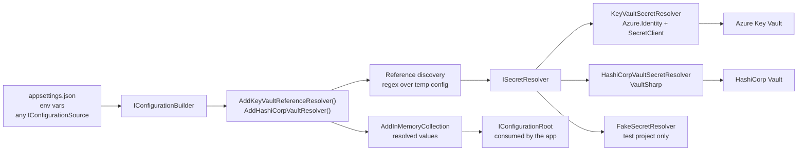

# Architecture Overview

## Overview and Purpose

KeyVaultReferenceResolver solves a narrow but persistent problem: Azure App Service understands the `@Microsoft.KeyVault(SecretUri=...)` reference syntax in application settings, and nothing else does. A team that adopts that syntax gets clean, secret-free configuration files in production and then has to invent something different for local development, Docker Compose, Kubernetes, and CI. The usual workarounds — environment-specific transforms, a second set of appsettings files, a `dotnet user-secrets` store that drifts from production — all reintroduce the coupling the reference syntax was supposed to remove.

The library implements the same reference resolution in the `Microsoft.Extensions.Configuration` layer, so a single `appsettings.json` works everywhere. It also extends the idea: a second package resolves HashiCorp Vault references using the same machinery, which lets an application move between Azure Key Vault and Vault without touching anything except the line that registers the resolver.

Architecturally the library is deliberately small. It is not a configuration provider, it does not hold a background refresh loop, and it does not own the credential. It is a build-time transformation over an `IConfigurationBuilder`: find the references, fetch the secrets, overlay the resolved values, get out of the way. Everything the application sees afterwards is an ordinary `IConfiguration` with ordinary string values.

The security posture is the part that shapes the design most. Because the library writes credentials into configuration, several defaults that would be conventional elsewhere are inverted here — developer credentials are off by default, vault hosts are allowlisted, failures null the value rather than leaving the reference string in place. Those choices are documented in [Security-Model.md](../Architecture/Security-Model.md) and are the reason the 2.0 release carries breaking behaviour changes.

## Architecture Diagram



The flow is one-directional and happens exactly once, while the configuration is being built. The extension method adds an in-memory source *after* the existing sources, which is what gives resolved values precedence over the reference strings they replace — `Microsoft.Extensions.Configuration` resolves a key by walking providers in reverse registration order, so the last writer wins.

`ISecretResolver` is the only seam that matters. The extension methods that do the orchestration accept one, so the discovery, concurrency, timeout and substitution logic is shared regardless of which vault is behind it. The Azure package ships the interface; the HashiCorp package references the Azure package purely to implement that interface, which is why `KeyVaultReferenceResolver.HashiCorp` has a `ProjectReference` to `KeyVaultReferenceResolver` rather than duplicating the abstraction.

Note what is *not* on the diagram. There is no `IConfigurationProvider` implementation, no `IChangeToken`, and no timer. Values are resolved during `Build()` and are then inert. A rotated secret does not propagate into a running application; see [Secret-Caching-And-Rotation.md](../Features/Secret-Caching-And-Rotation.md) for why that is deliberate and what to do instead.

## How It Works

### Registration

An application calls one extension method on its `IConfigurationBuilder`, after all the sources that might contain references have been added:

```csharp
var configuration = new ConfigurationBuilder()
    .AddJsonFile("appsettings.json")
    .AddEnvironmentVariables()
    .AddKeyVaultReferenceResolver()
    .Build();
```

Ordering matters in both directions. Sources added *before* the resolver are scanned for references; sources added *after* it are not, and can also shadow the resolved values. In ASP.NET Core, `builder.Configuration` already has the host's default sources registered, so calling the extension on it picks those up.

### Resolution

The extension method builds a throwaway `IConfigurationRoot` from the sources registered so far, enumerates every key/value pair, and matches each value against the reference patterns. Matching values are recorded along with the distinct set of secret URIs they point at. The throwaway root is disposed immediately: `Build()` instantiates a fresh set of providers, and any `AddJsonFile(reloadOnChange: true)` among them holds a `FileSystemWatcher` that would otherwise leak for the lifetime of the process.

If no references are found the builder is returned untouched — no client is constructed, no credential is acquired, no network call is made. This is what makes the library safe to register unconditionally, including in environments with no vault access.

Otherwise the distinct URIs are fetched through the `ISecretResolver` with bounded concurrency under a single overall time budget, and each referencing value is rebuilt by substituting resolved secrets back into the original string. The full stage-by-stage account is in [Secret-Resolution-Pipeline.md](../Architecture/Secret-Resolution-Pipeline.md).

### Consumption

Resolved values are handed to `AddInMemoryCollection()` as a `Dictionary<string, string?>`. A key whose secret could not be fetched maps to `null`, never to the literal reference string. The application therefore sees a missing value rather than a plausible-looking credential, regardless of whether `ThrowOnResolveFailure` is on.

## Key Components

### ISecretResolver

The abstraction, in [ISecretResolver.cs](../../src/KeyVaultReferenceResolver/ISecretResolver.cs). Two members: an async resolve and a sync resolve, both taking a reference string and returning the secret value. Keeping it this thin is what lets the same orchestration code drive Azure Key Vault, HashiCorp Vault and a test double. Note that the parameter is named `secretUri` but the HashiCorp implementation accepts its own reference formats there — the interface is really "resolve this reference string", and the name is historical.

### KeyVaultReferenceResolverExtensions

The orchestrator for the Azure side, in [KeyVaultReferenceResolverExtensions.cs](../../src/KeyVaultReferenceResolver/KeyVaultReferenceResolverExtensions.cs). It owns the reference regexes, the discovery pass, the concurrency gate, the overall timeout, substitution, and the failure contract. It also exposes the two public static helpers `IsKeyVaultReference` and `ExtractSecretUri` for callers that want to inspect a value without resolving it.

Five overloads exist, differing only in how options and the resolver are supplied: no arguments, a `TokenCredential`, an `Action<KeyVaultReferenceResolverOptions>`, an explicit options-plus-logger pair, and an explicit `ISecretResolver`. They all funnel into the last one.

### KeyVaultSecretResolver

The Azure implementation, in [KeyVaultSecretResolver.cs](../../src/KeyVaultReferenceResolver/KeyVaultSecretResolver.cs). It parses and validates secret URIs, constructs and caches one `SecretClient` per vault host, builds a hardened `DefaultAzureCredential` when the caller has not supplied one, enforces the per-secret timeout, checks the secret's validity period, caches the value, and maps `RequestFailedException` statuses onto messages an operator can act on. Detail in [Azure-Key-Vault-Provider.md](../Features/Azure-Key-Vault-Provider.md).

### HashiCorpVaultSecretResolver

The Vault implementation, in [HashiCorpVaultSecretResolver.cs](../../src/KeyVaultReferenceResolver.HashiCorp/HashiCorpVaultSecretResolver.cs). Structurally parallel to the Azure resolver, but with extra work that Vault's API shape forces: splitting a reference path into mount and path, probing whether a mount is KV v1 or v2, re-authenticating once when a cached login token has expired, and deciding whether an address carried inside a configuration value may be contacted at all. Detail in [HashiCorp-Vault-Provider.md](../Features/HashiCorp-Vault-Provider.md).

### FakeSecretResolver

A dictionary-backed test double in [FakeSecretResolver.cs](../../tests/KeyVaultReferenceResolver.TestSupport/FakeSecretResolver.cs), in a test-only project that is never packed.

Its predecessor, `FakeSecretResolver`, shipped inside the main package until 2.0. It was marked `[EditorBrowsable(EditorBrowsableState.Never)]` and carried prominent warnings, but neither stops a dependency-injection registration — and with `throwOnMissing: false` an application wired to it starts with empty passwords rather than failing. Documentation is not a control, so the type was moved out of the shipped assembly instead.

### Options and LogEvents

Each package has one options class and one static `LogEvents` class. The options classes both expose a `Validate()` that throws `ArgumentOutOfRangeException` for nonsensical timeouts or concurrency, called from both the resolver constructor and the extension method. The `LogEvents` classes are public on purpose: secret access is exactly the activity an ISO 27001 or SOC 2 audit asks for evidence of, and a stable `EventId` is what makes a log-based control testable. Azure uses the 1000 range, HashiCorp the 2000 range, so a consumer of both sees no collisions.

## Design Decisions and Trade-offs

**Build-time transformation instead of a configuration provider.** A custom `IConfigurationProvider` would have been the more idiomatic .NET design and would have made reload possible. It was not chosen because the reference syntax can appear in *any* source — JSON, environment variables, command line, Azure App Configuration — and a provider only sees its own data. Scanning the built configuration catches references wherever they came from. The cost is that reload is impossible: values are frozen at startup, and picking up a rotated secret means restarting the process.

**One shared orchestration, two providers.** Discovery, concurrency, timeouts and the failure contract live in the extension methods rather than in the resolvers, so both vault backends get identical behaviour for free. The trade-off is that the two extension classes are near-duplicates of each other — the HashiCorp version resolves per configuration key rather than per distinct URI, because its reference format does not decompose to a canonical URI as cleanly. Someone maintaining one should check whether the other needs the same change.

**netstandard2.0 for the libraries.** This keeps .NET Framework 4.6.1+ and .NET Core 2.0+ consumers in scope, which matters for a library whose whole purpose is to unblock legacy applications moving to Key Vault. The cost is visible in the code: no `IAsyncDisposable`, no nullable reference types without the `Nullable` shim package (which the HashiCorp project references for `[NotNullWhen]`), and `GetAwaiter().GetResult()` in the sync paths.

**Fail closed, always.** `ThrowOnResolveFailure = false` does not mean "leave the value alone". It means "set the key to `null` and keep going". Leaving the literal `@Microsoft.KeyVault(...)` string in place is the failure mode that actually hurts, because the application then uses the reference text as a password and the resulting error appears at some downstream service with no hint of the cause. This is a breaking change from 1.x and is called out in [CHANGELOG.md](../../CHANGELOG.md).

**Secret names are not logged above Debug.** One `Information` record per resolved key would produce a map of exactly which configuration keys hold credentials, and key names routinely embed tenant or customer identifiers (`Clients:AcmeCorp:ApiKey`). Aggregated log stores are a much softer target than the vault, so the per-secret record is `Debug` and only an aggregate count is `Information`.

## Integration Points

The library sits between the configuration stack and two secret stores, and takes a hard dependency on very little else.

- **Microsoft.Extensions.Configuration** — the only structural dependency. The library extends `IConfigurationBuilder` and uses `AddInMemoryCollection` as its output channel.
- **Microsoft.Extensions.Logging.Abstractions** — optional `ILogger`, defaulting to `NullLogger.Instance`. Abstractions only, so no logging implementation is imposed.
- **Azure.Identity** — supplies `DefaultAzureCredential` and the `TokenCredential` type the caller can override with anything, including a federated or workload identity credential.
- **Azure.Security.KeyVault.Secrets** — `SecretClient`. The caller can pass `SecretClientOptions` for retry, proxy, transport and service-version control; the library forces `Diagnostics.IsLoggingContentEnabled = false` on whatever it is given.
- **VaultSharp** — the HashiCorp Vault client, in the HashiCorp package only. Its transitive `System.Text.Json` is explicitly pinned forward past a High-severity advisory (GHSA-8g4q-xg66-9fp4).
- **Microsoft.SourceLink.GitHub** — build-time only, so consumers can step into library sources from a symbol server.

## Important Considerations

### Performance

Resolution cost is paid once, at startup, and is dominated by network round trips to the vault.

- Distinct secret URIs are fetched concurrently, capped by `MaxConcurrency` (default 8).
- Duplicate references to the same URI are fetched once — the Azure side deduplicates into a `HashSet<string>` before fetching.
- `SecretClient` and `IVaultClient` instances are cached per vault, so N secrets from one vault mean one client and one credential acquisition.
- `OverallTimeout` (default 2 minutes) bounds the whole pass. Without it, N unreachable references would stall startup for up to N × `Timeout`, which outlives most container liveness probes.
- Zero references means zero cost: the builder short-circuits before constructing anything.

### Security

Covered in full in [Security-Model.md](../Architecture/Security-Model.md). The headline controls: vault hosts must match an allowlist, Vault addresses in references must be explicitly trusted, secret names and paths are masked everywhere they could reach a log or an exception property, Azure SDK content logging is forced off, developer credentials are opt-in, all regexes have a 1-second timeout, and HTTPS is required unless plaintext is explicitly allowed for a local dev Vault.

### Operational

- Both resolvers implement `IDisposable`. Disposing clears cached secrets and clients — the strings cannot be zeroed, but dropping the references lets the GC reclaim them instead of keeping them reachable in every crash dump for the process lifetime.
- Resolution failures surface out of `IConfigurationBuilder.Build()`, which in ASP.NET Core means the host fails to start. That is the intended behaviour for a missing credential.
- Every log record carries a stable `EventId`; see [Logging-And-Monitoring.md](../Operations/Logging-And-Monitoring.md) for the catalogue and suggested alerts.
- The two packages are versioned in lockstep and released together from a tag-verified GitHub Actions workflow; see [Release-And-Publishing.md](../Development/Release-And-Publishing.md).
