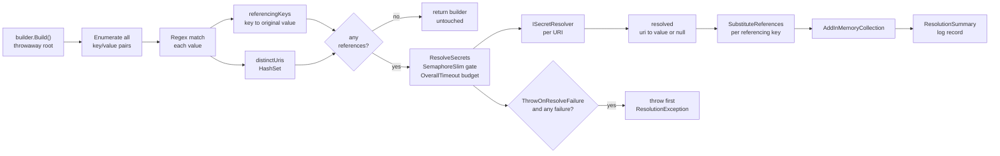

# Secret Resolution Pipeline

## Overview and Purpose

The pipeline is the part of the library that runs exactly once, inside `IConfigurationBuilder.Build()`, and turns reference strings into secret values. Everything else in the codebase either feeds it options or is called by it.

It exists as a distinct concern because the hard problems are not in talking to a vault — the Azure and Vault SDKs do that — but in the orchestration around it. How do you find references when they can come from any configuration source? How do you avoid fetching the same secret five times because five keys point at it? How do you stop N unreachable vaults from stalling startup past the liveness probe? And when a fetch fails, what exactly does the application see?

The answers are concentrated in two near-parallel classes: [KeyVaultReferenceResolverExtensions.cs](../../src/KeyVaultReferenceResolver/KeyVaultReferenceResolverExtensions.cs) for Azure Key Vault and [HashiCorpVaultReferenceExtensions.cs](../../src/KeyVaultReferenceResolver.HashiCorp/HashiCorpVaultReferenceExtensions.cs) for HashiCorp Vault. They share a shape and a failure contract but differ in one meaningful way, described under *Azure and HashiCorp compared* below.

## Architecture Diagram



Two things about this shape are worth drawing out.

First, discovery is completely separated from fetching. The discovery pass produces two data structures — a map from configuration key to its original value, and a set of distinct secret URIs — and then the temporary configuration root is disposed before any network call happens. That separation is what makes deduplication possible and what keeps the `FileSystemWatcher` lifetime short.

Second, the failure path is not an escape hatch. Whether or not `ThrowOnResolveFailure` is set, a failed URI is recorded as `null` in the resolved map, and any configuration value containing it becomes `null`. The option controls only whether an exception is *also* thrown. There is no configuration in which the application receives the literal reference string as its value.

## How It Works

### Stage 1 — Probe the configuration under construction

```csharp
var tempConfig = builder.Build();
try
{
    foreach (var kvp in tempConfig.AsEnumerable()) { /* ... */ }
}
finally
{
    (tempConfig as IDisposable)?.Dispose();
}
```

`builder.Build()` is called on the builder the caller is still assembling. This instantiates a *second*, independent set of providers from the same sources — not the ones the caller's own `Build()` will later create. That matters for two reasons.

It means the library sees the fully merged, hierarchically flattened configuration exactly as the application will: JSON files, environment variables, command line, Azure App Configuration, anything. A reference works regardless of which source it came from.

It also means the probe must be disposed. Every `AddJsonFile(reloadOnChange: true)` source materialises a `FileSystemWatcher` in its provider. Leaving the probe root undisposed leaks one watcher per source for the lifetime of the process — on a container with a handful of JSON sources this is small, but it is a real and permanent leak, and the `try`/`finally` around the enumeration exists solely to close it. The cast to `IDisposable` is needed because `IConfigurationRoot` does not declare it on netstandard2.0.

### Stage 2 — Discover and deduplicate references

Every non-empty value is matched against the reference patterns. On the Azure side, `EnumerateSecretUris` yields every URI in a value — a single value may embed more than one reference, and may mix references with literal text:

```json
"Connection": "Server=db;User=app;Password=@Microsoft.KeyVault(SecretUri=https://v.vault.azure.net/secrets/pw)"
```

Matches feed two structures. `referencingKeys` maps configuration key to the *original, unsubstituted* value, because substitution happens later and needs the template. `distinctUris` is a `HashSet<string>` with `StringComparer.Ordinal`, which is what collapses ten keys pointing at one secret into one fetch. Ordinal comparison is deliberate: a Key Vault secret name is case-sensitive, so URIs that differ only in case are genuinely different secrets and must not be merged.

If `distinctUris` is empty the method returns the builder immediately. No credential is acquired, no client is constructed, no vault is contacted. This is what makes the call safe to register unconditionally in environments with no vault access at all.

### Stage 3 — Fetch with bounded concurrency under one budget

`ResolveSecrets` is where the concurrency and timeout policy lives:

```csharp
using (var overallCts = new CancellationTokenSource())
using (var gate = new SemaphoreSlim(options.MaxConcurrency))
{
    if (options.OverallTimeout != Timeout.InfiniteTimeSpan)
        overallCts.CancelAfter(options.OverallTimeout);

    var tasks = distinctUris.Select(uri => ResolveOneAsync(/* ... */)).ToArray();
    Task.WhenAll(tasks).GetAwaiter().GetResult();
}
```

A task is created for every distinct URI up front, but each one waits on the `SemaphoreSlim` before doing any work, so at most `MaxConcurrency` (default 8) requests are in flight. The gate is awaited with `CancellationToken.None` rather than the overall token — a task that is cancelled while queued still needs to pass through the `finally` that releases the semaphore, and cancelling the wait itself would make that bookkeeping fragile. The cancellation that matters is applied to the vault call inside.

`OverallTimeout` (default 2 minutes) is the ceiling for the entire pass, distinct from the per-secret `Timeout` (default 30 seconds) enforced inside each resolver. The reason for having both: with only a per-secret timeout, twelve unreachable references at concurrency 8 serialise into two waves of 30 seconds, and a larger set stalls startup for minutes. Container orchestrators kill the pod long before that, producing a crash loop whose cause is invisible. The overall budget converts that into one bounded failure with a logged reason.

`Task.WhenAll(...).GetAwaiter().GetResult()` blocks the calling thread. `IConfigurationBuilder.Build()` is synchronous and there is no async alternative in the configuration API, so this is forced. It is safe here because it runs during application startup on a thread that has nothing else to do, but it is the reason the library should not be invoked from inside a request or a UI callback.

### Stage 4 — Record success or fail closed

`ResolveOneAsync` wraps a single fetch:

```csharp
resolved[secretUri] = secretValue;
if (logger.IsEnabled(LogLevel.Debug))
{
    var maskedUri = MaskUri(secretUri);
    Log.ReferenceResolved(logger, maskedUri);
}
```

`Log` is the package's source-generated logging class; the explicit `IsEnabled` guard is there because masking allocates and this path runs per secret on every resolution. See [Logging-And-Monitoring.md](../Operations/Logging-And-Monitoring.md).

On failure, every exception type is caught and the same three things happen: the URI maps to `null`, a `KeyVaultReferenceResolutionException` is queued naming the configuration key and carrying the original exception as `InnerException`, and an `Error`-level record is written stating that the value has been set to null.

The configuration key in the message comes from `FirstKeyReferencing`, which scans `referencingKeys` for a key whose value mentions this URI. It returns the *first* match, so when several keys share a secret the exception names only one of them. That is a reporting simplification, not a functional one — every referencing key is still nulled.

Failures are collected in a `ConcurrentQueue` rather than thrown immediately, so the whole pass completes and every failure gets logged before the first one is rethrown. An operator debugging a startup failure sees all four broken references in the log, not just whichever one happened to fail first.

### Stage 5 — Substitute back into the original values

```csharp
var result = SecretUriPattern.Replace(originalValue, m => Substitute(m));
result = VaultNamePattern.Replace(result, m => Substitute(m));
return failed ? null : result;
```

`SubstituteReferences` runs both patterns over the value, replacing each match with its resolved secret and leaving surrounding literal text intact. The `failed` flag is set by the substitution callback if any reference in the value has no resolved secret, and the whole value collapses to `null` in that case.

That all-or-nothing rule is the point. A connection string with two embedded references, one of which failed, would otherwise be handed to the application as a syntactically valid string with a blank password — which fails at the database with an authentication error and no indication that a vault lookup was involved. Returning `null` makes the application's own null check or options validation catch it at startup instead.

### Stage 6 — Overlay and summarise

```csharp
builder.AddInMemoryCollection(resolvedValues);

var succeeded = resolvedValues.Count(pair => pair.Value != null);
Log.ResolutionSummary(logger, succeeded, resolvedValues.Count);
```

The record is `Information`, event ID 1004, with the template *"Resolved {Count} of {Total} configuration value(s) containing Key Vault reference(s)"*.

The in-memory source is appended last, so it takes precedence over the sources that held the reference strings. The summary record is the only `Information`-level statement about the overall outcome, and it is deliberately aggregate: `succeeded` and `Total` tell an operator whether startup was clean without enumerating which keys hold credentials. A mismatch between the two numbers is the single most useful alert signal the library emits — see [Logging-And-Monitoring.md](../Operations/Logging-And-Monitoring.md).

## Key Components

### The discovery regexes

Both Azure patterns are `RegexOptions.Compiled | RegexOptions.IgnoreCase` with a 1-second `RegexTimeout`. The timeout is a ReDoS bound: configuration values can come from sources an attacker may influence, and a compiled pattern with no timeout is an unbounded CPU sink. The `VaultName` pattern additionally constrains every capture group to Azure's own naming rules, which is a security control rather than a convenience — see [Reference-Formats.md](../Features/Reference-Formats.md).

### The SemaphoreSlim gate

One `SemaphoreSlim(MaxConcurrency)` per resolution pass, disposed with the `CancellationTokenSource`. It is local to the pass rather than a field on the resolver, so concurrency is scoped to one `Build()` and two independent builders do not contend.

### The failure queue

A `ConcurrentQueue<KeyVaultReferenceResolutionException>`. Only the first entry is ever thrown; the rest exist so that all failures reach the log. If `ThrowOnResolveFailure` is `false` the queue is simply discarded after the pass.

### SubstituteReferences

The all-or-nothing substitution described in stage 5. Its `failed` flag is captured by a local function closure, which is why the two `Replace` calls can share one failure signal across both patterns.

## Azure and HashiCorp compared

The two pipelines are structurally the same and differ in their unit of work.

| Aspect | Azure | HashiCorp |
| --- | --- | --- |
| Unit of resolution | distinct secret URI | configuration key |
| Deduplication | yes, `HashSet<string>` ordinal | no |
| Embedded references | yes, substituted into surrounding text | no, whole value must be the reference |
| Multiple references per value | yes | no |
| Failure granularity | URI nulled, every referencing key nulled | key nulled |
| Exception type | `KeyVaultReferenceResolutionException` | `HashiCorpVaultReferenceResolutionException` |
| Event ID range | 1000s | 2000s |

The HashiCorp side resolves per key because its reference formats do not decompose to a single canonical identifier as cleanly — `@HashiCorp.Vault(VaultAddress=...;SecretPath=...;SecretKey=...)` and `hashicorp://host/path#key` can denote the same secret while differing as strings, so a naive `HashSet` would not deduplicate reliably anyway. The consequence is that N keys pointing at the same Vault secret cause N reads, though the resolver's own cache absorbs the repeats within a pass.

The HashiCorp `UriPattern` is anchored with `^...$`, which is why the whole value must be the reference. The `@HashiCorp.Vault(...)` attribute form is not anchored, but `IsHashiCorpVaultReference` is used as a whole-value predicate and the resolved secret replaces the entire value, so embedding it in a larger string does not work either.

Anyone changing one of these two classes should check whether the other needs the same change. They have drifted apart before, and the near-duplication is the main maintenance cost of the shared-orchestration design.

## Design Decisions and Trade-offs

**Probe the built configuration rather than implement a provider.** A custom `IConfigurationProvider` is the idiomatic .NET design and would support reload. It was rejected because a provider only sees its own data, and references legitimately appear in any source. The price is that values are frozen after `Build()`: rotation requires a restart.

**Deduplicate on the Azure side only.** Correct where it is cheap and reliable, skipped where it would be unreliable. The alternative — canonicalising HashiCorp references into a comparable key — is possible but adds a parsing layer whose bugs would silently merge distinct secrets.

**Collect failures, throw one.** Throwing eagerly from the first failing task would abandon the remaining tasks mid-flight and log only one of several problems. Collecting them costs a queue allocation and gives a complete diagnostic picture. The trade-off is that `Build()` takes the full `OverallTimeout` in the worst case instead of failing at the first error.

**Two timeout levels.** More configuration surface, but the per-secret timeout alone does not bound startup and the overall timeout alone gives no per-call granularity for retry backoff. Both defaults (30s and 2m) are chosen to sit inside typical container probe windows.

**Block on `Task.WhenAll`.** Unavoidable given the synchronous configuration API. Documented rather than worked around, because the alternatives — `Task.Run` plus a wait, or a sync-over-async helper — hide the same blocking behind more machinery.

## Integration Points

- **`IConfigurationBuilder`** — both the input (sources to scan) and the output (`AddInMemoryCollection`). The pipeline mutates the builder and returns it for chaining.
- **`ISecretResolver`** — the only outbound dependency of the pipeline itself. Everything vault-specific is behind it, which is why `FakeSecretResolver` can exercise the whole pipeline with no network.
- **`ILogger`** — four event IDs per package: `SecretResolved` (Debug), `ResolutionFailed` (Error), `ResolutionSummary` (Information), plus the resolver-level `SecretRead` (Information). Defaults to `NullLogger.Instance`.
- **Options validation** — `options.Validate()` is called at the top of the pipeline, before any work, so a bad `MaxConcurrency` or negative timeout fails fast with an `ArgumentOutOfRangeException` naming the property.

## Important Considerations

### Performance

- Startup cost is roughly `ceil(distinctUris / MaxConcurrency)` round trips, not `distinctUris` round trips.
- Deduplication makes the Azure side insensitive to how many keys share a secret.
- The throwaway `Build()` is a real cost on configurations with many sources — it constructs and then discards a full provider set. It is paid once.
- Raising `MaxConcurrency` past the low teens tends to trade startup latency for HTTP 429s from Key Vault; the throttling message in [Troubleshooting-Guide.md](../Operations/Troubleshooting-Guide.md) says as much.

### Security

- Failure is closed at two levels: the URI map and the substituted value. Neither can yield the literal reference string.
- Masking is applied to every URI before it reaches a log or an exception property. `MaskSecretUri` keeps scheme and host and replaces the secret name with `***`.
- Failure exceptions carry the original exception as `InnerException`, which may itself contain an unmasked URI if it came from a third-party SDK. The README notes this; do not serialise inner exceptions into a user-facing error page.
- The per-secret record is `Debug` specifically so that an aggregated log store does not accumulate a map of which configuration keys hold credentials.

### Operational

- Resolution failures surface out of `Build()`. In ASP.NET Core that means the host does not start, which is the intended outcome for a missing credential.
- A `null` configuration value where a reference used to be is the fail-closed signal, not a bug. Alert on `ResolutionFailed` (1003 / 2003) and on `ResolutionSummary` where `Count < Total`.
- `OverallTimeout` should be set below the orchestrator's startup probe threshold so the library, not the platform, reports the failure.
