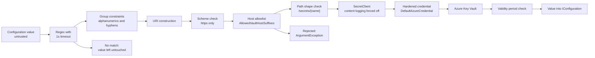

# Security Model

## Overview and Purpose

This library's job is to move credentials from a vault into application configuration. That makes it a component where an ordinary bug becomes a credential exposure, and where a merely permissive default becomes an attack path. The design reflects that: several defaults are inverted relative to what a general-purpose library would choose, and a few behaviours that look unhelpful — nulling a value instead of leaving it, refusing a vault host that is spelled slightly differently — are there because the permissive alternative is exploitable.

The model rests on four assumptions. Configuration values are **not** trusted input, because a configuration source can be an environment variable, a mounted file, or a remote store that something other than the deployment pipeline can write to. Logs and telemetry are a **softer target** than the vault itself, so secret names must not accumulate there. Startup failures are **preferable** to silent degradation, because an application running with a blank password fails later, elsewhere, with no diagnostic trail. And the library **cannot** compensate for a misconfigured vault, so it should not pretend to.

What follows catalogues every control in the codebase, states the attack each one addresses, and then states plainly what is out of scope. The formal reporting policy and supported-version matrix live in [SECURITY.md](../../SECURITY.md); this document covers the implementation.

## Architecture Diagram



Read the diagram as a funnel: each stage narrows what a configuration value is allowed to make the process do. The two stages that matter most are the **group constraints** and the **host allowlist**, because together they are what stops a tampered configuration value from directing an authenticated request to a host of the attacker's choosing.

The HashiCorp path has the same shape with different gates — transport check, address pinning or allowlist, path and key character validation — described under *Vault address trust* and *Path and key validation* below.

## How It Works

### Fail-closed resolution

The single most important behaviour. When a reference cannot be resolved, the configuration key is set to `null`:

```csharp
// Fail closed. Leaving a key unset would let the application read the literal
// "@Microsoft.KeyVault(SecretUri=...)" string and use it as a credential.
resolved[secretUri] = null;
```

This happens regardless of `ThrowOnResolveFailure`. That option controls only whether an exception is *also* raised. There is no configuration in which the application receives the reference string in place of the secret.

The attack this closes is mundane and therefore likely: a vault is unreachable, the application starts anyway, and `config["ConnectionStrings:Db"]` returns `@Microsoft.KeyVault(SecretUri=https://...)`. The application uses that as a password. The failure surfaces at the database as an authentication error with no mention of Key Vault, and — worse — the literal reference string, containing the vault host and secret name, ends up in the database server's failed-login log. On the HashiCorp side the same reference string would contain the Vault address.

Substitution extends the rule to compound values. A value with two embedded references, one of which failed, collapses to `null` rather than being handed over with a blank password spliced into the middle. See [Secret-Resolution-Pipeline.md](../Architecture/Secret-Resolution-Pipeline.md) stage 5.

This is a breaking change from 1.x, recorded in [CHANGELOG.md](../../CHANGELOG.md).

### Vault host allowlisting (Azure)

`KeyVaultReferenceResolverOptions.AllowedVaultHostSuffixes` defaults to the eight suffixes that Microsoft actually serves Key Vault and Managed HSM on:

```text
.vault.azure.net            .vaultcore.azure.net
.vault.usgovcloudapi.net    .vault.azure.cn
.vault.microsoftazure.de    .managedhsm.azure.net
.managedhsm.usgovcloudapi.net  .managedhsm.azure.cn
```

`EnsureAllowedVaultHost` is called during URI parsing, before any client is constructed. A host that matches no suffix raises `ArgumentException` naming the option to change if the rejection is wrong.

Without this check, a `SecretUri=` reference carries its own host, so anything that can write a configuration value can make the process issue an authenticated HTTPS request to an arbitrary host during startup. With a managed identity that request carries no bearer token for the wrong audience — `SecretClient` scopes the token to the vault resource — but the request itself is an SSRF primitive from inside the trust boundary, and a credential misconfiguration on top of it turns into token exfiltration.

Setting the list to empty disables the check. Do that only when resolving against a non-Microsoft endpoint on purpose, and name the specific suffix rather than clearing the list.

### Reference group constraints

The `VaultName=` pattern does not accept arbitrary text:

```csharp
@"@Microsoft\.KeyVault\(VaultName=(?<vault>[A-Za-z0-9-]{3,24});SecretName=(?<secret>[A-Za-z0-9-]{1,127})(?:;SecretVersion=(?<version>[A-Za-z0-9]{1,64}))?\)"
```

Each group is restricted to Azure's own naming rules. This is a security control, not input hygiene. `UriFromMatch` interpolates these groups straight into a URI string:

```csharp
var uri = $"https://{vaultName}.{suffix}/secrets/{secretName}";
```

A looser `[^;]+` for `vault` would let a value like `VaultName=evil.example.com%23` inject authority or path characters and redirect the lookup. Constraining the groups means nothing reaching that interpolation can alter the URI's authority. The `SecretUri=` pattern excludes `)`, whitespace and backslash from its URI group for the same reason, and then relies on the host allowlist because it carries a host by design.

### Vault address trust (HashiCorp)

Vault has no equivalent of a well-known DNS suffix, so the address in a reference is handled by explicit trust instead of a pattern. `ResolveTrustedAddress` applies three rules in order:

1. **No address in the reference** — use `options.VaultAddress`, or `VAULT_ADDR`.
2. **`options.VaultAddress` is set** — the reference must name that same address after normalisation, or `InvalidOperationException` is thrown: *"Refusing to authenticate against an unexpected vault."*
3. **Neither set** — the address must appear in `options.AllowedVaultAddresses`; if that list is empty, any HTTPS address is accepted.

Setting `VaultAddress` explicitly is the strongest available protection and is the recommended production configuration. The third rule's fallback — accept any HTTPS address — exists for convenience and is the weakest posture the package allows; it means a tampered configuration value can send the resolver's ambient Vault token to a host of the attacker's choosing. Unlike the Azure case, that token is bearer-shaped and directly replayable.

Normalisation in `NormalizeVaultAddress` lowercases scheme and host and trims a trailing slash, but deliberately leaves the path case-sensitive, because a Vault behind a gateway at `https://gw.example.com/Vault` is a different endpoint from `/vault`.

### Transport enforcement

Azure requires `https` unconditionally:

```csharp
if (uri.Scheme != Uri.UriSchemeHttps)
    throw new ArgumentException($"Key Vault secret URIs must use https. Got scheme '{uri.Scheme}'.", nameof(secretUri));
```

HashiCorp requires it too, with one opt-in escape. `EnsureTransportAllowed` accepts `http` only when `AllowInsecureTransport` is `true`, and the rejection message says why: over plaintext HTTP the Vault token and the returned secret both travel in the clear. That includes pod-to-pod traffic inside a cluster, which is the case people most often assume is safe. The option exists for `vault server -dev` on a laptop and nothing else.

### Path and key validation (HashiCorp)

`ValidateSecretPath` rejects `?`, `#`, `\` and control characters, and rejects any `.` or `..` segment. The path comes from a configuration value and is handed to VaultSharp, which puts it into the request URL. `Uri` normalises dot segments away, so `secret/data/../../sys/mounts` would reach a completely different Vault API endpoint — and a `?` or `#` would splice a query string or fragment onto the request. `ValidateSecretKey` rejects control characters so a key cannot inject into a header or a log line.

The Azure side gets the same protection differently: `ParseSecretUri` requires the first path segment to be exactly `secrets` and takes only the next one or two segments, so extra path elements cannot redirect the call.

### Secret name masking

Every place a reference could reach a log, an exception message, or a serialised exception property, it is masked first.

`KeyVaultReferenceResolutionException.MaskSecretUri` keeps scheme and host and replaces the rest:

```text
https://myvault.vault.azure.net/secrets/db-password
  →  https://myvault.vault.azure.net/secrets/***
```

An unparseable value masks to `***` entirely. `HashiCorpVaultReferenceResolutionException.MaskVaultReference` does the same for both Vault formats, keeping the address and blanking path and key.

Crucially, the masking happens in the **constructor**, so the public `SecretUri` / `VaultReference` properties are never populated with the raw value:

```csharp
SecretUri = MaskSecretUri(secretUri);
```

That matters because this exception surfaces out of `IConfigurationBuilder.Build()` during startup, which means it reaches crash dumps, developer exception pages and APM sinks — several of which serialise exception properties by reflection. The vault host is retained on purpose: knowing *which* vault failed is the point of the exception. The inventory of secret names inside it is not.

The HashiCorp exception masks for an additional reason. Its reference is taken verbatim from a configuration value, so a compound value — a connection string with an inline password next to an embedded reference — would otherwise be captured whole into a reflection-serialised public property.

`FakeSecretResolver` masks too, because its `KeyNotFoundException` becomes the `InnerException` of the resolution failure that gets logged, and an unmasked URI there would put the secret name into the log by the back door.

### Log level discipline

Records that name a secret are `Debug`. Records that go to an aggregated store are `Information` and name only the vault:

```csharp
// Information level carries no secret name: these records are shipped to
// aggregated log stores, where the set of names would amount to an inventory
// of the vault's contents. The name is available at Debug.
Log.SecretRead(_logger, vaultUri);
```

`Log.SecretRead` is source-generated with `Level = LogLevel.Information` and the template *"Successfully resolved secret from {VaultUri}"* — the vault, never the secret name.

The same split applies to the pipeline's per-key record versus its aggregate summary. One `Information` record per resolved key would produce a map of exactly which configuration keys hold credentials, and key names routinely embed tenant or customer identifiers (`Clients:AcmeCorp:ApiKey`).

HashiCorp `MaskPath` keeps only the mount point: `secret/data/prod/db` becomes `secret/***`. Vault key names like `prod-db-root-password` are self-describing enough to be worth hiding.

### Azure SDK content logging suppression

```csharp
// Never let Azure SDK content logging write secret payloads to the log,
// regardless of AZURE_LOG_LEVEL or any listener the consumer has attached.
clientOptions.Diagnostics.IsLoggingContentEnabled = false;
```

`BuildClientOptions` forces this on whatever `SecretClientOptions` the caller supplied. Azure SDK content logging writes full HTTP request and response bodies, and a Key Vault `GET /secrets/{name}` response body *is* the secret. It can be switched on by an environment variable (`AZURE_LOG_LEVEL`) or by an `AzureEventSourceListener` registered anywhere in the process, so leaving it to the consumer's discretion means it is one unrelated diagnostic session away from dumping every secret to stdout. This is overridden unconditionally, even against an explicitly-set value.

### Credential chain hardening

`CreateDefaultCredential` builds a `DefaultAzureCredential` with the chain narrowed:

```csharp
ExcludeAzureCliCredential = !options.AllowDeveloperCredentials,
ExcludeAzureDeveloperCliCredential = !options.AllowDeveloperCredentials,
ExcludeVisualStudioCredential = !options.AllowDeveloperCredentials,
ExcludeAzurePowerShellCredential = !options.AllowDeveloperCredentials,
ExcludeInteractiveBrowserCredential = true,
ExcludeEnvironmentCredential = options.ExcludeEnvironmentCredential
```

`AllowDeveloperCredentials` defaults to **false**, which is the opposite of `DefaultAzureCredential`'s own default. Four developer credential sources are excluded unless opted in, so a process running in Azure cannot silently fall back to a developer's cached personal identity — an identity that is typically far more privileged than the workload's and whose use is much harder to attribute in an audit.

Interactive browser is excluded unconditionally: a non-interactive startup path should never open a browser, and if it somehow can, that is a prompt an operator can be socially engineered through.

`ExcludeEnvironmentCredential` defaults to **false** for 1.x compatibility, and this is the weakest default in the library. The environment credential sits *ahead of* managed identity in the chain, so anything that can set `AZURE_CLIENT_ID` / `AZURE_TENANT_ID` / `AZURE_CLIENT_SECRET` in the process environment redirects all vault access to an identity of its choosing. Set it to `true` whenever the workload authenticates with a managed or workload identity — which is to say, in essentially every Azure deployment.

The HashiCorp side has the analogous hazard in its auth auto-detection order (`VAULT_TOKEN` before AppRole before Kubernetes), which is why it logs which method won. See [Vault-Authentication-Methods.md](../Features/Vault-Authentication-Methods.md).

### ReDoS bounds

Every `Regex` in the library is constructed with `TimeSpan.FromSeconds(1)`. Five patterns across three files: two in the Azure extensions, two in the HashiCorp resolver, two in the HashiCorp exception's masking helper. `MaskVaultReference` additionally catches `RegexMatchTimeoutException` and falls through to masking the value entirely, so a pathological input cannot turn masking itself into a failure that leaks the unmasked value.

The patterns in use are not obviously catastrophic, but they run over untrusted configuration values, they are `Compiled`, and a future edit could introduce nested quantification. The timeout is cheap insurance against that.

### Secret validity enforcement

Key Vault does not block a read of a secret whose `ExpiresOn` has passed — for secrets, expiry is advisory metadata. That is why the CIS control "set an expiration date on all secrets" has no enforcement effect on its own. `CheckValidityPeriod` makes it enforceable at the consumer: it warns on `NotBefore` in the future and on `ExpiresOn` in the past, warns when expiry falls inside `ExpiryWarningThreshold` (default 7 days), and throws if `RejectSecretsOutsideValidityPeriod` is set.

The reject option defaults to off, because turning it on can stop an application that is working fine with a secret whose expiry date was never maintained. Detail in [Secret-Validity-Enforcement.md](../Features/Secret-Validity-Enforcement.md).

### Disposal

Both resolvers implement `IDisposable` and clear their secret and client caches:

```csharp
// Resolved secrets are plain managed strings and cannot be zeroed, but dropping the
// references lets the garbage collector reclaim them rather than keeping them reachable
// (and therefore present in any crash dump) for the lifetime of the process.
```

This is a mitigation, not a guarantee. A `string` in .NET is immutable and cannot be overwritten; the best available action is to make it unreachable so the GC can eventually reuse the memory. Secrets that have already been written into `IConfiguration` stay reachable for the process lifetime regardless.

### The test double is not in the package

Until 2.0 the test double shipped inside the production package as `FakeSecretResolver`, mitigated by `[EditorBrowsable(EditorBrowsableState.Never)]`, prominent XML docs, and `throwOnMissing` defaulting to `true`.

Only the last of those was a control, and it was one flag away from failing: with `throwOnMissing: false` the double returns an empty string for every unknown secret, so an application wired to it starts with empty passwords and API keys rather than failing — the exact silent degradation the rest of the library exists to prevent. Hiding a type from IntelliSense does not stop a dependency-injection registration, and a warning in a doc comment is not a control at all.

From 2.0 the type is gone from the shipped assembly. `FakeSecretResolver` lives in a test-only project that is never packed, so no consumer can reach it by accident. Consumers who need a stub implement `ISecretResolver` themselves; it has two members.

## Key Components

### KeyVaultReferenceResolutionException

Carries `ConfigurationKey` and a masked `SecretUri`. Masking in the constructor is the defence; see *Secret name masking*. File: [KeyVaultReferenceResolutionException.cs](../../src/KeyVaultReferenceResolver/KeyVaultReferenceResolutionException.cs).

### HashiCorpVaultReferenceResolutionException

Carries `ConfigurationKey` and a masked `VaultReference`, with regex-based masking for both Vault formats and a `RegexMatchTimeoutException` catch. File: [HashiCorpVaultReferenceResolutionException.cs](../../src/KeyVaultReferenceResolver.HashiCorp/HashiCorpVaultReferenceResolutionException.cs).

### EnsureAllowedVaultHost / ResolveTrustedAddress

The two host-trust gates, one per package. Both throw rather than degrading, both name the option to change in the message.

### BuildClientOptions / CreateDefaultCredential

The two places where the library overrides what the Azure SDK would do by default — content logging off, credential chain narrowed.

### LogEvents / HashiCorpLogEvents

Public and stable by design. Secret access is what an ISO 27001 or SOC 2 audit asks for evidence of, and a stable identifier is what makes a log-based control testable rather than a message-text grep. Azure uses 1000s, HashiCorp 2000s.

## Design Decisions and Trade-offs

**Fail closed rather than fail open.** Nulling the value can stop an application that 1.x would have started. That is the intended trade: a hard startup failure is diagnosable in seconds, whereas a credential-shaped reference string propagating into a downstream system is not.

**Allowlist hosts rather than validate them.** An allowlist of DNS suffixes is coarse and needs editing for private endpoints with custom DNS or for a Managed HSM in a cloud not listed. The alternative — pattern-matching "looks like a vault" — fails against any attacker who registers a plausible name. The option is a list precisely so the coarseness is fixable.

**Constrain reference groups tightly.** `[A-Za-z0-9-]{3,24}` will reject a vault name Azure someday permits. Accepted, because the group is interpolated into a URI and a loose group is an authority-injection vector.

**Developer credentials off by default, environment credential on by default.** Inconsistent, and deliberately so. Excluding developer credentials breaks nobody who was relying on documented behaviour, whereas excluding the environment credential would break every 1.x consumer using a service principal in environment variables. The README and this document both flag it as the thing to turn on; a future major version should flip it.

**Mask in the constructor, not at the log site.** Costs a little clarity — the exception cannot report the exact URI even to a trusted caller — and buys immunity to every future reflection-based serialiser that touches the exception.

**Force content logging off even when explicitly set.** Removes a legitimate capability from consumers who want full HTTP diagnostics. Worth it: the response body of a Key Vault secret read is the secret, and there is no partial-redaction setting to reach for.

**Ship the test double in the main package.** Convenient, and a real risk. Mitigated by three signals rather than solved by moving it to a separate package, which would be the cleaner answer and a breaking change.

## Integration Points

- **Azure.Identity** — credential chain construction and narrowing. Consumers can bypass it entirely by supplying `options.Credential`, including a `WorkloadIdentityCredential` or a federated `ClientAssertionCredential`; the exclusion options are then ignored.
- **Azure.Security.KeyVault.Secrets** — `SecretClient`, with `Diagnostics.IsLoggingContentEnabled` forced off and everything else left to the caller's `SecretClientOptions`.
- **VaultSharp** — Vault client and auth method info. The transitive `System.Text.Json` is pinned forward past GHSA-8g4q-xg66-9fp4.
- **Microsoft.Extensions.Logging.Abstractions** — the audit-evidence channel. Abstractions only; the consumer chooses the sink and therefore owns its retention and access control.
- **CodeQL** — `security-extended` queries run on push, on PR, and weekly on a schedule so newly published queries reach existing code. See [Release-And-Publishing.md](../Development/Release-And-Publishing.md).

## What the library does not protect against

Stated explicitly so these are not reported as surprises. The authoritative list is in [SECURITY.md](../../SECURITY.md).

- **Secrets in `IConfiguration` after resolution.** Resolved values are ordinary `string`s. They appear in a full process dump, and `IConfigurationRoot.GetDebugView()` prints them. That is documented `IConfiguration` behaviour.
- **Vault misconfiguration.** Over-broad RBAC, disabled purge protection, public network access. The library cannot compensate; scope the identity to `Key Vault Secrets User` on specific secrets where possible.
- **Rotation without a restart.** References resolve once at build time. Clearing a resolver's cache does not change values already in `IConfiguration`.
- **Upstream SDK vulnerabilities.** Report to Azure SDK or VaultSharp maintainers; this repo bumps the dependency once a fix ships.
- **An attacker with code execution in the process.** Out of scope by definition — at that point the credentials are readable from memory.
- **Compromise of the identity itself.** A stolen managed identity token or Vault token is a platform problem.

## Important Considerations

### Performance

The security controls are cheap. Host-suffix matching is a short `EndsWith` loop over at most eight strings. Regex timeouts only cost anything on pathological input. `SecretClient` and `IVaultClient` caching means one credential acquisition per vault rather than one per secret. None of this is on a request path — it runs once, at startup.

### Security

Recommended production posture, both packages:

```csharp
// Azure
options.ExcludeEnvironmentCredential = true;       // when using managed/workload identity
options.AllowDeveloperCredentials = false;         // default
options.ThrowOnResolveFailure = true;              // default
options.ManagedIdentityClientId = "...";           // required with multiple assigned identities
options.RejectSecretsOutsideValidityPeriod = true; // once expiry dates are maintained

// HashiCorp
options.VaultAddress = "https://vault.example.com"; // pins the vault
options.AllowInsecureTransport = false;             // default
options.ThrowOnResolveFailure = true;               // default
options.AuthMethod = new KubernetesAuthMethod(...); // explicit, not auto-detected
```

Setting `AuthMethod` and `VaultAddress` explicitly removes both HashiCorp ambient-environment hazards at once. Setting `ExcludeEnvironmentCredential` removes the Azure one.

### Operational

- Alert on `ResolutionFailed` (1003 / 2003) — a fail-closed null has been written.
- Alert on `AuthMethodSelected` (2101) reporting `TokenAuthMethod` in an environment expected to use Kubernetes auth — that means a stray `VAULT_TOKEN` won the auto-detection.
- Alert on `SecretExpired` (1101) and treat `SecretExpiringSoon` (1102) as a rotation ticket.
- `Reauthenticated` (2102) at a steady low rate is normal token-TTL behaviour; a spike means the login TTL is shorter than the workload's read pattern.
- Do not enable Azure SDK verbose logging as a debugging step and assume content is safe — the library forces content logging off, but request URLs still contain secret *names*.
