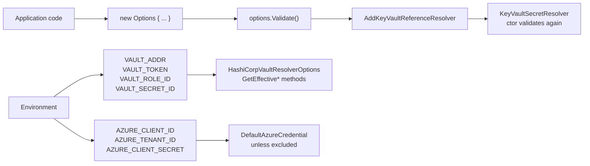

# Configuration Reference

## Overview and Purpose

Every setting in both packages, with its type, default, effect and the value recommended for production. This is the lookup document; the reasoning behind the defaults is in [Security-Model.md](../Architecture/Security-Model.md) and the per-environment recipes are in [Environment-Deployment-Guide.md](../Deployment/Environment-Deployment-Guide.md).

Two structural notes before the tables.

**Options are plain objects, not bound from configuration.** Neither `KeyVaultReferenceResolverOptions` nor `HashiCorpVaultResolverOptions` is registered with `IOptions<T>` or bound from an `IConfiguration` section. They are constructed in code and passed to the extension method. That is a consequence of *when* the library runs — it configures the configuration system, so it cannot read its own settings from it. Anything environment-dependent has to come from `builder.Environment`, an environment variable read directly, or a conditional in code.

**Several options are ignored in combination.** Setting `Credential` on the Azure side silently disables five other options. Setting `AuthMethod` on the HashiCorp side disables auto-detection and `KubernetesRoleName`. The tables flag these.

## Architecture Diagram



Note the two distinct paths. Azure options flow entirely from code; the Azure *environment* variables are consumed by `Azure.Identity` rather than by this library, which only decides whether that step is in the chain. HashiCorp options have explicit fallbacks to `VAULT_*` variables built into the options class itself, via `GetEffectiveVaultAddress()` and `GetEffectiveAuthMethod()`.

`Validate()` is called twice on the normal path — once by the extension method and once by the resolver constructor. Harmless and intentional: a consumer constructing a resolver directly gets the same check.

## KeyVaultReferenceResolverOptions

File: [KeyVaultReferenceResolverOptions.cs](../../src/KeyVaultReferenceResolver/KeyVaultReferenceResolverOptions.cs).

### Authentication

| Option | Type | Default | Effect |
| --- | --- | --- | --- |
| `Credential` | `TokenCredential?` | `null` | Use this credential verbatim. **Setting it makes the next five options inert.** |
| `ManagedIdentityClientId` | `string?` | `null` | Client ID of the user-assigned managed identity. **Required** when the host has more than one assigned — the credential cannot choose on its own. |
| `TenantId` | `string?` | `null` | Tenant to authenticate against. Needed for cross-tenant vault access. |
| `AuthorityHost` | `Uri?` | `null` | Entra ID authority for sovereign clouds, e.g. `https://login.microsoftonline.us/`. |
| `AllowDeveloperCredentials` | `bool` | `false` | Permits Azure CLI, Azure Developer CLI, Visual Studio and Azure PowerShell cached credentials. **Inverts `DefaultAzureCredential`'s own default.** |
| `ExcludeEnvironmentCredential` | `bool` | `false` | Removes `AZURE_CLIENT_ID`/`AZURE_TENANT_ID`/`AZURE_CLIENT_SECRET` from the chain. **Set to `true` in production.** |

`ExcludeInteractiveBrowserCredential` is not exposed — interactive browser is always excluded.

**Recommended production values:** `AllowDeveloperCredentials = false` (default), `ExcludeEnvironmentCredential = true`, `ManagedIdentityClientId` set whenever multiple identities are assigned.

The environment credential sits *ahead of* managed identity in the chain, so anything able to set those three variables in the process environment redirects all vault access to an identity of its choosing. Its default of `false` exists for 1.x compatibility only.

### Client behaviour

| Option | Type | Default | Effect |
| --- | --- | --- | --- |
| `ClientOptions` | `SecretClientOptions?` | `null` | Retry policy, transport/proxy, diagnostics, service version pinning. `Diagnostics.IsLoggingContentEnabled` is **forced to `false`** on whatever instance is supplied. |

The override is unconditional, even against an explicit `true`, because a Key Vault secret-read response body *is* the secret. Note that the library mutates the instance you pass, which matters if it is shared with other Azure clients.

### Failure handling

| Option | Type | Default | Effect |
| --- | --- | --- | --- |
| `ThrowOnResolveFailure` | `bool` | `true` | Throw the first `KeyVaultReferenceResolutionException` out of `Build()`. When `false`, the key is still set to `null` — the literal reference string is **never** left in place. |

**Recommended: leave `true` in every environment.** For offline development use `MockSecretResolver` or a local-only configuration source rather than turning this off; see [Local-Setup-And-Testing.md](../Development/Local-Setup-And-Testing.md).

### Timeouts and concurrency

| Option | Type | Default | Effect |
| --- | --- | --- | --- |
| `Timeout` | `TimeSpan` | 30 s | Budget for a single secret read. `Timeout.InfiniteTimeSpan` for none. |
| `OverallTimeout` | `TimeSpan` | 2 min | Budget for resolving *every* reference. `Timeout.InfiniteTimeSpan` for none. |
| `MaxConcurrency` | `int` | 8 | Secrets resolved concurrently. Minimum 1. |

Both timeouts exist because either alone is insufficient. Without an overall budget, N unreachable references stall startup for up to N × `Timeout`, which outlives most container liveness probes. Without a per-secret timeout there is no granularity for the SDK's retry backoff.

**Recommended:** keep `OverallTimeout` comfortably below the orchestrator's startup probe threshold, so the library reports the failure rather than the platform killing the pod. Reduce `MaxConcurrency` if a fleet starting simultaneously triggers HTTP 429.

### Caching

| Option | Type | Default | Effect |
| --- | --- | --- | --- |
| `EnableCaching` | `bool` | `true` | Cache resolved secrets in the resolver instance. |
| `CacheTtl` | `TimeSpan` | `Timeout.InfiniteTimeSpan` | How long an entry stays valid. Must be positive or infinite — zero is rejected. |

The infinite default is deliberate: polling a vault on a timer mostly buys traffic and throttling risk while still not detecting a rotation promptly. Refresh on evidence instead, via `InvalidateCache()` or `forceRefresh: true`. Detail in [Secret-Caching-And-Rotation.md](../Features/Secret-Caching-And-Rotation.md).

Neither option affects values already written into `IConfiguration`.

### Reference resolution

| Option | Type | Default | Effect |
| --- | --- | --- | --- |
| `VaultDnsSuffix` | `string` | `"vault.azure.net"` | Host suffix used to build a URI from a `VaultName=` reference. A leading dot is trimmed. |

Set for sovereign clouds — `vault.usgovcloudapi.net`, `vault.azure.cn` — alongside `AuthorityHost`. The `SecretUri=` format carries its own host and is unaffected.

This is the only option that changes what a reference *means* rather than how it is fetched. Note that the public `ExtractSecretUri` helper has no options parameter and always composes against `vault.azure.net`.

### Validity enforcement

| Option | Type | Default | Effect |
| --- | --- | --- | --- |
| `RejectSecretsOutsideValidityPeriod` | `bool` | `false` | Refuse a secret outside `NotBefore`/`ExpiresOn` instead of warning. |
| `ExpiryWarningThreshold` | `TimeSpan` | 7 days | Warn this far ahead of expiry. `TimeSpan.Zero` disables. |

Off by default because enabling it can stop an application that works fine with a secret whose expiry date was never maintained. Adopt in stages; see [Secret-Validity-Enforcement.md](../Features/Secret-Validity-Enforcement.md).

### Host allowlist

| Option | Type | Default | Effect |
| --- | --- | --- | --- |
| `AllowedVaultHostSuffixes` | `IList<string>` | `DefaultAllowedVaultHostSuffixes` | A secret URI's host must end with one of these. Empty list disables the check. |
| `DefaultAllowedVaultHostSuffixes` | `static IReadOnlyList<string>` | eight suffixes | The defaults, exposed so a consumer can extend rather than replace. |

```text
.vault.azure.net              .vaultcore.azure.net
.vault.usgovcloudapi.net      .vault.azure.cn
.vault.microsoftazure.de      .managedhsm.azure.net
.managedhsm.usgovcloudapi.net .managedhsm.azure.cn
```

To add a host without losing the defaults:

```csharp
options.AllowedVaultHostSuffixes.Add(".vault.contoso-private.net");
```

**Never clear the list** unless you are deliberately resolving against a non-Microsoft endpoint. A `SecretUri=` reference carries its own host, so this check is what stops a tampered configuration value from making the process issue an authenticated request to an arbitrary host during startup.

### Validate()

```csharp
if (Timeout <= TimeSpan.Zero && Timeout != Timeout.InfiniteTimeSpan)             → ArgumentOutOfRangeException
if (OverallTimeout <= TimeSpan.Zero && OverallTimeout != Timeout.InfiniteTimeSpan) → ArgumentOutOfRangeException
if (CacheTtl <= TimeSpan.Zero && CacheTtl != Timeout.InfiniteTimeSpan)           → ArgumentOutOfRangeException
if (MaxConcurrency < 1)                                                          → ArgumentOutOfRangeException
```

Called by the extension method before any work and by the resolver constructor. Note what is *not* validated: `VaultDnsSuffix` is not checked for plausibility, `ExpiryWarningThreshold` accepts negatives (which simply never match), and `AllowedVaultHostSuffixes` accepts an empty list as a legitimate opt-out.

## HashiCorpVaultResolverOptions

File: [HashiCorpVaultResolverOptions.cs](../../src/KeyVaultReferenceResolver.HashiCorp/HashiCorpVaultResolverOptions.cs).

### Vault address

| Option | Type | Default | Effect |
| --- | --- | --- | --- |
| `VaultAddress` | `string?` | `null` → `VAULT_ADDR` | The Vault server. **When set, a reference must name this same address** or resolution is refused. |
| `AllowedVaultAddresses` | `IList<string>` | empty | Addresses a reference may name. Empty **and** `VaultAddress` unset means any HTTPS address is accepted. |
| `AllowInsecureTransport` | `bool` | `false` | Permits `http://`. |
| `Namespace` | `string?` | `null` | Vault Enterprise namespace. Leave null for open-source Vault. |

**Set `VaultAddress` in production.** It is the single highest-value setting in this package. Leaving both it and `AllowedVaultAddresses` unset means a tampered configuration value can direct the resolver's Vault token to a host of the attacker's choosing — and unlike an Azure token, a Vault token is a bearer credential the receiving host can replay.

`AllowInsecureTransport` exists for `vault server -dev` on a laptop. Over plaintext HTTP the token and the secret both travel in the clear, including pod-to-pod inside a cluster.

### Authentication

| Option | Type | Default | Effect |
| --- | --- | --- | --- |
| `AuthMethod` | `IVaultAuthMethod?` | `null` → auto-detect | The auth method. **Setting it skips auto-detection entirely.** |
| `KubernetesRoleName` | `string?` | `null` | Vault role for Kubernetes auth. Only consulted during auto-detection, and auto-detected Kubernetes auth is **impossible without it**. |

Auto-detection order: `VAULT_TOKEN` → `VAULT_ROLE_ID` + `VAULT_SECRET_ID` → Kubernetes service account (requires `KubernetesRoleName`). A leftover `VAULT_TOKEN` therefore wins over the intended workload identity, which is why the selected method is logged at `Information` as `AuthMethodSelected` (2101).

**Recommended: set `AuthMethod` explicitly.** See [Vault-Authentication-Methods.md](../Features/Vault-Authentication-Methods.md).

### KV engine

| Option | Type | Default | Effect |
| --- | --- | --- | --- |
| `MountPath` | `string` | `"secret"` | Mount used when a reference path has only one segment. |
| `KvVersion` | `int?` | `null` | `1` or `2`. Null means try v2, retry as v1 on a mount-shape mismatch. |

The probe exists because detecting the version properly means reading `sys/mounts`, which a least-privileged application token has no access to. Set `KvVersion` explicitly to remove one round trip per read on a v1 mount.

### Failure handling, timeouts, caching

Identical semantics to the Azure package:

| Option | Type | Default |
| --- | --- | --- |
| `ThrowOnResolveFailure` | `bool` | `true` |
| `Timeout` | `TimeSpan` | 30 s |
| `OverallTimeout` | `TimeSpan` | 2 min |
| `MaxConcurrency` | `int` | 8 |
| `EnableCaching` | `bool` | `true` |
| `CacheTtl` | `TimeSpan` | infinite |

One important difference. `Timeout` here is applied as VaultSharp's `VaultServiceTimeout`, because **VaultSharp does not observe a `CancellationToken`** ([issue #368](https://github.com/rajanadar/VaultSharp/issues/368)). It is therefore the only timeout that actually bounds a Vault call — setting it to `Timeout.InfiniteTimeSpan` leaves Vault calls genuinely unbounded, which the Azure side does not.

### Methods

| Method | Returns | Throws |
| --- | --- | --- |
| `Validate()` | void | `ArgumentOutOfRangeException` for a bad timeout, TTL or concurrency |
| `GetEffectiveVaultAddress()` | `string` | `InvalidOperationException` if neither `VaultAddress` nor `VAULT_ADDR` is set, or the transport is not permitted |
| `EnsureTransportAllowed(string)` | the address | `InvalidOperationException` for a malformed URI or plaintext HTTP without opt-in |
| `GetEffectiveAuthMethod()` | `IVaultAuthMethod` | `InvalidOperationException` listing all four remedies if nothing is available |

## Environment variables

| Variable | Read by | Purpose |
| --- | --- | --- |
| `VAULT_ADDR` | `GetEffectiveVaultAddress()` | Vault address when `VaultAddress` is unset |
| `VAULT_TOKEN` | `TokenAuthMethod` | Vault token; **first** in auto-detection |
| `VAULT_ROLE_ID` | `AppRoleAuthMethod` | AppRole role ID; needs `VAULT_SECRET_ID` |
| `VAULT_SECRET_ID` | `AppRoleAuthMethod` | AppRole secret ID |
| `AZURE_CLIENT_ID` | `Azure.Identity` | Service principal client ID |
| `AZURE_TENANT_ID` | `Azure.Identity` | Tenant |
| `AZURE_CLIENT_SECRET` | `Azure.Identity` | Service principal secret |
| `AZURE_LOG_LEVEL` | Azure SDK | Enables SDK logging. Content logging stays off regardless; request URLs still contain secret names. |

The Kubernetes service account token is read from `KubernetesAuthMethod.DefaultTokenPath` (`/var/run/secrets/kubernetes.io/serviceaccount/token`), not from an environment variable.

The `AZURE_*` variables are consumed by `Azure.Identity`, not by this library. `ExcludeEnvironmentCredential = true` is what removes them from the chain.

## Extension method overloads

| Overload | Use when |
| --- | --- |
| `AddKeyVaultReferenceResolver()` | Defaults are fine; managed identity in Azure. |
| `AddKeyVaultReferenceResolver(TokenCredential)` | You have a credential and want defaults otherwise. Throws `ArgumentNullException` on null. |
| `AddKeyVaultReferenceResolver(Action<Options>)` | The common case. Throws `ArgumentNullException` on null. |
| `AddKeyVaultReferenceResolver(Options?, ILogger?)` | You want startup logging. |
| `AddKeyVaultReferenceResolver(ISecretResolver, Options?, ILogger?)` | Tests, or a custom resolver. |

| HashiCorp overload | Use when |
| --- | --- |
| `AddHashiCorpVaultResolver()` | Everything from `VAULT_*`. Development only. |
| `AddHashiCorpVaultResolver(Action<Options>)` | The common case. |
| `AddHashiCorpVaultResolver(Options?, ILogger?)` | With logging. |
| `AddHashiCorpVaultResolver(ISecretResolver, Options?, ILogger?)` | Tests, or a custom resolver. |

The `ILogger` parameter is worth using. Without it the library logs to `NullLogger.Instance` and startup resolution is completely silent, including failures. In ASP.NET Core the host's logger is not yet available while `builder.Configuration` is being assembled, so pass a bootstrap logger:

```csharp
using var loggerFactory = LoggerFactory.Create(b => b.AddConsole());
var logger = loggerFactory.CreateLogger("KeyVaultReferenceResolver");

builder.Configuration.AddKeyVaultReferenceResolver(
    new KeyVaultReferenceResolverOptions { ExcludeEnvironmentCredential = true },
    logger);
```

## Design Decisions and Trade-offs

**Plain option objects, not `IOptions<T>`.** Unavoidable: the library configures the configuration system, so it cannot bind its own settings from it. The cost is that environment-dependent settings need code, not a JSON section.

**Mutable `IList` for the host allowlist.** Lets a consumer `.Add()` a private-endpoint suffix without restating the defaults. Also lets them `.Clear()` the protection, which is the intended escape hatch and the obvious footgun. `DefaultAllowedVaultHostSuffixes` is exposed separately as `IReadOnlyList` so the defaults can be recovered.

**Two timeouts in both packages.** More surface, and both are needed — neither alone bounds startup while retaining retry granularity.

**`Timeout.InfiniteTimeSpan` as the "no limit" sentinel rather than `null`.** Keeps the properties non-nullable `TimeSpan` and matches the BCL convention. It does mean `Validate()` needs the awkward `<= Zero && != InfiniteTimeSpan` form in three places, since `InfiniteTimeSpan` is `-1` ticks and would otherwise fail the positivity check.

**`ExcludeEnvironmentCredential` defaults to `false`.** The one default chosen for backwards compatibility over safety. Excluding it would break every 1.x consumer using a service principal in environment variables. Flagged everywhere; a future major version should flip it.

**HashiCorp defaults to accepting any HTTPS address.** The weakest default in either package, and there is no better one available — Vault has no well-known DNS suffix to allowlist. Compensated for by documentation rather than code.

**Duplicate the shared options rather than share a base class.** `Timeout`, `OverallTimeout`, `MaxConcurrency`, `EnableCaching`, `CacheTtl`, `ThrowOnResolveFailure` and `Validate()` are near-identical in both classes. A shared base would remove the duplication and couple the two packages' public surfaces, so that a change for Vault's benefit would alter the Azure package's API. The duplication was preferred.

## Integration Points

- **`IConfigurationBuilder`** — where options take effect. Register after all sources that may contain references.
- **`Azure.Identity` / `Azure.Security.KeyVault.Secrets`** — consumers of the Azure credential and client options.
- **VaultSharp** — consumer of `VaultServiceTimeout` and `Namespace` via `VaultClientSettings`.
- **`ILogger`** — optional on every overload, defaulting to `NullLogger.Instance`. Pass one.
- **`builder.Environment`** — the idiomatic source for environment-dependent option values, since the options are not bound from configuration.

## Important Considerations

### Performance

- `MaxConcurrency` 8 suits a handful of secrets from one vault. Raising it past the low teens tends to trade startup latency for HTTP 429s.
- `Timeout` 30 s gives the Azure SDK's retry backoff room to complete. Lowering it below ~10 s can cut off a legitimate retry.
- `OverallTimeout` 2 min is the startup ceiling. Keep it under the orchestrator's probe threshold.
- `EnableCaching = false` is fine for startup-only use and harmful for a resolver injected into request handling.

### Security

The production baseline:

```csharp
// Azure
options.ExcludeEnvironmentCredential = true;
options.AllowDeveloperCredentials = false;              // default
options.ThrowOnResolveFailure = true;                   // default
options.ManagedIdentityClientId = "<uami-client-id>";   // if >1 identity assigned
options.RejectSecretsOutsideValidityPeriod = true;      // once expiry dates are curated
// AllowedVaultHostSuffixes: leave as default

// HashiCorp
options.VaultAddress = "https://vault.example.com";
options.AuthMethod = KubernetesAuthMethod.FromFile("my-app-role");
options.AllowInsecureTransport = false;                 // default
options.ThrowOnResolveFailure = true;                   // default
options.KvVersion = 2;                                  // skips the probe
```

- Clearing `AllowedVaultHostSuffixes` removes the SSRF protection. Add to the list instead.
- Setting `Credential` silently ignores five other options — check for it when an identity looks wrong.
- `ClientOptions` has its `IsLoggingContentEnabled` mutated. Do not share the instance with clients that need content logging.

### Operational

- Pass an `ILogger`, or startup resolution is silent including its failures.
- Set `ManagedIdentityClientId` on any host with multiple assigned identities; the alternative is an unhelpful authentication error.
- Set `KvVersion` to remove the probe round trip and its `KvVersionProbe` (2005) record.
- `VaultDnsSuffix` and `AuthorityHost` must be set together in a sovereign cloud, and the default host allowlist already covers the national clouds.
- Options are validated at registration, so a bad value fails immediately with the property name — not at the first vault read.
