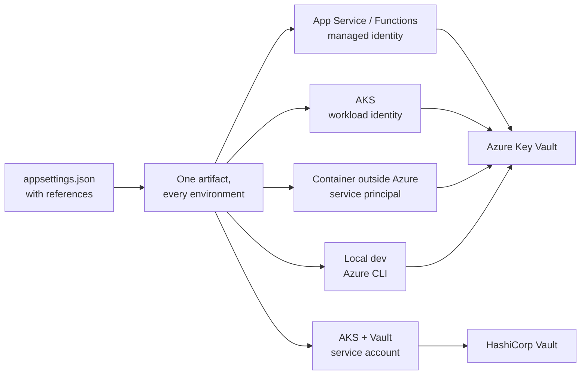

# Environment Deployment Guide

## Overview and Purpose

The library's premise is that one `appsettings.json` works everywhere. What differs between environments is not the configuration file but the *identity* the process authenticates with, and that is what this guide covers: which identity to use per host, which options make that identity the only one reachable, and what has to be true of the vault before any of it works.

The recipes below are ordered roughly from most to least preferred. Managed identity and Kubernetes service account auth are the two targets worth designing towards, because neither requires provisioning a credential into the workload. Everything below those — service principals in environment variables, Vault tokens — exists because some deployments cannot reach the good options, not because they are reasonable defaults.

One rule cuts across all of them: **register the resolver after every source that might contain a reference, and before nothing that should shadow it.** Sources added before the resolver are scanned; sources added after are not, and can override resolved values.

## Architecture Diagram



The point of the diagram is the left-hand side: one artifact. Nothing environment-specific belongs in the configuration file, because the reference string is identical everywhere. The branch happens in the option values, which come from code conditioned on `builder.Environment` — the options are not bound from configuration, since the library configures the configuration system.

## Prerequisites

### Common

- .NET Framework 4.6.1+ or .NET Core 2.0+ / .NET 5+. The libraries target netstandard2.0.
- `KeyVaultReferenceResolver`, and `KeyVaultReferenceResolver.HashiCorp` if using Vault. **Install matching versions** — the two packages are released in lockstep.
- Outbound HTTPS to the vault. Port 443 to `*.vault.azure.net` or your Vault address.

### Azure Key Vault

Before the first deployment:

1. **An identity.** Managed identity preferred; a service principal only where managed identity is unavailable.
2. **A role assignment.** `Key Vault Secrets User` is the least-privilege built-in role that permits reading secret values:

   ```bash
   # Confirm the subscription, resource group and vault name before running this.
   az role assignment create \
     --role "Key Vault Secrets User" \
     --assignee-object-id "$PRINCIPAL_OBJECT_ID" \
     --assignee-principal-type ServicePrincipal \
     --scope "/subscriptions/$SUB/resourceGroups/$RG/providers/Microsoft.KeyVault/vaults/$VAULT"
   ```

   Scope to a single secret rather than the whole vault where the secret set is stable:

   ```bash
   --scope ".../vaults/$VAULT/secrets/$SECRET_NAME"
   ```

   On a vault still using legacy access policies, the equivalent is the `Get` secret permission. Prefer migrating the vault to RBAC.

3. **Network reachability.** If the vault has `publicNetworkAccess: Disabled`, the workload needs a private endpoint and DNS that resolves the vault host to it. A vault firewall rejecting the caller produces the same HTTP 403 as a missing role assignment, which is why the library's 403 message names both.

4. **Vault hardening**, independent of this library: soft delete enabled (default, and no longer disableable), purge protection enabled, diagnostic logging to a Log Analytics workspace so `SecretGet` operations are auditable on the vault side as well as in the application.

### HashiCorp Vault

1. **A reachable HTTPS address.** `VAULT_ADDR` or `options.VaultAddress`.
2. **An auth method enabled** on the Vault server — `kubernetes`, `approle`, or a provisioned token.
3. **A policy** granting read on the specific path prefix. Minimum for KV v2:

   ```hcl
   # KV v2 — read one application's secrets and nothing else
   path "secret/data/myapp/*" {
     capabilities = ["read"]
   }
   ```

   For KV v1 the path has no `data` segment:

   ```hcl
   path "secret/myapp/*" {
     capabilities = ["read"]
   }
   ```

   Add only if you also need secret metadata such as versions or timestamps:

   ```hcl
   path "secret/metadata/myapp/*" {
     capabilities = ["read", "list"]
   }
   ```

   **`sys/mounts` is deliberately not required.** The resolver probes the KV version with the permissions the application already holds rather than asking Vault which version the mount runs, specifically so a least-privileged policy suffices.

## How It Works

### Azure App Service and Azure Functions

The best-supported target, and the one whose reference syntax the library reproduces.

```csharp
var builder = WebApplication.CreateBuilder(args);

builder.Configuration.AddKeyVaultReferenceResolver(options =>
{
    options.ExcludeEnvironmentCredential = true;
    options.AllowDeveloperCredentials = false;

    // Only when the app has more than one user-assigned identity.
    options.ManagedIdentityClientId = builder.Configuration["Azure:ManagedIdentityClientId"];
});
```

Enable a managed identity on the app and grant it `Key Vault Secrets User`. A system-assigned identity is simplest; a user-assigned identity is preferable when several apps should share one role assignment, or when the identity must outlive the app resource.

`ExcludeEnvironmentCredential = true` matters here. App Service surfaces every application setting as an environment variable, so an `AZURE_CLIENT_SECRET` setting left over from an earlier deployment model would take priority over the managed identity — and the credential chain would use it silently.

If you also use App Service's *native* Key Vault reference support, the platform resolves those references before the application starts and the library never sees them. Mixing is harmless but confusing; pick one.

Functions is identical. On the Consumption plan, note that resolution happens per cold start, so `OverallTimeout` should sit well inside the platform's startup budget.

### Azure Kubernetes Service — workload identity

```csharp
builder.Configuration.AddKeyVaultReferenceResolver(options =>
{
    options.ExcludeEnvironmentCredential = true;
});
```

`DefaultAzureCredential` includes a workload identity step that picks up the projected federated token, so no explicit credential is needed — provided the pod is labelled and the service account annotated:

```yaml
apiVersion: v1
kind: ServiceAccount
metadata:
  name: myapp
  annotations:
    azure.workload.identity/client-id: "<user-assigned-identity-client-id>"
---
apiVersion: apps/v1
kind: Deployment
spec:
  template:
    metadata:
      labels:
        azure.workload.identity/use: "true"
    spec:
      serviceAccountName: myapp
```

To be explicit rather than relying on chain ordering:

```csharp
options.Credential = new WorkloadIdentityCredential();
```

Remember that setting `Credential` makes `ExcludeEnvironmentCredential`, `AllowDeveloperCredentials`, `ManagedIdentityClientId`, `TenantId` and `AuthorityHost` inert.

Prefer workload identity over AAD Pod Identity, which is deprecated, and over a service principal secret in a Kubernetes `Secret`.

### Kubernetes with HashiCorp Vault

```csharp
builder.Configuration.AddHashiCorpVaultResolver(options =>
{
    options.VaultAddress = "https://vault.example.com";
    options.AuthMethod = KubernetesAuthMethod.FromFile("myapp-role");
    options.KvVersion = 2;
});
```

Three things are being done deliberately here.

**`VaultAddress` pins the vault.** A reference naming any other address is refused with *"Refusing to authenticate against an unexpected vault."* Without this, a tampered configuration value can send the pod's Vault token to a host of the attacker's choosing — and a Vault token is a bearer credential that host can replay.

**`AuthMethod` is explicit.** Auto-detection tries `VAULT_TOKEN` first, so a stray token in the container environment would win over the service account. Setting it removes the question. If you do rely on auto-detection, `KubernetesRoleName` must be set — Kubernetes auth can never be reached by environment alone.

**`KvVersion = 2`** removes a round trip per read that the version probe would otherwise spend.

`KubernetesAuthMethod.FromFile` re-reads the projected token on every login, which is required rather than optional: the kubelet rotates bound service account tokens at roughly 80% of their lifetime, and VaultSharp caches its login until it expires. A JWT captured once would work at startup and fail an hour later. See [Vault-Authentication-Methods.md](../Features/Vault-Authentication-Methods.md).

The pod needs `automountServiceAccountToken` left at its default, and the Vault role must bind the service account:

```bash
vault write auth/kubernetes/role/myapp-role \
  bound_service_account_names=myapp \
  bound_service_account_namespaces=production \
  policies=myapp-read \
  ttl=1h
```

A `ttl` shorter than the workload's read interval produces a steady stream of `Reauthenticated` (2102) records — functional, but a sign the TTL is too tight.

### Containers outside Azure

The least preferred Azure path, because it requires a real secret to reach the container.

```csharp
builder.Configuration.AddKeyVaultReferenceResolver(options =>
{
    options.AllowDeveloperCredentials = false;
    // ExcludeEnvironmentCredential must stay false — the environment
    // credential is the only thing available here.
});
```

With `AZURE_CLIENT_ID`, `AZURE_TENANT_ID` and `AZURE_CLIENT_SECRET` in the environment, the chain's environment credential is what authenticates.

Mitigations, in order of value: use a federated credential (OIDC) instead of a client secret where the platform supports it; if a secret is unavoidable, mount it as a file and read it into a `ClientSecretCredential` rather than leaving it in the environment where every child process and crash dump can see it; rotate it on a schedule; scope it to a single vault.

```csharp
// Mounted-file variant — keeps the secret out of the process environment.
var clientSecret = File.ReadAllText("/run/secrets/azure-client-secret").Trim();
options.Credential = new ClientSecretCredential(tenantId, clientId, clientSecret);
options.ExcludeEnvironmentCredential = true; // inert once Credential is set, but states intent
```

### Local development — Azure

```csharp
builder.Configuration.AddKeyVaultReferenceResolver(options =>
{
    options.AllowDeveloperCredentials = builder.Environment.IsDevelopment();
});
```

`AllowDeveloperCredentials` re-enables the Azure CLI, Azure Developer CLI, Visual Studio and Azure PowerShell credentials. `az login` first.

Two things to get right. **Point developers at a dev vault, not production** — a developer identity is usually far more privileged than a workload's, and granting it production secret access defeats the separation the vault provides. And **keep `ThrowOnResolveFailure` on**. Turning it off to work offline produces `null` configuration values and a confusing cascade of downstream errors; use `MockSecretResolver` or a local-only configuration source instead. See [Local-Setup-And-Testing.md](../Development/Local-Setup-And-Testing.md).

The conditional means the same code is safe in production: `IsDevelopment()` is false there, and the developer credentials stay excluded.

### Local development — HashiCorp Vault

```bash
vault server -dev   # prints a root token
export VAULT_ADDR=http://127.0.0.1:8200
export VAULT_TOKEN=<dev-root-token>
```

```csharp
builder.Configuration.AddHashiCorpVaultResolver(options =>
{
    options.AllowInsecureTransport = builder.Environment.IsDevelopment();
});
```

`AllowInsecureTransport` is required because a dev Vault serves plaintext HTTP. Gate it on the environment check — over plaintext the token and the secret both travel in the clear, and "it's only inside the cluster" is not an exception.

Note that the `hashicorp://` reference format always reconstructs `https://`, so a plaintext dev Vault needs the `@HashiCorp.Vault(VaultAddress=http://...)` attribute format.

### Sovereign clouds

Two settings must agree, plus possibly a third.

```csharp
// Azure US Government
builder.Configuration.AddKeyVaultReferenceResolver(options =>
{
    options.AuthorityHost = new Uri("https://login.microsoftonline.us/");
    options.VaultDnsSuffix = "vault.usgovcloudapi.net";
    options.ExcludeEnvironmentCredential = true;
});
```

```csharp
// Azure China
options.AuthorityHost = new Uri("https://login.chinacloudapi.cn/");
options.VaultDnsSuffix = "vault.azure.cn";
```

`AuthorityHost` is where tokens are issued; `VaultDnsSuffix` is the host a `VaultName=` reference composes into. Getting only one right produces either an authentication failure against the wrong authority or a DNS failure for a `vault.azure.net` host.

The default `AllowedVaultHostSuffixes` already covers the US Government, China and Germany clouds plus Managed HSM, so no change is needed there. `SecretUri=` references carry their own host and are unaffected by `VaultDnsSuffix` — but they are still checked against the allowlist.

One caveat: the public `ExtractSecretUri` helper has no options parameter and always composes `VaultName` references against `vault.azure.net`. Prefer `SecretUri=` references in a sovereign cloud if you also use that helper.

### CI/CD pipelines

```csharp
// A pipeline resolving references to run integration tests.
builder.Configuration.AddKeyVaultReferenceResolver(options =>
{
    options.AllowDeveloperCredentials = false;
    options.ExcludeEnvironmentCredential = false; // OIDC federation populates these
});
```

Use a federated credential (OIDC / workload identity federation) so no long-lived secret is stored in the pipeline. GitHub Actions and Azure DevOps both support it, and this repository's own release workflow uses the same mechanism for NuGet publishing — see [Release-And-Publishing.md](../Development/Release-And-Publishing.md).

Better still, do not resolve real secrets in CI at all. Use `MockSecretResolver` for unit and integration tests, and reserve vault access for deployment-time smoke tests against a dedicated test vault.

## Recommended settings by environment

| Environment | Identity | Key options |
| --- | --- | --- |
| App Service / Functions | Managed identity | `ExcludeEnvironmentCredential = true`; `ManagedIdentityClientId` if >1 identity |
| AKS (Key Vault) | Workload identity | `ExcludeEnvironmentCredential = true`; optionally explicit `WorkloadIdentityCredential` |
| AKS (Vault) | K8s service account | `VaultAddress`, `AuthMethod = KubernetesAuthMethod.FromFile(role)`, `KvVersion` |
| Azure VM | Managed identity | `ExcludeEnvironmentCredential = true` |
| Container outside Azure | Service principal / OIDC | leave `ExcludeEnvironmentCredential = false`, or mount the secret as a file |
| Local dev (Azure) | Azure CLI | `AllowDeveloperCredentials = IsDevelopment()` |
| Local dev (Vault) | `VAULT_TOKEN` | `AllowInsecureTransport = IsDevelopment()` |
| CI/CD | Federated credential | prefer `MockSecretResolver`; never a long-lived secret |
| Sovereign cloud | as above | `AuthorityHost` **and** `VaultDnsSuffix` together |

## Design Decisions and Trade-offs

**One artifact, environment-specific options in code.** The library cannot bind its own options from configuration, since it configures the configuration system. The upside is that environment logic is visible and type-checked in `Program.cs`; the downside is that it cannot be changed without a redeploy.

**Developer credentials off by default.** Local development needs one extra line. Worth it: the alternative is a process in Azure silently falling back to a developer's cached identity.

**`ExcludeEnvironmentCredential` on by recommendation rather than by default.** Flipping the default would break every 1.x consumer using a service principal in environment variables. Every deployment recipe above sets it explicitly instead.

**Vault address pinning recommended everywhere.** `VaultAddress` costs a line of configuration and closes the package's weakest default. There is no automatic equivalent, because Vault has no well-known DNS suffix to allowlist the way Azure does.

**No `sys/mounts` requirement.** Costs one round trip per read on a KV v1 mount when `KvVersion` is unset. Worth it — the alternative forces every consumer to widen its Vault policy.

**`OverallTimeout` defaults to 2 minutes.** Chosen to sit inside typical container startup probe windows, so the library reports a vault outage rather than the orchestrator killing the pod with no explanation. Tighten it if your probe threshold is lower.

## Integration Points

- **Azure managed identity / workload identity** — via `DefaultAzureCredential`. No credential material in the workload.
- **Kubernetes service accounts** — projected token at a fixed path, re-read per login, validated by Vault's `kubernetes` auth method.
- **Azure RBAC** — `Key Vault Secrets User`, scoped to a vault or to individual secrets.
- **Azure Private Link** — a private endpoint plus DNS for a vault with public access disabled. The host must still match `AllowedVaultHostSuffixes`; a private endpoint keeps the `*.vault.azure.net` name, so no change is needed unless custom DNS is in play.
- **Vault policies** — path-scoped `read`. No `sys/*` capability required.
- **Vault Enterprise namespaces** — `options.Namespace`.
- **App Service native Key Vault references** — resolved by the platform before startup; the library never sees them. Choose one mechanism.

## Important Considerations

### Performance

- Resolution happens once per process start. On App Service Consumption plans that means per cold start.
- Distinct Azure secret URIs are deduplicated and fetched at `MaxConcurrency` (8). HashiCorp references are not deduplicated.
- One `SecretClient` / `IVaultClient` and one credential acquisition per vault.
- `OverallTimeout` should be below the orchestrator's startup probe threshold.
- Staggering instance startup avoids a fleet hitting one vault simultaneously and triggering HTTP 429.

### Security

- Scope the role assignment to individual secrets where the secret set is stable.
- Set `ExcludeEnvironmentCredential = true` in every Azure deployment with a managed or workload identity.
- Set `VaultAddress` in every HashiCorp deployment.
- Never clear `AllowedVaultHostSuffixes`; add to it.
- `AllowInsecureTransport` is for `vault server -dev` only. Pod-to-pod plaintext is still plaintext.
- Point developers at a dev vault. A developer identity with production secret access defeats the separation.
- Resolved secrets are ordinary strings in `IConfiguration` and appear in a process dump and in `GetDebugView()`. Do not expose that view.

### Operational

- Pass an `ILogger` to the extension method, or startup resolution — including its failures — is silent.
- 403 at startup: check the role assignment **and** the vault firewall. The status cannot distinguish them.
- 404 at startup: check the secret name, then the vault's soft-deleted list.
- A rotated secret does not reach a running application. Plan a rolling restart.
- Alert on `ResolutionFailed` (1003 / 2003) and on `AuthMethodSelected` (2101) reporting an unexpected method. Catalogue in [Logging-And-Monitoring.md](../Operations/Logging-And-Monitoring.md).
- Install matching versions of the two packages; they are released in lockstep and not tested against each other's older releases.
