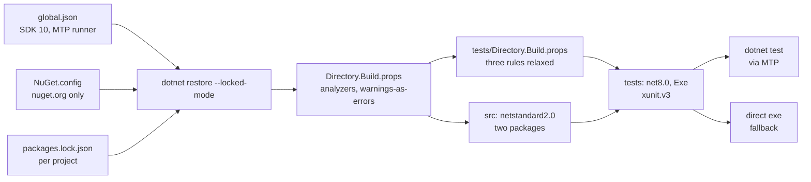

# Local Setup and Testing

## Overview and Purpose

This document covers building the solution and working with its test suites. [CONTRIBUTING.md](../../CONTRIBUTING.md) is the authoritative statement of the branch and review flow and of what a change to the resolution path additionally needs; this is the technical companion — why the toolchain is arranged as it is, how the test projects are structured, and the conventions that will bite an unfamiliar contributor.

Three things about the setup are non-obvious enough to state up front.

**The SDK floor is higher than the target framework.** The libraries target netstandard2.0, so consumers need only .NET 8+. Building the repository requires the .NET 10 SDK, because the test projects run on Microsoft.Testing.Platform. That asymmetry is deliberate and is a contributor requirement only.

**Release builds treat warnings as errors; Debug builds do not.** Iterate in Debug, then check `-c Release` before pushing, or CI will find what you did not.

**Lock files are committed and CI restores in locked mode.** Change a `PackageReference` without running `dotnet restore` and committing the updated `packages.lock.json`, and the build fails.

## Architecture Diagram



The two `Directory.Build.props` files are worth noticing. MSBuild only auto-imports the *nearest* one, so the test-level file imports the repository-level one explicitly via `GetPathOfFileAbove` — without that line, test projects would silently lose the analyzer and lock-file settings rather than inheriting them.

## Prerequisites

| Requirement | Version | Why |
| --- | --- | --- |
| .NET SDK | **10.0+** (pinned in [global.json](../../global.json)) | test projects run on Microsoft.Testing.Platform |
| .NET runtime | 8.0 | test projects target `net8.0` |
| Git | any | |
| IDE | Visual Studio 2022 17.8+, Rider, or VS Code + C# Dev Kit | optional |

```json
{
  "sdk": {
    "version": "10.0.0",
    "rollForward": "latestMajor"
  },
  "test": {
    "runner": "Microsoft.Testing.Platform"
  }
}
```

`rollForward: latestMajor` means a newer SDK is accepted, so the pin is a floor rather than an exact match. The `test.runner` key is what makes `dotnet test` drive the xunit.v3 assemblies through Microsoft.Testing.Platform instead of VSTest.

No Azure subscription or Vault server is needed. The whole suite runs offline against `MockSecretResolver` and Moq.

## How It Works

### Getting set up

```bash
git clone https://github.com/gijswalraven/KeyVaultReferenceResolver.git
cd KeyVaultReferenceResolver
dotnet restore --locked-mode
dotnet build -c Release
dotnet test -c Release
```

Use `--locked-mode` locally too, so a discrepancy between the lock files and the project files shows up on your machine rather than in CI.

### Build configuration

Repository-wide settings live in [Directory.Build.props](../../Directory.Build.props):

```xml
<EnableNETAnalyzers>true</EnableNETAnalyzers>
<AnalysisLevel>latest-Recommended</AnalysisLevel>
<EnforceCodeStyleInBuild>false</EnforceCodeStyleInBuild>
<TreatWarningsAsErrors Condition="'$(Configuration)' == 'Release'">true</TreatWarningsAsErrors>
<NuGetAudit>true</NuGetAudit>
<NuGetAuditMode>all</NuGetAuditMode>
<RestorePackagesWithLockFile>true</RestorePackagesWithLockFile>
```

The file's own comment explains the intent: kept in one place

> so that "we run static analysis on our secrets library" is demonstrable from one place rather than asserted.

- **Analyzers on, code style off.** Correctness and nullability warnings are enforced; formatting preferences are not, so a contributor is not fighting the analyzer over brace placement.
- **Warnings as errors in Release only.** Debug stays warning-only so local iteration is not blocked mid-edit.
- **`NuGetAuditMode=all`** surfaces advisories for transitive packages, not just direct ones. CI additionally fails on the vulnerable-package listing, because audit findings arrive as restore *warnings* rather than build errors.
- **`ContinuousIntegrationBuild`** is set when `GITHUB_ACTIONS` is true, which normalises the source paths embedded in the PDBs. Without it, SourceLink symbols carry the runner's absolute paths.

Test projects add one override, in [tests/Directory.Build.props](../../tests/Directory.Build.props):

```xml
<NoWarn>$(NoWarn);CA1707;CA1806;CA1711</NoWarn>
```

CA1707 (no underscores in identifiers) conflicts with the `Method_Scenario_ExpectedResult` naming convention. CA1806 (do not ignore method results) conflicts with tests that call a constructor purely to assert it does not throw. CA1711 (no type names ending in `Collection`) conflicts with xUnit's collection-definition convention, where the attribute reference is by string. Production code keeps the full set; do not add suppressions there without a reason written in the file.

### Restore sources and lock files

[NuGet.config](../../NuGet.config) clears inherited sources and pins nuget.org:

```xml
<packageSources>
  <clear />
  <add key="nuget.org" value="https://api.nuget.org/v3/index.json" protocolVersion="3" />
</packageSources>
```

The `<clear />` is the important element. Without it, restore uses whatever sources are configured on the machine or agent — which on a corporate workstation routinely includes private feeds. A private feed serving a package with one of these IDs would then be consulted or preferred, which is the dependency-confusion path. A `packageSourceMapping` binds every pattern to nuget.org explicitly, so adding a second source later cannot silently widen where existing packages come from.

Do not add a private feed. Four `packages.lock.json` files (two `src`, two `tests`) pin the full transitive closure; regenerate with `dotnet restore` after changing a `PackageReference` and commit the result in the same pull request.

### Solution layout

```text
src/
  KeyVaultReferenceResolver/              netstandard2.0, the core package
  KeyVaultReferenceResolver.HashiCorp/    netstandard2.0, ProjectReference to core
tests/
  KeyVaultReferenceResolver.Tests/            net8.0, Exe
  KeyVaultReferenceResolver.HashiCorp.Tests/  net8.0, Exe
```

One test project per library, each referencing only its own. The HashiCorp test project gets the core package transitively through the project reference, which is why it can use `MockSecretResolver`.

### Test project setup

```xml
<TargetFramework>net8.0</TargetFramework>
<ImplicitUsings>enable</ImplicitUsings>
<Nullable>enable</Nullable>
<IsPackable>false</IsPackable>
<IsTestProject>true</IsTestProject>
<!-- xunit.v3 test projects are self-executing -->
<OutputType>Exe</OutputType>
```

```xml
<PackageReference Include="Moq" Version="4.20.72" />
<PackageReference Include="xunit.v3" Version="4.0.1" />
```

`OutputType=Exe` is the xunit.v3 model: a test assembly is a runnable program. `dotnet test` works through the `test.runner` key in `global.json`, and the executables can also be run directly:

```bash
tests/KeyVaultReferenceResolver.Tests/bin/Release/net8.0/KeyVaultReferenceResolver.Tests.exe
```

That is the documented fallback when `dotnet test` reports *"Zero tests ran"* — a local toolchain quirk rather than a broken suite.

Moq is present but used sparingly; most tests use `MockSecretResolver` or a hand-written counting double.

### Test suites

| Project | File | Covers |
| --- | --- | --- |
| Core | `KeyVaultReferenceResolverExtensionsTests` | the pipeline: discovery, dedup, concurrency, failure contract |
| Core | `KeyVaultSecretResolverTests` | URI parsing, host allowlist, credential construction, error mapping |
| Core | `CachingBehaviourTests` | caching, `forceRefresh`, `InvalidateCache`, validity — by counting vault fetches |
| Core | `EmbeddedReferenceTests` | references inside larger values, multiple per value, all-or-nothing substitution |
| Core | `SecretLeakageTests` | **no secret reaches a log or an exception** |
| Core | `KeyVaultReferenceResolutionExceptionTests` | constructor masking |
| Core | `KeyVaultReferenceResolverOptionsTests` | `Validate()` |
| Core | `MockSecretResolverTests` | the test double itself |
| HashiCorp | `HashiCorpVaultReferenceExtensionsTests` | the Vault pipeline |
| HashiCorp | `HashiCorpVaultSecretResolverTests` | reference parsing, mount splitting, address trust |
| HashiCorp | `SecretPathValidationTests` | `..` traversal and illegal characters |
| HashiCorp | `AuthenticationTests` | the three auth methods and detection order |
| HashiCorp | `HashiCorpVaultResolverOptionsTests` | `Validate()`, `GetEffective*` |
| HashiCorp | `VaultEnvironmentCollection` | the non-parallel collection definition |

Two of these deserve particular attention.

`SecretLeakageTests` is a guard rail rather than a unit test. It plants a sentinel secret value, runs resolution with a capturing logger, and asserts the sentinel appears nowhere in the log output or in exception messages and properties. From [CONTRIBUTING.md](../../CONTRIBUTING.md):

> **No new secret in a log or an exception.** `SecretLeakageTests` enforces this with a sentinel value; if you add a log or exception that carries a reference, extend it.

`CachingBehaviourTests` establishes its assertions by *counting vault fetches* rather than inspecting cache internals. That is the right shape for testing a cache: it asserts observable behaviour ("a second resolution of the same URI does not hit the vault") rather than implementation detail, so a cache rewrite that preserves behaviour does not break the tests.

### Testing conventions

**Plain xUnit assertions.** `Assert.Equal`, `Assert.Throws<T>`, `Assert.Contains`. FluentAssertions is deliberately not referenced.

**`Assert.Throws<T>` matches the exception type exactly.** Use `Assert.ThrowsAny<T>` when a derived type is acceptable — a recurring source of confusing failures.

**Pass a cancellation token to async calls that accept one**, enforced by analyzer xUnit1051:

```csharp
await resolver.ResolveSecretAsync(uri, TestContext.Current.CancellationToken);
```

**Name tests `Method_Scenario_ExpectedResult`**, so a CI failure reads as a sentence: `ResolveSecretAsync_HostNotAllowed_Throws`.

**Environment-mutating tests must join the `"VaultEnvironment"` collection.**

```csharp
[CollectionDefinition("VaultEnvironment", DisableParallelization = true)]
public class VaultEnvironmentCollection
{
}
```

> Serializes the test classes that mutate the process-wide VAULT_* environment variables. Without this they race: one class clears VAULT_TOKEN while another is asserting on it.

`Environment.SetEnvironmentVariable` affects the whole process, and xUnit runs collections in parallel by default. Any class touching `VAULT_ADDR`, `VAULT_TOKEN`, `VAULT_ROLE_ID` or `VAULT_SECRET_ID` needs the attribute:

```csharp
[Collection("VaultEnvironment")]
public class MyEnvironmentTests
{
}
```

Symptom of forgetting: intermittent failures that pass in isolation.

**Prefer `MockSecretResolver` over a live vault.** The whole suite runs offline; keep it that way.

### MockSecretResolver

The test double in the *main* package, at [MockSecretResolver.cs](../../src/KeyVaultReferenceResolver/MockSecretResolver.cs).

```csharp
var resolver = new MockSecretResolver()
    .AddSecret("https://myvault.vault.azure.net/secrets/db-password", "s3cret")
    .AddSecret("https://myvault.vault.azure.net/secrets/api-key", "key123");

var config = new ConfigurationBuilder()
    .AddInMemoryCollection(new Dictionary<string, string?>
    {
        ["Db:Password"] = "@Microsoft.KeyVault(SecretUri=https://myvault.vault.azure.net/secrets/db-password)"
    })
    .AddKeyVaultReferenceResolver(resolver)
    .Build();

Assert.Equal("s3cret", config["Db:Password"]);
```

| Member | Behaviour |
| --- | --- |
| `MockSecretResolver()` | empty, `throwOnMissing: true` |
| `MockSecretResolver(Dictionary<string,string>, bool throwOnMissing = true)` | seeded |
| `AddSecret(uri, value)` | returns `this` for chaining |
| `AddSecrets(Dictionary)` | returns `this` |
| `Clear()`, `Count`, `ContainsSecret(uri)` | inspection |

`throwOnMissing: true` raises `KeyNotFoundException` with a **masked** URI — masked because the exception becomes the `InnerException` of the resolution failure the pipeline logs, and an unmasked URI there would put the secret name into the log by the back door.

`throwOnMissing: false` returns an empty string for every unknown secret. Useful for asserting the fail-open shape, and dangerous in application code: an application wired to it would start with empty passwords and API keys rather than failing.

Backed by a `ConcurrentDictionary`, because reference resolution now fetches concurrently and a test may add a secret while a resolution is in flight.

Three containment measures make it harder to use by accident: `[EditorBrowsable(EditorBrowsableState.Never)]` keeps it out of IntelliSense, the XML docs open with **"Test use only. Never register this in an application that runs in production"**, and `throwOnMissing` defaults to `true`. It ships in the production package for convenience, which is a known risk — see [Security-Model.md](../Architecture/Security-Model.md).

### Working offline

Do not disable `ThrowOnResolveFailure` to work without vault access. That produces `null` configuration values and a confusing cascade of downstream errors. Either register a `MockSecretResolver`, or use a local-only configuration source that supplies literal values instead of references:

```csharp
if (builder.Environment.IsDevelopment() && offline)
{
    builder.Configuration.AddJsonFile("appsettings.Offline.json", optional: true);
    // literal values, gitignored — no references to resolve
}
else
{
    builder.Configuration.AddKeyVaultReferenceResolver(/* ... */);
}
```

### Debugging into the library

Both packages ship SourceLink and symbol packages (`.snupkg`), with `EmbedUntrackedSources` and `PublishRepositoryUrl` set. Enable *Source Link* and disable *Just My Code* in the debugger to step through library sources from a consuming application.

## Key Components

### global.json

Pins the SDK floor and selects Microsoft.Testing.Platform as the test runner. Both keys are load-bearing.

### Directory.Build.props (root and tests)

Analyzers, warnings-as-errors in Release, NuGet audit, lock files, CI path normalisation. The tests variant relaxes exactly three rules and explains each in a comment.

### NuGet.config

Source pinning and package source mapping, against dependency confusion.

### VaultEnvironmentCollection

The single-collection definition that serialises environment-mutating tests.

### SecretLeakageTests

The sentinel-based guard against a secret reaching a log or exception. Extend it when you add a record or an exception that carries a reference.

### MockSecretResolver

The offline test double. Fluent, thread-safe, deliberately hard to reach for by accident.

## Design Decisions and Trade-offs

**.NET 10 SDK to build a netstandard2.0 library.** Raises the contributor bar to get Microsoft.Testing.Platform and current analyzers. Consumers are unaffected — the packages still target netstandard2.0 and need only .NET 8+ at runtime.

**Warnings as errors in Release only.** A single mode would either block local iteration or let warnings ship. The split costs a `-c Release` check before pushing.

**Analyzers on, code style off.** Enforces correctness without turning every pull request into a formatting argument. The cost is inconsistent formatting across files.

**Lock files committed, CI in locked mode.** Every dependency change becomes a reviewable diff and a restore is reproducible. The cost is a rebuild-and-commit step whenever a `PackageReference` changes, which is a routine source of failed first builds.

**`<clear />` in NuGet.config.** Closes dependency confusion. Also means a contributor behind a corporate proxy that requires a private mirror cannot restore without local modification — a deliberate trade.

**Three relaxed analyzer rules in tests, each with a written reason.** Better than a blanket suppression, and better than contorting test names to satisfy CA1707.

**One test project per library.** Keeps the dependency graph honest: the core test project cannot accidentally depend on VaultSharp. The cost is duplicated helper code between the two.

**Ship the test double in the production package.** Convenient and risky, mitigated by three signals rather than solved by a separate package — which would be cleaner and a breaking change.

**Non-parallel collection rather than injected environment access.** An `IEnvironment` abstraction would remove the need entirely and would add an interface and a constructor parameter to the options class purely for testability. The collection was preferred; the cost is a convention a contributor must remember.

**Test caching by counting fetches.** Asserts behaviour rather than internals, so a cache rewrite that preserves semantics does not break the suite.

## Integration Points

- **Microsoft.Testing.Platform** — the runner, selected via `global.json`. Test assemblies are self-executing.
- **xunit.v3 4.0.1** — including analyzer xUnit1051, which requires a cancellation token on async calls that accept one.
- **Moq 4.20.72** — present for interface mocking; most tests use `MockSecretResolver` or a counting double.
- **Roslyn analyzers** — `latest-Recommended` via `EnableNETAnalyzers`.
- **NuGet audit** — `NuGetAuditMode=all` covers transitive packages; CI adds a hard gate.
- **SourceLink** — `Microsoft.SourceLink.GitHub` plus `.snupkg` symbol packages.
- **GitHub Actions** — the same commands, plus `--locked-mode`, plus CodeQL and Scorecard. See [Release-And-Publishing.md](../Development/Release-And-Publishing.md).

## Important Considerations

### Performance

- Test collections run in parallel except `"VaultEnvironment"`.
- The whole suite is offline — no network, no vault, no credentials.
- `dotnet build --no-restore` after a restore saves noticeable time when iterating.
- Analyzers add build time; a Debug build skips the warnings-as-errors pass but still runs them.

### Security

- **Never commit a real secret**, token, connection string or certificate — not even a redacted-looking one, and not in a test fixture.
- Extend `SecretLeakageTests` when adding a log record or exception that carries a reference.
- Do not add a private feed to `NuGet.config`.
- A security fix should come with a test demonstrating the *old* behaviour was exploitable; that is worth more than one asserting the new behaviour is correct.
- Never register `MockSecretResolver` in application code. Guard any conditional registration with an environment check.

### Operational

- `dotnet restore --locked-mode` locally, so lock-file drift surfaces on your machine.
- Check `-c Release` before pushing; Debug will not show warnings-as-errors failures.
- *"Zero tests ran"* from `dotnet test` — run the test executables directly.
- Intermittent test failures that pass in isolation — a missing `[Collection("VaultEnvironment")]`.
- `Assert.Throws<T>` is exact-match; reach for `Assert.ThrowsAny<T>` when a derived type is fine.
- A `PackageReference` change needs a committed `packages.lock.json` update in the same pull request.
