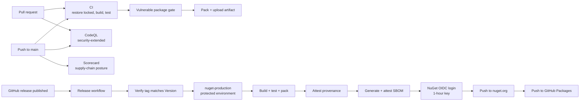

# Release and Publishing

## Overview and Purpose

Two NuGet packages are published from this repository, and a compromise of that pipeline would be a supply-chain compromise of every application that consumes them. The pipeline is therefore built around one assumption: **the publishing path is a higher-value target than the code**. An attacker who can push a package under an existing ID does not need to find a bug in the resolution logic.

That shapes five controls, each closing a specific path:

- **No long-lived publishing credential.** NuGet Trusted Publishing exchanges the workflow's OIDC token for an API key valid for one hour. There is no secret in the repository to steal.
- **Actions pinned to commit SHAs.** A tag like `v4` is mutable and can be repointed at arbitrary code by the action owner or a compromised maintainer account.
- **A protected environment gates the publish job.** Creating a GitHub release is not by itself sufficient to push to nuget.org.
- **Build provenance attestations.** A consumer can verify a `.nupkg` on nuget.org was built from this repository, this workflow and this commit.
- **A pinned, auditable dependency closure.** Lock files, source pinning, `NuGetAudit`, and a CI gate that fails on a vulnerable transitive package.

Four workflows implement this: CI, CodeQL, OpenSSF Scorecard, and Release. The contributor-facing release *procedure* is in [CONTRIBUTING.md](../../CONTRIBUTING.md); this document covers what the automation does and why.

## Architecture Diagram



Note the ordering inside the release job. The tag/version check runs **first**, before anything is built, because NuGet does not permit true deletion — a wrong version pushed is permanent. The OIDC login runs **last**, immediately before the push, because the exchanged key is valid for only an hour and an earlier login could expire during a slow build.

Note also what the Release workflow does *not* reuse: it rebuilds and retests from scratch rather than downloading CI's artifact. That is deliberate, and discussed under *Design Decisions*.

## How It Works

### CI — [ci.yml](../../.github/workflows/ci.yml)

Triggers on pushes to `main` and on pull requests targeting it.

```yaml
permissions:
  contents: read
```

Declared explicitly because, without a block, the job inherits the repository default — which on older repositories is read-write for `GITHUB_TOKEN`.

```yaml
- uses: actions/checkout@11d5960a326750d5838078e36cf38b85af677262 # v4
  with:
    persist-credentials: false
```

Two controls in four lines. The SHA pin is explained in the file's own comment:

> Actions are pinned to commit SHAs: a tag like v4 is mutable and can be repointed at arbitrary code by the action owner or a compromised maintainer account. Dependabot keeps the SHAs and comments current.

`persist-credentials: false` stops `GITHUB_TOKEN` being written into `.git/config`, where any later step — including one from a compromised action — could read it. Nothing in CI pushes, so the credential has no reason to persist.

Both .NET 8 and .NET 10 SDKs are installed: 10 to build (per `global.json`), 8 because the test projects target `net8.0`.

```yaml
- name: Restore dependencies
  run: dotnet restore --locked-mode
```

> Locked mode fails if a committed `packages.lock.json` does not match the project's dependency graph, so a dependency cannot change without the lock file changing in the same pull request.

That is the control that makes dependency changes reviewable. A transitive bump cannot arrive silently between two builds of the same commit.

```yaml
- name: Check for vulnerable dependencies
  run: |
    set -o pipefail
    output="$(dotnet list package --vulnerable --include-transitive)"
    echo "$output"
    if echo "$output" | grep -qE '^\s+> '; then
      echo "::error::Vulnerable packages found - see the listing above."
      exit 1
    fi
```

The gate exists because `NuGetAudit` emits *warnings* during restore, and warnings are non-blocking in Debug — so a known-vulnerable transitive package would ship unnoticed. Parsing the listing for the `> ` marker turns it into a hard failure. `set -o pipefail` so a failure inside the command substitution is not masked.

This is exactly the control that caught the `System.Text.Json` advisory behind the explicit forward pin in the HashiCorp package:

```xml
<!-- Explicit pin: overrides VaultSharp's transitive 8.0.4, which has a High severity advisory (GHSA-8g4q-xg66-9fp4) -->
<PackageReference Include="System.Text.Json" Version="10.0.12" />
```

CI ends with `dotnet pack` and an artifact upload, so a pull request's packages can be inspected before merge.

### CodeQL — [codeql.yml](../../.github/workflows/codeql.yml)

```yaml
on:
  push:
    branches: [main]
  pull_request:
    branches: [main]
  schedule:
    - cron: "31 4 * * 1"
```

> Weekly, so newly published queries reach existing code rather than only code that happens to change.

The schedule is the interesting trigger. Push and pull-request runs only ever analyse code that moved; a weekly run re-analyses everything against whatever queries CodeQL has added since. For a library whose risk is concentrated in code that rarely changes, that is where the value is.

```yaml
queries: security-extended
```

Beyond the default query set, accepting more false positives for wider coverage.

```yaml
# Explicit build rather than autobuild: the solution targets
# netstandard2.0 alongside net8.0 test projects, and autobuild has been
# known to pick only one.
- name: Build
  run: dotnet build -c Release
```

Autobuild analysing only one target framework would silently halve coverage.

### Scorecard — [scorecard.yml](../../.github/workflows/scorecard.yml)

```yaml
on:
  branch_protection_rule:
  schedule:
    - cron: "17 5 * * 1"
  push:
    branches: [main]
```

OpenSSF Scorecard measures repository *configuration* rather than code:

> Continuously measures the supply-chain controls this repository relies on — pinned actions, scoped token permissions, branch protection, signed releases, dependency update tooling — so a regression (an unpinned action, a widened permission) is caught rather than noticed years later.

The `branch_protection_rule` trigger is the notable one: a change to branch protection is exactly the kind of regression that would otherwise go unobserved. The weekly schedule exists because configuration changes independently of the code, so a push trigger would mostly re-measure the same thing.

```yaml
publish_results: false
```

Results go to the repository's Security tab rather than the public Scorecard API, so the posture is visible to maintainers without being advertised.

### Release — [release.yml](../../.github/workflows/release.yml)

Triggered only by a published GitHub release.

```yaml
environment: nuget-production
```

> A protected environment gates the only job that can publish. Configure it with required reviewers and a tag-pattern deployment branch rule, so creating a release is not by itself sufficient to push a package to nuget.org.

This is the control that separates "can create a release" from "can publish a package". With required reviewers configured, the job pauses for approval before it runs. Note the conditional phrasing — the workflow declares the environment, and the protection rules have to be configured on the repository for it to have teeth.

```yaml
permissions:
  packages: write       # GitHub Packages push
  contents: write       # upload the SBOM as a release asset
  id-token: write       # OIDC for Trusted Publishing and attestations
  attestations: write   # record provenance
```

Four narrowly-scoped permissions, each with a comment saying which step needs it. `contents: write` is the widest and exists solely for `gh release upload`.

**Tag/version verification runs first:**

```yaml
env:
  RELEASE_TAG: ${{ github.event.release.tag_name }}
run: |
  tag="$RELEASE_TAG"
  csproj="src/KeyVaultReferenceResolver/KeyVaultReferenceResolver.csproj"
  version="$(grep -oPm1 '(?<=<Version>)[^<]+' "$csproj")"
  if [ "$tag" != "v$version" ]; then
    echo "::error::Release tag '$tag' does not match <Version> '$version' ..."
    exit 1
  fi
```

Two things worth noting. The tag is passed via `env` rather than interpolated into the script, because tag names can legally contain shell metacharacters that would splice into the `run` block — a genuine injection vector in GitHub Actions. And the check runs before any build, because NuGet does not allow true deletion: a wrong version pushed is permanent, so the failure has to happen before anything is pushed.

The check reads only the core package's csproj. That works because the two packages are versioned in lockstep — see *Version lockstep* below — but it means a HashiCorp csproj left at an older version would pass the gate and publish a mismatched pair.

**Build provenance:**

```yaml
- name: Attest build provenance
  uses: actions/attest-build-provenance@e8998f949152b193b063cb0ec769d69d929409be # v2
  with:
    subject-path: "./artifacts/*.nupkg"
```

> Provenance links each package to this repository, this workflow and this commit, so a consumer can verify with `gh attestation verify <file> --repo <owner>/<repo>` that the package on nuget.org was built here and not uploaded from somewhere else.

This is the control that survives a stolen publishing credential. An attacker who somehow pushes a package under these IDs cannot produce a valid attestation, so a consumer who verifies detects it:

```bash
gh attestation verify KeyVaultReferenceResolver.2.0.0.nupkg \
  --repo gijswalraven/KeyVaultReferenceResolver
```

**SBOM generation:**

```yaml
- name: Generate SBOM
  run: |
    version="${RELEASE_TAG#v}"
    dotnet tool restore
    dotnet dotnet-CycloneDX KeyVaultReferenceResolver.sln \
      --output ./sbom \
      --filename KeyVaultReferenceResolver-sbom.cdx.json \
      --output-format Json \
      --exclude-test-projects \
      --exclude-dev \
      --set-version "$version"
```

CycloneDX 6.2.0, pinned in [.config/dotnet-tools.json](../../.config/dotnet-tools.json) with `rollForward: false` so the tool version cannot drift. The SBOM is then *itself* attested and attached to the release:

> An SBOM lets a consumer enumerate the transitive closure — Azure.Identity, VaultSharp and everything under them — without restoring the package themselves.

`--exclude-test-projects` and `--exclude-dev` keep xunit, Moq and the SourceLink build-time packages out of the shipped inventory.

**Trusted Publishing:**

```yaml
- name: NuGet login (OIDC)
  id: nuget-login
  uses: NuGet/login@8d196754b4036150537f80ac539e15c2f1028841 # v1
  with:
    user: GijsWalraven

- name: Publish to NuGet.org
  run: dotnet nuget push ./artifacts/*.nupkg --api-key "$NUGET_API_KEY" ...
  env:
    NUGET_API_KEY: ${{ steps.nuget-login.outputs.NUGET_API_KEY }}
```

> Trusted Publishing: exchange this job's OIDC token for a short-lived nuget.org API key, so no long-lived secret is stored in the repo. The temporary key is valid for one hour, so this runs immediately before the push rather than earlier in the job.

No long-lived API key exists to leak, and the exchange requires a matching policy on nuget.org bound to this owner, repository and workflow file. Renaming `release.yml` breaks publishing until the policy is updated — a deliberate coupling.

The `user` value is a nuget.org profile name and is public information, since it is the listed owner of the packages.

**GitHub Packages** is pushed last with `continue-on-error: true`, so a failure there does not fail a release whose nuget.org push already succeeded.

### Dependabot — [dependabot.yml](../../.github/dependabot.yml)

Weekly, Monday, two ecosystems.

```yaml
# NuGet dependencies. Azure.Identity, Azure.Security.KeyVault.Secrets and
# VaultSharp all sit directly in the credential path, so advisories against
# them matter more here than in an average library.
```

Grouped so related packages move together: `azure-sdk` (`Azure.*`), `microsoft-extensions` (`Microsoft.Extensions.*`), and `test-dependencies` (xunit, Moq, coverlet, test SDK). The Azure SDK grouping matters because those packages are versioned and tested together upstream, and splitting them across pull requests produces combinations Microsoft never tested.

The `github-actions` ecosystem bumps the pinned SHAs *and* their trailing version comments, which is what keeps SHA pinning maintainable rather than a one-time exercise.

### CODEOWNERS — [.github/CODEOWNERS](../../.github/CODEOWNERS)

Review is requested automatically. Security-sensitive surfaces are listed separately even though the owner is currently the same person:

> Called out separately so that a change here is visible as such in the pull request.

The separately-listed paths are `/src/` (the resolution path), `/.github/workflows/` and `/.config/` (anything that can publish a package, mint a token, or run with repository secrets), the two `Directory.Build.props` files plus `NuGet.config` and `global.json` (build and dependency policy), and `SECURITY.md`.

Like the protected environment, this has teeth only once branch protection requires code-owner review.

## Version lockstep

The two packages are released together and their `<Version>` elements must move together. Nothing in the automation enforces this — the release workflow's tag check reads only the core csproj — so it is a manual discipline.

The reason is the `ProjectReference`. `KeyVaultReferenceResolver.HashiCorp` references the core project, so a released HashiCorp package carries a `PackageReference` dependency on the core package at the version it was built against. Diverging versions produce combinations that were never built or tested together, and the HashiCorp package implements `ISecretResolver` from the core package — an interface change would break across a version gap.

Release procedure, from [CONTRIBUTING.md](../../CONTRIBUTING.md):

1. Bump `<Version>` in **both** `src/**/*.csproj` and add the CHANGELOG section.
2. Tag `vX.Y.Z` and publish a GitHub release.
3. The workflow verifies the tag against the csproj version, then packs, attests, generates the SBOM, and publishes via Trusted Publishing — pausing for approval in the `nuget-production` environment.

Semantic versioning, with one clarification that this repository has already exercised:

> A behaviour change that could break a consumer at runtime is a major bump even if the API still compiles — the 2.0.0 release is the precedent for that.

2.0.0 changed no public signatures. It changed what happens when a reference cannot be resolved (fail closed rather than leaving the literal string), which recompiles cleanly and can stop an application from starting. That is a major bump.

## Package metadata

Both csproj files carry the same shape:

```xml
<PackageId>KeyVaultReferenceResolver</PackageId>
<Version>2.0.0</Version>
<PackageLicenseExpression>MIT</PackageLicenseExpression>
<PackageReadmeFile>README.md</PackageReadmeFile>
<PublishRepositoryUrl>true</PublishRepositoryUrl>
<EmbedUntrackedSources>true</EmbedUntrackedSources>
<IncludeSymbols>true</IncludeSymbols>
<SymbolPackageFormat>snupkg</SymbolPackageFormat>
<GenerateDocumentationFile>true</GenerateDocumentationFile>
```

SourceLink plus `.snupkg` symbols means a consumer can step into library sources from the debugger. `GenerateDocumentationFile` ships the XML docs, which for this library carry a significant part of the security rationale — the comments on `ExcludeEnvironmentCredential` and `RejectSecretsOutsideValidityPeriod` are the explanation a consumer sees in IntelliSense.

The root `README.md` is packed into both packages via a `<None Include="..\..\README.md" Pack="true" />` item, so both listings show the same documentation.

`ContinuousIntegrationBuild` is set when `GITHUB_ACTIONS` is true, which normalises the source paths in the PDBs. Without it the symbols carry the runner's absolute paths and the build is not path-reproducible.

## Design Decisions and Trade-offs

**Trusted Publishing instead of a stored API key.** Removes the highest-value secret from the repository. The cost is a coupling to the workflow filename — the nuget.org policy is bound to `release.yml`, so renaming it breaks publishing until the policy is updated.

**Actions pinned to SHAs.** Closes a mutable-tag supply-chain path. Unmaintainable by hand, which is why Dependabot's `github-actions` ecosystem is configured to bump the SHAs and their comments.

**A protected environment on the publish job.** Separates release creation from package publication. Costs an approval step on every release, and only works if the repository-side protection rules are actually configured.

**Verify the tag before building.** Cheap, and the only chance to catch a version mismatch — NuGet does not allow deletion. It reads only the core csproj, so a stale HashiCorp version would pass; the lockstep rule is what covers that gap, and it is manual.

**Pass the tag through `env`, not interpolation.** Closes a real shell-injection vector, since tag names can contain metacharacters. Worth the slightly noisier YAML.

**Rebuild in the release job rather than reusing CI's artifact.** Costs build time and, in principle, introduces the possibility of a different result from the same commit. Chosen because a published package should be built inside the protected environment with attestation-capable permissions, not promoted from a less-restricted job whose artifact could in principle be tampered with between runs.

**Parse `dotnet list package --vulnerable` output.** A fragile string match against tool output, and the only way to turn a restore warning into a hard failure. It has already paid for itself once.

**Weekly CodeQL and Scorecard on a schedule.** Catches queries and configuration regressions that a push-triggered run never would. Costs scheduled compute on an otherwise idle repository.

**Group Dependabot updates.** Fewer, more coherent pull requests; the Azure SDK moves as a set because it is tested that way upstream. The cost is that one package in a group can block the whole group's update.

**`continue-on-error` on GitHub Packages.** A secondary registry should not fail a release whose primary push succeeded. It does mean a silent divergence between the two registries is possible.

**CODEOWNERS listing security-sensitive paths separately under the same owner.** Currently redundant as access control, and useful as a signal in the pull-request UI — a diff touching `/src/` or `/.github/workflows/` is visibly different from one touching a README.

**Scorecard results kept private.** Visible to maintainers without advertising the posture. The trade-off is losing the public badge that signals the controls exist.

## Integration Points

- **GitHub Actions OIDC** — backs both Trusted Publishing and the build provenance attestations. `id-token: write` is what enables it.
- **nuget.org Trusted Publishing** — a policy bound to owner, repository and workflow filename, under Account → Trusted Publishing.
- **GitHub Packages** — a secondary registry, best-effort.
- **GitHub Advanced Security** — CodeQL and Scorecard both publish SARIF to the Security tab.
- **Dependabot** — NuGet and GitHub Actions, weekly, grouped.
- **CycloneDX 6.2.0** — SBOM generation, pinned in the tools manifest with `rollForward: false`.
- **`gh attestation verify`** — the consumer-side verification command.
- **SourceLink / symbol servers** — `.snupkg` packages published alongside the main ones.
- **`nuget-production` environment** — the approval gate; must be configured repository-side.

## Important Considerations

### Performance

- CI runs restore, build, test, the vulnerability gate and pack — a few minutes on a small solution.
- The release job repeats all of that plus attestation and SBOM generation, then waits for environment approval.
- Weekly CodeQL and Scorecard runs are the only scheduled compute.
- `--locked-mode` restores are faster as well as more reproducible, since the graph does not need resolving.

### Security

- **No long-lived publishing credential exists.** Do not add one.
- **Never unpin an action to a tag.** SHA pins plus Dependabot are the maintainable form.
- **Never widen `permissions` beyond the step that needs it.** Each grant in `release.yml` has a comment naming its consumer.
- Keep `persist-credentials: false` on checkouts that do not push.
- Keep the tag/version check ahead of the build. NuGet has no true delete.
- Keep the tag in `env`, not interpolated into a `run` block.
- Do not add a private feed to `NuGet.config` — `<clear />` plus source mapping is what closes dependency confusion.
- Configure the `nuget-production` environment with required reviewers, and require code-owner review on `main`. Both controls are declared in the repository and only take effect once configured.

### Operational

- Release blocked at *"Verify tag matches package version"* — the tag and `<Version>` disagree. Fix the csproj and re-tag; do not force the push.
- **Bump both csproj versions.** The gate only checks one, and the packages must ship in lockstep.
- OIDC login failure — check the nuget.org Trusted Publishing policy still matches the owner, repository and workflow filename.
- Release waiting with no progress — the `nuget-production` environment is waiting for approval.
- A red vulnerability gate is a real finding: add an explicit forward `PackageReference` pin, as was done for `System.Text.Json`.
- A failed `--locked-mode` restore means a stale `packages.lock.json`; run `dotnet restore` and commit the result.
- The SBOM and the provenance attestation are attached to each GitHub release; point consumers at `gh attestation verify` when they ask how to confirm a package's origin.
