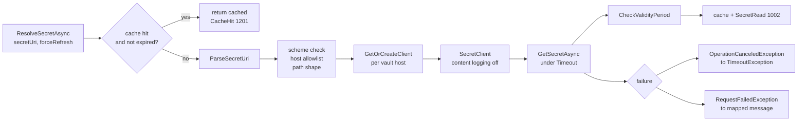

# Azure Key Vault Provider

## Overview and Purpose

`KeyVaultSecretResolver` is the default `ISecretResolver` implementation and the component that actually talks to Azure Key Vault. Everything above it — reference discovery, concurrency, substitution — is vault-agnostic; everything Azure-specific is here.

Its responsibilities are narrower than the class size suggests. Given a secret URI string it must validate that the URI is one this process should contact at all, obtain or reuse a `SecretClient` for that vault, acquire a credential without silently picking a more privileged identity than intended, perform the read inside a time budget, check the secret's validity metadata, cache the result, and — when the read fails — turn an HTTP status code into a message an operator can act on without opening the Azure portal.

That last responsibility is worth calling out, because it is the one most libraries skip. `RequestFailedException: Status 403` tells an operator nothing about whether the role assignment is missing, the vault firewall is blocking the caller, or the secret was soft-deleted. `DescribeRequestFailure` maps each status onto the specific thing to go and check.

File: [KeyVaultSecretResolver.cs](../../src/KeyVaultReferenceResolver/KeyVaultSecretResolver.cs).

## Architecture Diagram



Two entry conditions bypass the network entirely: a live cache entry, and a `forceRefresh: false` call for a URI already resolved. Everything else goes through the full validation funnel, and the funnel runs *before* the client is fetched — so a rejected host never reaches the point of having a credential attached to a request.

The two catch blocks are the whole error surface. A timeout becomes `TimeoutException` with a masked URI; an HTTP failure becomes `KeyVaultReferenceResolutionException` with a mapped message and the original exception preserved as `InnerException`. Anything else propagates unchanged, which matters because `ArgumentException` from validation should not be dressed up as a resolution failure.

## How It Works

### Construction

```csharp
public KeyVaultSecretResolver(
    KeyVaultReferenceResolverOptions? options = null,
    ILogger? logger = null)
{
    _options = options ?? new KeyVaultReferenceResolverOptions();
    _options.Validate();
    _credential = _options.Credential ?? CreateDefaultCredential(_options);
    _logger = logger ?? NullLogger.Instance;
}
```

Both parameters are optional, so `new KeyVaultSecretResolver()` is valid and gives defaults throughout. `Validate()` runs immediately, so a negative `Timeout` or a `MaxConcurrency` of zero fails at construction with an `ArgumentOutOfRangeException` naming the property, rather than at the first read.

The credential is resolved once and held for the instance lifetime. If the caller supplied `options.Credential`, it is used as-is and every credential-shaping option (`ManagedIdentityClientId`, `TenantId`, `AuthorityHost`, `AllowDeveloperCredentials`, `ExcludeEnvironmentCredential`) is ignored. That is the documented behaviour and is the escape hatch for workload identity, federated credentials, or any custom `TokenCredential`.

The logger parameter is `ILogger`, not `ILogger<KeyVaultSecretResolver>`, so an `ILogger<T>` obtained from DI can be passed directly — `ILogger<T>` derives from `ILogger`.

### URI parsing and validation

`ParseSecretUri` returns a `(Uri vaultUri, string secretName, string? version)` tuple and enforces four things on the way:

```csharp
if (!Uri.TryCreate(secretUri, UriKind.Absolute, out var uri))
    throw new ArgumentException($"Invalid Key Vault secret URI: {MaskUri(secretUri)}.", nameof(secretUri));

if (uri.Scheme != Uri.UriSchemeHttps)
    throw new ArgumentException($"Key Vault secret URIs must use https. Got scheme '{uri.Scheme}'.", nameof(secretUri));

EnsureAllowedVaultHost(uri);
```

Then the path shape. The first segment must be exactly `secrets` (case-insensitively), and only the following one or two segments are used:

```csharp
var pathParts = uri.AbsolutePath.Split(PathSeparators, StringSplitOptions.RemoveEmptyEntries);

if (pathParts.Length < 2 || !pathParts[0].Equals("secrets", StringComparison.OrdinalIgnoreCase))
    throw new ArgumentException($"Invalid Key Vault secret URI format: {MaskUri(secretUri)}. ...");

var secretName = Uri.UnescapeDataString(pathParts[1]);
var version = pathParts.Length > 2 ? Uri.UnescapeDataString(pathParts[2]) : null;
```

Taking only the first two or three segments means extra path elements cannot redirect the call to another Key Vault endpoint — a URI ending `/secrets/name/../../keys/something` cannot become a key operation. `Uri.UnescapeDataString` handles percent-encoded names, which Key Vault permits.

`vaultUri` is rebuilt from scheme and host only, deliberately dropping any port or path. That is also the cache key for clients, so every secret in one vault shares one client regardless of how the references were written.

### Host allowlisting

```csharp
private void EnsureAllowedVaultHost(Uri uri)
{
    var allowed = _options.AllowedVaultHostSuffixes;
    if (allowed == null || allowed.Count == 0)
        return;

    foreach (var suffix in allowed)
    {
        if (string.IsNullOrWhiteSpace(suffix))
            continue;
        if (uri.Host.EndsWith(suffix, StringComparison.OrdinalIgnoreCase))
            return;
    }

    throw new ArgumentException($"Vault host '{uri.Host}' is not an allowed Key Vault host. ...");
}
```

A short `EndsWith` loop over at most eight strings by default, covering the Azure public, US Government, China and Germany clouds plus Managed HSM in three of them. An empty or null list disables the check. The rejection message names the option to change, so an operator hitting it on a legitimate private-endpoint DNS name knows the fix without reading source.

The rationale is in [Security-Model.md](../Architecture/Security-Model.md): a `SecretUri=` reference carries its own host, so without this check anything able to write a configuration value can make the process issue an authenticated HTTPS request to an arbitrary host during startup.

### Client caching

```csharp
private SecretClient GetOrCreateClient(Uri vaultUri)
{
    return _secretClients.GetOrAdd(
        vaultUri.ToString(),
        _ => new SecretClient(vaultUri, _credential, BuildClientOptions()));
}
```

A `ConcurrentDictionary<string, SecretClient>` keyed by vault URI string. `SecretClient` is thread-safe and holds an HTTP pipeline plus a token cache, so reusing it is both correct and what keeps N secrets from one vault to a single credential acquisition rather than N.

`GetOrAdd` can invoke the factory more than once under contention and discard the loser. That is harmless here — a discarded `SecretClient` is garbage — and avoiding it would mean a lock on the hot path for no benefit.

### Client options and the content-logging override

```csharp
private SecretClientOptions BuildClientOptions()
{
    var clientOptions = _options.ClientOptions ?? new SecretClientOptions();

    // Never let Azure SDK content logging write secret payloads to the log,
    // regardless of AZURE_LOG_LEVEL or any listener the consumer has attached.
    clientOptions.Diagnostics.IsLoggingContentEnabled = false;

    return clientOptions;
}
```

Everything else on `SecretClientOptions` is the caller's to set — retry policy, `Transport` for a proxy or a custom `HttpClient`, `Diagnostics.ApplicationId`, service version pinning. Only content logging is overridden, and it is overridden unconditionally even against an explicit `true`.

The reason is that a Key Vault `GET /secrets/{name}` response body *is* the secret. Azure SDK content logging can be switched on by the `AZURE_LOG_LEVEL` environment variable or by an `AzureEventSourceListener` registered anywhere in the process, so leaving it to the consumer means every secret is one unrelated diagnostic session away from stdout. Note that this mutates the caller's own options instance, which is worth knowing if the same instance is shared with other Azure clients.

### The read

```csharp
using (var cts = CancellationTokenSource.CreateLinkedTokenSource(cancellationToken))
{
    if (_options.Timeout != System.Threading.Timeout.InfiniteTimeSpan)
        cts.CancelAfter(_options.Timeout);

    var response = string.IsNullOrEmpty(version)
        ? await client.GetSecretAsync(secretName, cancellationToken: cts.Token).ConfigureAwait(false)
        : await client.GetSecretAsync(secretName, version, cts.Token).ConfigureAwait(false);
```

The linked token source combines the caller's cancellation with the per-secret `Timeout` (default 30 seconds). Cancelling the caller's token cancels this read; the timeout elapsing does too, and the two cases are distinguished in the catch filter. `ConfigureAwait(false)` throughout, which matters because the synchronous entry points block on these tasks.

Two overloads because the SDK has two: version omitted reads the current version, version supplied pins it.

### Validity period check

`CheckValidityPeriod` inspects `response.Value.Properties` for `NotBefore` and `ExpiresOn`, warns or throws accordingly, and is covered in full in [Secret-Validity-Enforcement.md](../Features/Secret-Validity-Enforcement.md). The short version: Key Vault does not block a read of an expired secret, so this makes expiry enforceable at the consumer.

It runs *before* the value is cached, so a rejected secret does not land in the cache.

### Error mapping

```csharp
catch (OperationCanceledException ex) when (cts.IsCancellationRequested && !cancellationToken.IsCancellationRequested)
{
    throw new TimeoutException($"Timeout resolving secret from {MaskUri(secretUri)}", ex);
}
```

The filter is precise: translate to `TimeoutException` only when *this* resolver's budget elapsed and the caller did **not** cancel. A caller-initiated cancellation propagates as `OperationCanceledException`, which is what callers expect and what the pipeline's overall-timeout cancellation looks like.

```csharp
catch (RequestFailedException ex)
{
    throw new KeyVaultReferenceResolutionException(
        DescribeRequestFailure(ex, vaultUri, secretUri), ex);
}
```

`DescribeRequestFailure` is the operator-facing part:

| Status | Message names |
| --- | --- |
| 401, 403 | the `Key Vault Secrets User` role (or `Get` in a legacy access policy) on the named vault, **and** the vault firewall |
| 404 | the secret name, **and** soft-delete — a soft-deleted secret must be recovered before it can be read |
| 429 | reduce `MaxConcurrency`, raise `Timeout` so the SDK's backoff can complete, or stagger startup |
| other | the masked URI and the status code |

Each message names the specific next action. The 403 case covers both plausible causes because the status cannot distinguish them. The 404 case mentions soft-delete because that is the non-obvious cause — the secret exists in the portal's deleted list and every read returns 404. The 429 case is the one most likely to be self-inflicted: a fleet of instances all starting at once against one vault.

The original exception is preserved as `InnerException`, so the Azure request ID remains available for a support case.

### Synchronous entry points

```csharp
public string ResolveSecret(string secretUri)
    => ResolveSecretAsync(secretUri, forceRefresh: false).GetAwaiter().GetResult();
```

Blocking sync-over-async, required by `ISecretResolver` and ultimately by the synchronous `IConfigurationBuilder.Build()`. Safe during startup on a thread with nothing else to do; not safe to call from a request handler or a UI thread. Prefer the async overloads anywhere outside configuration build.

### Cache and disposal

`InvalidateCache(string? secretUri = null)` removes one entry or clears the lot. `ResolveSecretAsync(uri, forceRefresh: true)` bypasses and replaces an entry. Neither changes values already in `IConfiguration` — see [Secret-Caching-And-Rotation.md](../Features/Secret-Caching-And-Rotation.md).

`Dispose()` follows the standard pattern with a `protected virtual Dispose(bool)` and clears both dictionaries:

```csharp
// Resolved secrets are plain managed strings and cannot be zeroed, but dropping the
// references lets the garbage collector reclaim them rather than keeping them reachable
// (and therefore present in any crash dump) for the lifetime of the process.
```

A mitigation, not a guarantee. `string` is immutable in .NET and cannot be overwritten; making it unreachable is the best available action. Note that disposal does not dispose the `SecretClient` instances — `SecretClient` is not `IDisposable` — and does not set `_disposed` checks on the resolve path, so calling `ResolveSecretAsync` after `Dispose()` will simply repopulate the caches rather than throwing.

## Key Components

### CacheEntry

A `readonly struct` holding the value and an absolute expiry:

```csharp
_expiresAt = ttl == System.Threading.Timeout.InfiniteTimeSpan
    ? DateTimeOffset.MaxValue
    : DateTimeOffset.UtcNow.Add(ttl);
```

`IsExpired` compares against `DateTimeOffset.UtcNow`. A struct rather than a class so entries are stored inline in the `ConcurrentDictionary` buckets with no per-entry allocation.

### CreateDefaultCredential

Builds a `DefaultAzureCredential` with the chain narrowed — four developer credentials excluded unless `AllowDeveloperCredentials`, interactive browser excluded unconditionally, environment credential excluded on request — then applies `ManagedIdentityClientId`, `TenantId` and `AuthorityHost` if set. Full rationale in [Vault-Authentication-Methods.md](../Features/Vault-Authentication-Methods.md) and [Security-Model.md](../Architecture/Security-Model.md).

### MaskUri

A local `try`/`catch` wrapper that reduces a URI to `scheme://host/secrets/***`, falling back to `***` if it cannot be parsed. Functionally the same as `KeyVaultReferenceResolutionException.MaskSecretUri`; the duplication is minor and both are used on the paths where a URI could reach a log.

### Log

The package's source-generated log methods, in [Log.cs](../../src/KeyVaultReferenceResolver/Log.cs). `Log.CacheHit`, `Log.ResolvingSecret`, `Log.SecretRead` and the three validity warnings replace hand-written `ILogger` extension calls: the template is compiled once, arguments are not boxed into a `params` array, and nothing is evaluated when the level is disabled. The `EventId` values come from `const int` fields on `LogEvents`, which remains the public reference for consumers writing alerts. The cache-hit path is additionally guarded by `IsEnabled(LogLevel.Debug)` because masking allocates and that path runs per secret on every resolution.

## Design Decisions and Trade-offs

**Resolve the credential once, in the constructor.** Cheap and predictable, and matches how `DefaultAzureCredential` is meant to be used — it caches tokens internally. The cost is that a credential cannot be swapped at runtime; a process that needs a different identity needs a different resolver instance.

**Cache clients per vault, never dispose them.** `SecretClient` is thread-safe and not disposable, so this is the intended usage. The consequence is that the underlying HTTP handler lives for the process lifetime, which is also the recommended pattern for Azure SDK clients.

**Override content logging unconditionally.** Removes a legitimate diagnostic capability from consumers who want full HTTP tracing. Worth it, because the payload being traced is the secret and there is no partial-redaction option. Note the side effect on a shared `SecretClientOptions` instance.

**Map statuses to prose rather than rethrowing.** Costs some fidelity — the caller sees a `KeyVaultReferenceResolutionException`, not the original type — but the original is preserved as `InnerException`, and the mapped message removes a portal round trip from the usual diagnostic loop. The four cases covered are the four that actually occur.

**`TimeoutException` for the resolver's own budget, `OperationCanceledException` for the caller's.** The distinction requires a two-clause exception filter that reads awkwardly, and is the right call: a timeout is a condition to report, a cancellation is a condition to propagate.

**No `_disposed` guard on the resolve path.** `Dispose` sets the flag but resolution does not check it, so post-disposal use silently works and repopulates the caches. Defensible for a resolver whose disposal is a hygiene measure rather than a resource release, but it means `Dispose` is not a reliable way to prevent further vault access.

**Sync-over-async rather than async-only.** Forced by `IConfigurationBuilder.Build()` being synchronous. Documented rather than hidden behind a helper.

## Integration Points

- **`ISecretResolver`** — the interface this implements. Both `ResolveSecretAsync` and `ResolveSecret` have a `forceRefresh` overload beyond the interface, reachable only through the concrete type.
- **`Azure.Security.KeyVault.Secrets`** — `SecretClient`, `SecretClientOptions`, `KeyVaultSecret`, `SecretProperties`. The `Properties` bag is what makes validity checking possible.
- **`Azure.Identity`** — `DefaultAzureCredential` and `DefaultAzureCredentialOptions`. Bypassed entirely when `options.Credential` is set.
- **`Azure.Core`** — `TokenCredential` as the extension point, `RequestFailedException` as the error surface, `DiagnosticsOptions` for the content-logging override.
- **`KeyVaultReferenceResolverExtensions`** — the usual caller. It constructs a resolver from options when the consumer did not supply one, then drives it through the pipeline.
- **`Microsoft.Extensions.Logging.Abstractions`** — via the source-generated `Log` class. Defaults to `NullLogger.Instance`.

## Important Considerations

### Performance

- One `SecretClient` and one credential acquisition per vault, not per secret.
- A cache hit is a `ConcurrentDictionary` lookup plus a `DateTimeOffset` comparison, and does not allocate unless Debug logging is enabled.
- The per-secret `Timeout` bounds one read; the pipeline's `OverallTimeout` bounds the pass. Raising `Timeout` gives the SDK's built-in retry backoff room to complete, which is the correct response to intermittent 429s.
- Secret caching is on by default with an infinite TTL, so repeated resolution of the same URI through one instance costs nothing after the first.
- `PathSeparators` is a static `char[]` so URI splitting does not allocate a fresh array per call.

### Security

- Validation order matters and is correct: parse, scheme, host allowlist, path shape — all before a client is obtained. A rejected host never gets a credential attached to a request.
- `AllowDeveloperCredentials` defaults to `false`, inverting `DefaultAzureCredential`'s own default. `ExcludeEnvironmentCredential` defaults to `false` for 1.x compatibility and should be set to `true` in any managed-identity deployment.
- Content logging is forced off. Request *URLs* still contain secret names, so Azure SDK verbose logging is still not something to leave on.
- Every URI in a log record or exception message is masked to `scheme://host/secrets/***`.
- `options.Credential` overrides all credential-shaping options silently. If an identity looks wrong, check whether a credential was passed explicitly.

### Operational

- 403 at startup: check the role assignment (`Key Vault Secrets User`) *and* the vault firewall. The message names both because the status cannot distinguish them.
- 404 at startup: check the secret name, then check the vault's deleted-secrets list. Soft-delete is the non-obvious cause.
- 429 at startup across a fleet: reduce `MaxConcurrency`, raise `Timeout`, or stagger instance startup.
- `TimeoutException` naming a masked URI means the per-secret budget elapsed — usually a firewall dropping packets rather than rejecting them, or a private endpoint with no DNS.
- Alert on `SecretRead` (1002) volume for a baseline, and on the validity warnings (1101–1103) as rotation signals. Catalogue in [Logging-And-Monitoring.md](../Operations/Logging-And-Monitoring.md).
