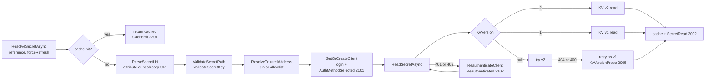

# HashiCorp Vault Provider

## Overview and Purpose

`HashiCorpVaultSecretResolver` is the `ISecretResolver` implementation for HashiCorp Vault, shipped in the separate `KeyVaultReferenceResolver.HashiCorp` package. It exists so that an application already using the library's reference syntax can point at Vault instead of Azure Key Vault by changing the registration line and the reference format, and nothing else.

It is structurally parallel to the Azure resolver — parse, validate, get-or-create client, read under a timeout, cache, mask — but three parts of Vault's design force work that has no Azure equivalent.

**Mounts and paths are not a fixed shape.** A Vault path like `secret/data/myapp/config` encodes a mount point, a KV-v2 marker, and an application path, and the split between them is a convention rather than a rule. `SplitPath` has to guess.

**KV v1 and KV v2 are different APIs on the same mount syntax.** Finding out which version a mount runs means reading `sys/mounts`, which a least-privileged application token cannot do. The resolver probes instead.

**VaultSharp caches its login and does not observe `CancellationToken`.** The first means a token TTL expiry poisons the client for the life of the process unless handled; the second means the only timeout that actually bounds a Vault call is the HTTP client's service timeout.

Each of those is handled explicitly below. File: [HashiCorpVaultSecretResolver.cs](../../src/KeyVaultReferenceResolver.HashiCorp/HashiCorpVaultSecretResolver.cs).

## Architecture Diagram



The two retry loops are the distinguishing features. The version probe retries the *read shape* against the same client; the re-authentication retries the *whole read* against a fresh client. Neither loops more than once, so a genuinely broken mount or a genuinely revoked token fails after two attempts rather than spinning.

Validation happens before the client is obtained, exactly as on the Azure side — a reference naming an untrusted Vault address never reaches the point of having a Vault token sent with it. That ordering matters more here than on the Azure side, because a Vault token is a bearer credential that is directly replayable.

## How It Works

### Construction

```csharp
public HashiCorpVaultSecretResolver(
    HashiCorpVaultResolverOptions? options = null,
    ILogger? logger = null)
{
    _options = options ?? new HashiCorpVaultResolverOptions();
    _options.Validate();
    _logger = logger ?? NullLogger.Instance;
}
```

Note what is *not* here: no credential. Unlike the Azure resolver, which builds a `TokenCredential` in its constructor, the Vault auth method is resolved lazily inside `GetOrCreateClient`. That is because `GetEffectiveAuthMethod()` reads environment variables and the Kubernetes token file, and doing that at construction would mean a resolver could not be created in an environment where no auth is available even if no reference ever needs resolving.

### Reference parsing

`ParseSecretUri` tries the attribute pattern then the `hashicorp://` pattern, returning a `(vaultAddress, secretPath, secretKey)` tuple. Both formats and their exact regexes are documented in [Reference-Formats.md](../Features/Reference-Formats.md). Neither matching means an `ArgumentException` whose message shows both expected formats — the reference is masked in that message.

The path and key from either format go through validation immediately:

```csharp
return (
    attrMatch.Groups["addr"].Value,
    ValidateSecretPath(attrMatch.Groups["path"].Value),
    ValidateSecretKey(attrMatch.Groups["key"].Value)
);
```

`ValidateSecretPath` rejects `?`, `#`, `\` and control characters, and rejects any `.` or `..` segment. This is not cosmetic. The path is handed to VaultSharp, which puts it into the request URL, and `Uri` normalises dot segments away — so `secret/data/../../sys/mounts` would reach a completely different Vault API endpoint, and a `?` or `#` would splice a query string or fragment onto the request. `ValidateSecretKey` rejects control characters so a key cannot inject into a header or a log line. The error message describes an offending control character as `\uXXXX` rather than emitting it.

### Trusted address resolution

```csharp
private string ResolveTrustedAddress(string vaultAddress)
{
    if (string.IsNullOrWhiteSpace(vaultAddress))
        return _options.GetEffectiveVaultAddress();

    _options.EnsureTransportAllowed(vaultAddress);

    if (!string.IsNullOrWhiteSpace(_options.VaultAddress))
    {
        if (AddressesMatch(vaultAddress, _options.VaultAddress!))
            return vaultAddress;

        throw new InvalidOperationException(
            $"Vault address '{vaultAddress}' in a configuration reference does not match the configured " +
            $"VaultAddress. Refusing to authenticate against an unexpected vault.");
    }

    var allowed = _options.AllowedVaultAddresses;
    if (allowed == null || allowed.Count == 0)
        return vaultAddress;
    // ... check membership, else throw
}
```

Three tiers, strongest first:

1. **`options.VaultAddress` set** — the reference must name that same vault. This pins the resolver and is the recommended production setting.
2. **`options.AllowedVaultAddresses` non-empty** — the reference must appear in the list. Use when one application legitimately reads from several vaults.
3. **Neither set** — any HTTPS address is accepted.

Tier 3 is the weakest posture the package allows, and it is the default. A tampered configuration value can then direct the resolver's ambient Vault token to a host of the attacker's choosing. Unlike the Azure case — where `SecretClient` scopes its token to the vault resource — a Vault token is a bearer credential that the receiving host can replay against the real Vault. Set `VaultAddress`.

`EnsureTransportAllowed` runs before any of the tiers, so plaintext HTTP is rejected regardless of trust unless `AllowInsecureTransport` is set.

### Address normalisation

```csharp
private static string NormalizeVaultAddress(string address)
{
    address = address.TrimEnd('/');

    if (Uri.TryCreate(address, UriKind.Absolute, out var uri))
    {
        var builder = new UriBuilder(uri)
        {
            Scheme = uri.Scheme.ToLowerInvariant(),
            Host = uri.Host.ToLowerInvariant()
        };

        return builder.Uri.GetComponents(
            UriComponents.SchemeAndServer | UriComponents.Path,
            UriFormat.UriEscaped).TrimEnd('/');
    }

    return address;
}
```

Scheme and host are lowercased; the path is deliberately left case-sensitive. A Vault behind a gateway at `https://gw.example.com/Vault` is a different endpoint from `/vault`, and folding the case would either break that deployment or make two distinct endpoints compare equal. This is also the client cache key, so `https://Vault.Example.com/` and `https://vault.example.com` share one client and one login.

### Client creation and login

```csharp
return _vaultClients.GetOrAdd(effectiveAddress, address =>
{
    var authMethod = _options.GetEffectiveAuthMethod();

    _logger.LogInformation(
        HashiCorpLogEvents.AuthMethodSelected,
        "Authenticating to Vault at {VaultAddress} using {AuthMethod}",
        address, authMethod.GetType().Name);

    var settings = new VaultClientSettings(address, authMethod.GetAuthMethodInfo());

    if (_options.Timeout != System.Threading.Timeout.InfiniteTimeSpan)
        settings.VaultServiceTimeout = _options.Timeout;

    if (!string.IsNullOrWhiteSpace(_options.Namespace))
        settings.Namespace = _options.Namespace;

    return new VaultClient(settings);
});
```

The `AuthMethodSelected` record at `Information` is a deliberate audit control, not diagnostics. Auto-detection tries `VAULT_TOKEN`, then AppRole, then the Kubernetes service account — so a leftover `VAULT_TOKEN` in a production container silently overrides the intended workload identity, and without this record nothing says so. Only the method's type name is logged, never the credential.

`VaultServiceTimeout` is the load-bearing timeout. VaultSharp does not observe a `CancellationToken` ([VaultSharp issue #368](https://github.com/rajanadar/VaultSharp/issues/368)), so the `CancellationTokenSource.CancelAfter` on the caller side cannot actually interrupt an in-flight Vault HTTP call. Setting the service timeout is what bounds it, and a timeout there surfaces as a `TaskCanceledException` — which is why the resolver's catch filter for `OperationCanceledException` is broader than the Azure one.

`Namespace` is a Vault Enterprise feature; leave it null for open-source Vault.

### Mount and path splitting

```csharp
private static (string mountPath, string actualPath) SplitPath(string fullPath)
{
    var parts = fullPath.Split(new[] { '/' }, StringSplitOptions.RemoveEmptyEntries);
    if (parts.Length < 2)
        return (string.Empty, fullPath);

    if (parts.Length >= 3 && parts[1].Equals("data", StringComparison.OrdinalIgnoreCase))
    {
        // KV v2 format: mount/data/path -> mount, path
        return (parts[0], string.Join("/", parts, 2, parts.Length - 2));
    }

    // KV v1 format or no data segment: mount/path -> mount, path
    return (parts[0], string.Join("/", parts, 1, parts.Length - 1));
}
```

VaultSharp's KV API takes mount point and path as separate arguments, but a reference carries them as one string. The `data` segment in position 1 is the KV v2 convention that the Vault CLI and HTTP API use, so its presence is treated as the signal:

| Reference path | Mount | Path |
| --- | --- | --- |
| `secret/data/myapp` | `secret` | `myapp` |
| `kv/data/myapp/config` | `kv` | `myapp/config` |
| `secret/myapp` | `secret` | `myapp` |
| `myapp` | *(from `options.MountPath`)* | `myapp` |

A single-segment path yields an empty mount, and `ReadSecretAsync` then substitutes `options.MountPath` (default `secret`).

The heuristic has a real edge case: an application whose second path segment is genuinely called `data` on a KV v1 mount — `secret/data/thing` where `data` is a folder, not the v2 marker — will be split wrongly. Naming a path segment `data` on a v1 mount is unusual, but if it happens, set `KvVersion = 1` and the v1 read path will use the mount/path split it produces.

### KV version probing

```csharp
if (_options.KvVersion == 1)
    return await ReadKvV1Async(...);
if (_options.KvVersion == 2)
    return await ReadKvV2Async(...);

try
{
    return await ReadKvV2Async(...);
}
catch (VaultApiException ex) when (IsMountVersionMismatch(ex))
{
    _logger.LogDebug(HashiCorpLogEvents.KvVersionProbe,
        "Mount {MountPath} did not answer as KV v2 (HTTP {Status}); retrying as KV v1. " +
        "Set KvVersion to skip this probe.", mountPath, ex.HttpStatusCode);

    return await ReadKvV1Async(...);
}
```

With `KvVersion` set, one read. With it unset (the default), v2 is attempted and a version mismatch falls back to v1.

The obvious alternative — read `sys/mounts` and ask Vault which version the mount runs — is not available:

> Detecting the engine version properly would mean reading `sys/mounts`, which a least-privileged application token has no access to — so the version is probed with the permissions the application already holds.

That is the crux. A correctly scoped application policy grants `read` on one path prefix and nothing else. Requiring `sys/mounts` access to resolve a secret would force every consumer to widen its policy, which is a worse security outcome than one wasted round trip.

`IsMountVersionMismatch` accepts both 404 and 400: a v1 mount has no `/data/` sub-path so the v2 request shape 404s, and some Vault versions return 400 with *"Invalid path for a versioned K/V secrets engine"* instead.

The probe costs one extra round trip per distinct mount on a v1 mount, and the log record says how to remove it. On a v2 mount there is no extra cost.

### Re-authentication

```csharp
catch (VaultApiException ex) when (IsAuthFailure(ex))
{
    // VaultSharp logs in once and caches the result on the auth method info,
    // so once the login token's TTL elapses every subsequent read fails with
    // 403 for the life of the process. Evict the client and log in again.
    _logger.LogInformation(HashiCorpLogEvents.Reauthenticated,
        "Vault returned {Status} for {SecretPath}; re-authenticating and retrying once.",
        ex.HttpStatusCode, MaskPath(secretPath));

    var freshClient = ReauthenticateClient(vaultAddress);
    secretValue = await ReadSecretAsync(freshClient, secretPath, secretKey, cts.Token).ConfigureAwait(false);
}
```

This is the fix for a failure mode that only appears in long-running processes. VaultSharp performs its login once and caches the resulting token on the auth method info object. Vault login tokens have a TTL — commonly an hour for AppRole or Kubernetes auth. Once it elapses, every read through that client returns 403 forever, and the application looks like it has lost its Vault permissions.

`ReauthenticateClient` removes the cached client for the address so the next `GetOrCreateClient` performs a fresh login:

```csharp
private IVaultClient ReauthenticateClient(string vaultAddress)
{
    var effectiveAddress = NormalizeVaultAddress(ResolveTrustedAddress(vaultAddress));
    _vaultClients.TryRemove(effectiveAddress, out _);
    return GetOrCreateClient(vaultAddress);
}
```

Exactly one retry. A genuine permission problem — a policy that never granted the path — produces 403 twice and the second one propagates, so a misconfiguration does not turn into an infinite login loop. The `Information`-level record makes the distinction visible: a steady trickle of `Reauthenticated` is normal token-TTL churn, a burst is a policy problem or a login TTL shorter than the workload's read interval.

The retry re-reads through the *whole* `ReadSecretAsync`, which means the version probe runs again on the fresh client.

`IsAuthFailure` covers 401 and 403. Treating 403 as re-authenticatable is slightly broad — 403 can also mean "your policy does not allow this path" — but the single-retry bound makes the cost of the wrong guess one extra login.

### Reading

Both read paths look the same shape:

```csharp
Secret<SecretData> secret = await client.V1.Secrets.KeyValue.V2.ReadSecretAsync(
    path: actualPath, mountPoint: mountPath).ConfigureAwait(false);

if (secret?.Data?.Data == null || !secret.Data.Data.TryGetValue(secretKey, out var value))
    throw new KeyNotFoundException($"Secret key not found at path '{MaskPath(secretPath)}'");

return value?.ToString() ?? string.Empty;
```

A Vault KV secret is a dictionary of fields, so the reference names both a path and a key within it. A missing key raises `KeyNotFoundException` with a masked path. A key present but null yields an empty string rather than null, so the caller always gets a string.

`value?.ToString()` is because KV values are `object` — a numeric or boolean field in the KV JSON comes back as a boxed value, and `ToString()` is the pragmatic conversion. Secrets are normally strings, so this rarely matters, but a field stored as `8080` resolves to `"8080"`.

The v1 shape differs only in that its dictionary is `secret.Data` rather than `secret.Data.Data`.

### Timeout handling

```csharp
catch (OperationCanceledException ex) when (!cancellationToken.IsCancellationRequested)
{
    // Either the per-secret budget elapsed, or the Vault HTTP client hit
    // VaultServiceTimeout (which surfaces as a TaskCanceledException).
    throw new TimeoutException($"Timeout resolving secret from {MaskSecretUri(secretUri)}", ex);
}
```

Compare the Azure filter, which also checks `cts.IsCancellationRequested`. Here the filter is broader on purpose, because `VaultServiceTimeout` firing inside VaultSharp produces a `TaskCanceledException` that is *not* associated with this resolver's `CancellationTokenSource`. Both causes are genuinely timeouts and both should surface as one.

A caller-initiated cancellation still propagates as `OperationCanceledException`.

### Masking

`MaskSecretUri` keeps the Vault address and blanks path and key for both formats. `MaskPath` keeps only the mount point:

```text
secret/data/prod/db-credentials  →  secret/***
```

Vault key names are self-describing (`prod-db-root-password`), so masking the path and logging the key only at `Debug` keeps an aggregated log store from accumulating an inventory of the vault. See [Security-Model.md](../Architecture/Security-Model.md).

### Cache and disposal

Identical in shape to the Azure resolver: a `ConcurrentDictionary<string, CacheEntry>` keyed by the *reference string* rather than a canonical URI, `InvalidateCache(string?)`, a `forceRefresh` overload, and a `Dispose` that clears both dictionaries. Because the cache key is the raw reference, the same secret written in both formats occupies two cache entries. See [Secret-Caching-And-Rotation.md](../Features/Secret-Caching-And-Rotation.md).

## Key Components

### IsHashiCorpVaultReference / TryExtractSecretInfo

Public statics. The first is the predicate the pipeline uses to decide whether a configuration value is a reference at all. The second parses without resolving, and swallows every exception to return `null` — so a well-formed reference with an illegal path is indistinguishable from a non-reference.

### ValidateSecretPath / ValidateSecretKey

The two input gates on the parts of a reference that reach a URL. Described above; the `..` segment check is the one that matters most.

### SplitPath

The mount/path heuristic. Static and pure, so it is straightforward to test directly.

### ReadKvV2Async / ReadKvV1Async

The two read shapes, differing only in the VaultSharp API surface and the nesting depth of the returned dictionary.

### ReauthenticateClient

Client eviction plus re-creation. Note it re-runs `ResolveTrustedAddress`, so the trust decision is re-made on the retry rather than assumed.

### HashiCorpLogEvents

Event IDs in the 2000 range, so a consumer using both packages sees no collisions with the core package's 1000s. `KvVersionProbe` (2005), `AuthMethodSelected` (2101) and `Reauthenticated` (2102) have no Azure counterpart because the behaviours they record are Vault-specific. The class exposes both `const int` numeric IDs and `EventId` fields, declared together so the two forms cannot drift.

## Design Decisions and Trade-offs

**Probe the KV version rather than read `sys/mounts`.** One extra round trip per v1 mount, versus requiring every consumer to grant `sys/mounts` read to an application token. The probe is the right trade, and `KvVersion` removes the cost for anyone who knows their mount.

**Heuristic mount/path split.** Simple, matches the convention every Vault user writes paths in, and wrong for a v1 mount with a segment literally named `data`. The alternative — requiring mount and path as separate reference fields — would have made the reference format more verbose for every user to fix an edge case for almost none.

**Re-authenticate on 403 as well as 401.** Slightly broad: a policy that genuinely lacks the path also returns 403, so that case costs one wasted login. Bounded to one retry, and the alternative — only retrying 401 — misses the common case, because Vault returns 403 for an expired token.

**Lazy auth method resolution.** A resolver can be constructed in an environment with no Vault credentials at all, and only fails if a reference actually needs resolving. That matches the pipeline's short-circuit when no references are present. The cost is that a misconfiguration surfaces later than it would from a constructor check.

**Log the selected auth method at `Information`.** An extra record per vault, and the thing that makes a stray `VAULT_TOKEN` visible. Cheap.

**Cache keyed on the raw reference string.** Simple and correct, and means the two reference formats for one secret cache separately. A canonicalisation step would fix that and introduce the risk of merging distinct secrets; not worth it.

**Accept plaintext HTTP behind an option.** `AllowInsecureTransport` exists only for `vault server -dev`. The rejection message spells out that the token and the secret both travel in the clear, including pod-to-pod inside a cluster.

**Bearer-token trust model needs explicit pinning.** Defaulting `AllowedVaultAddresses` to empty (accept any HTTPS address) is the weakest default in either package. It is the default because there is no DNS suffix to allowlist the way Azure can; the documentation compensates by recommending `VaultAddress` everywhere.

## Integration Points

- **`ISecretResolver`** — implemented from the core package, which is why this project has a `ProjectReference` to it.
- **VaultSharp 1.17.5.1** — `IVaultClient`, `VaultClient`, `VaultClientSettings`, `VaultApiException`, and the `V1.Secrets.KeyValue.V1`/`.V2` APIs. Its transitive `System.Text.Json` is pinned forward to 10.0.12 past GHSA-8g4q-xg66-9fp4.
- **`IVaultAuthMethod`** — the auth abstraction, with Token, AppRole and Kubernetes implementations. See [Vault-Authentication-Methods.md](../Features/Vault-Authentication-Methods.md).
- **`HashiCorpVaultReferenceExtensions`** — the pipeline that drives this resolver. It resolves per configuration key rather than per distinct reference.
- **`VAULT_ADDR`** — read by `GetEffectiveVaultAddress()` when `options.VaultAddress` is unset.
- **`Nullable` shim package** — a `PrivateAssets` dependency providing `[NotNullWhen]` on netstandard2.0, used by the `TryFromEnvironment` / `TryFromFile` patterns.

## Important Considerations

### Performance

- One `IVaultClient` and one login per normalised Vault address.
- The version probe costs one extra round trip per read against a v1 mount when `KvVersion` is unset. Set it.
- Re-authentication costs one login plus one re-read, once per token expiry.
- The pipeline does not deduplicate HashiCorp references, so N keys pointing at one secret cause N reads — though the resolver's own cache absorbs repeats within a pass after the first.
- `VaultServiceTimeout` is the only effective timeout. Setting `Timeout = Timeout.InfiniteTimeSpan` leaves Vault calls genuinely unbounded.

### Security

- Set `options.VaultAddress` in production. It is the single highest-value setting in this package.
- Set `options.AuthMethod` explicitly rather than relying on auto-detection, and watch `AuthMethodSelected` (2101) if you do not.
- Leave `AllowInsecureTransport` off. Pod-to-pod plaintext inside a cluster is still plaintext.
- Path validation blocks `..` traversal to other Vault endpoints. Do not relax it.
- Scope the Vault policy to the specific path prefix the application reads. The resolver deliberately never needs `sys/mounts`.
- Reference strings are masked before reaching any log or exception property; paths are reduced to their mount point.

### Operational

- Repeated 403s with no `Reauthenticated` record in between: a policy problem, not a token TTL problem.
- A burst of `Reauthenticated` (2102): the login TTL is shorter than the workload's read interval, or the auth role's `token_ttl` was reduced.
- `KvVersionProbe` (2005) in the log on every start: set `KvVersion = 1` to remove a round trip.
- `AuthMethodSelected` (2101) reporting `TokenAuthMethod` in Kubernetes: a stray `VAULT_TOKEN` won auto-detection over the service account.
- *"Refusing to authenticate against an unexpected vault"*: a reference names an address other than the pinned `VaultAddress` — which is the control working, not a bug.
- `KeyNotFoundException` naming `mount/***`: the path resolved but the field name in the reference does not exist in that KV secret.
