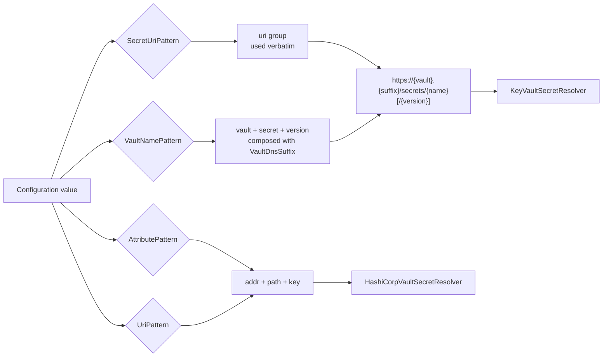

# Reference Formats

## Overview and Purpose

A reference is a string that appears in a configuration value and names a secret rather than containing one. The library supports four of them: two for Azure Key Vault and two for HashiCorp Vault.

The Azure formats are not invented here. `@Microsoft.KeyVault(SecretUri=...)` and `@Microsoft.KeyVault(VaultName=...;SecretName=...)` are the syntaxes Azure App Service already understands in application settings, and matching them exactly is the whole point of the library — an `appsettings.json` that works under App Service works unchanged under Docker, Kubernetes or `dotnet run`. The HashiCorp formats are the library's own, designed to be recognisable alongside the Azure ones.

The parsing is more constrained than it needs to be for correctness, because a reference is untrusted input. A configuration value can arrive from an environment variable, a mounted file, or a remote store, and the parsed pieces get interpolated into a URL that the process will then send an authenticated request to. The regexes are the first gate in that funnel; see [Security-Model.md](../Architecture/Security-Model.md) for the rest.

## Architecture Diagram



The Azure branch converges: both formats become a single canonical secret URI string before anything else happens, which is what makes deduplication across a configuration possible. Ten keys written in a mix of both formats that denote the same secret produce one URI and therefore one fetch.

The HashiCorp branch does not converge to a single string — it produces a three-part tuple — which is the reason the Vault pipeline resolves per configuration key instead of per distinct secret. See [Secret-Resolution-Pipeline.md](../Architecture/Secret-Resolution-Pipeline.md).

## How It Works

### Azure: SecretUri format

```json
"Database": "@Microsoft.KeyVault(SecretUri=https://myvault.vault.azure.net/secrets/db-connection)"
"ApiKey":   "@Microsoft.KeyVault(SecretUri=https://myvault.vault.azure.net/secrets/api-key/abc123def456)"
```

The pattern, from [KeyVaultReferenceResolverExtensions.cs](../../src/KeyVaultReferenceResolver/KeyVaultReferenceResolverExtensions.cs):

```csharp
@"@Microsoft\.KeyVault\(SecretUri=(?<uri>https://[^)\s\\]+)\)"
```

The URI group requires `https://` and excludes `)`, whitespace and backslash. Excluding `)` is what terminates the match; excluding whitespace and backslash stops a value from smuggling in a second URL component or a Windows-style path. The URI is then used verbatim — no composition, no normalisation — so the host it names is the host that will be contacted, subject to the allowlist check in `KeyVaultSecretResolver.ParseSecretUri`.

Appending a version segment pins the secret. Omitting it resolves the current version at startup.

### Azure: VaultName format

```json
"Database": "@Microsoft.KeyVault(VaultName=myvault;SecretName=db-connection)"
"ApiKey":   "@Microsoft.KeyVault(VaultName=myvault;SecretName=api-key;SecretVersion=abc123def456)"
```

```csharp
@"@Microsoft\.KeyVault\(VaultName=(?<vault>[A-Za-z0-9-]{3,24});SecretName=(?<secret>[A-Za-z0-9-]{1,127})(?:;SecretVersion=(?<version>[A-Za-z0-9]{1,64}))?\)"
```

Every group is constrained to Azure's own naming rules, and the bounds are Azure's real limits: a vault name is 3–24 alphanumerics-and-hyphens, a secret name is up to 127 of the same, a version is up to 64 alphanumerics with no hyphen.

Those constraints are a security control rather than input hygiene, because `UriFromMatch` interpolates the groups straight into a string:

```csharp
var uri = $"https://{vaultName}.{suffix}/secrets/{secretName}";
if (!string.IsNullOrEmpty(version))
    uri += $"/{version}";
```

A looser group — `[^;]+`, say — would let a crafted value inject authority or path characters and point the lookup somewhere else entirely. With the groups restricted to alphanumerics and hyphens, nothing reaching that interpolation can alter the URI's authority.

The `suffix` comes from `options.VaultDnsSuffix`, default `vault.azure.net`, with a leading dot trimmed if present. This is the knob for sovereign clouds: set `vault.usgovcloudapi.net` for Azure Government or `vault.azure.cn` for Azure China, alongside `AuthorityHost`. The `SecretUri=` format carries its own host and is unaffected by the setting.

Note the asymmetry: `VaultDnsSuffix` decides which host a `VaultName` reference resolves to, while `AllowedVaultHostSuffixes` decides which hosts are acceptable at all. In a sovereign cloud both need to agree, and the default allowlist already covers the four national clouds plus Managed HSM.

### Azure: embedded and multiple references

A reference does not have to be the whole value. Both patterns are unanchored, and `SubstituteReferences` replaces each match in place:

```json
"Connection": "Server=db.internal;User=app;Password=@Microsoft.KeyVault(SecretUri=https://v.vault.azure.net/secrets/pw)"
```

```json
"Compound": "@Microsoft.KeyVault(SecretUri=https://v.vault.azure.net/secrets/user):@Microsoft.KeyVault(VaultName=v;SecretName=pass)"
```

Mixing the two formats in one value works. Substitution runs `SecretUriPattern.Replace` then `VaultNamePattern.Replace` over the result, and both share a single `failed` flag — so if *any* reference in the value cannot be resolved, the whole value becomes `null` rather than being handed over partially substituted. A connection string with a blank password would otherwise fail at the database with no hint that a vault was involved.

### HashiCorp: attribute format

```json
"Database": "@HashiCorp.Vault(VaultAddress=https://vault.example.com;SecretPath=secret/data/myapp;SecretKey=db-password)"
```

```csharp
@"@HashiCorp\.Vault\(VaultAddress=(?<addr>[^;)]+);SecretPath=(?<path>[^;)]+);SecretKey=(?<key>[^)]+)\)"
```

All three parts are required and order is fixed. The groups are much looser than the Azure ones — `[^;)]+` accepts almost anything — because a Vault address is an arbitrary URL and a Vault path is an arbitrary hierarchy. The constraint is applied afterwards instead, by three separate checks in [HashiCorpVaultSecretResolver.cs](../../src/KeyVaultReferenceResolver.HashiCorp/HashiCorpVaultSecretResolver.cs):

- `EnsureTransportAllowed` on the address — HTTPS unless `AllowInsecureTransport`.
- `ResolveTrustedAddress` on the address — must match `options.VaultAddress` or appear in `AllowedVaultAddresses`.
- `ValidateSecretPath` and `ValidateSecretKey` on the path and key.

`ValidateSecretPath` rejects `?`, `#`, `\` and control characters, and rejects any `.` or `..` segment. The path goes into a Vault API request URL, `Uri` normalises dot segments away, and `secret/data/../../sys/mounts` would therefore reach a different endpoint. `ValidateSecretKey` rejects control characters.

### HashiCorp: URI format

```json
"Database": "hashicorp://vault.example.com/secret/data/myapp#db-password"
```

```csharp
@"^hashicorp://(?<host>[^/]+)/(?<path>[^#]+)#(?<key>.+)$"
```

Shorter, and anchored with `^...$`, so the reference must be the entire configuration value. The scheme is reconstructed as `https://` unconditionally:

```csharp
var vaultAddress = $"https://{host}";
```

There is no way to express plaintext HTTP in this format. A local dev Vault on `http://127.0.0.1:8200` needs the attribute format together with `AllowInsecureTransport = true`.

The `hashicorp://` form is otherwise equivalent to the attribute form and goes through the same path and key validation.

### HashiCorp: no embedding, no multiples

Unlike the Azure side, a HashiCorp reference must be the whole value. The `UriPattern` is anchored, and although the attribute pattern is not, the pipeline treats `IsHashiCorpVaultReference` as a whole-value predicate and replaces the entire value with the resolved secret. Putting `@HashiCorp.Vault(...)` inside a connection string does not work: the connection string would be replaced by the bare secret.

Compose such values in the application instead, or store the whole connection string as one Vault secret.

## Key Components

### EnumerateSecretUris

Yields every Azure secret URI in a value, running both patterns in turn. This is what makes multi-reference values work and what feeds the deduplicating `HashSet`.

### UriFromMatch

The single place where a match becomes a URI. It prefers the `uri` group if present, otherwise composes from `vault` / `secret` / `version` and the DNS suffix. Both `EnumerateSecretUris` and the public `ExtractSecretUri` go through it, so the two cannot disagree about what a reference means.

### IsKeyVaultReference / IsHashiCorpVaultReference

Public static predicates. Useful for a validation pass over configuration before the resolver runs — for example, asserting in a test that no `appsettings.Production.json` value contains a literal secret:

```csharp
if (KeyVaultReferenceResolverExtensions.IsKeyVaultReference(config["Db:Password"]))
{
    // still a reference, so resolution did not happen
}
```

### ExtractSecretUri / ExtractSecretInfo

Public static extractors. `ExtractSecretUri` returns the canonical URI string of the *first* reference in a value, or `null`. `ExtractSecretInfo` returns a `(vaultAddress, secretPath, secretKey)?` tuple for the HashiCorp formats.

One caveat on `ExtractSecretUri`: it has no options parameter, so a `VaultName` reference is composed against the public-cloud suffix `vault.azure.net` regardless of what `VaultDnsSuffix` is set to elsewhere. In a sovereign cloud the returned URI will name the wrong host. It is a convenience for inspection, not a substitute for the resolution path.

`ExtractSecretInfo` swallows all parsing and validation exceptions and returns `null`, so a reference that is well-formed but has an illegal path is indistinguishable from one that is not a reference at all.

## Format comparison

| | Azure SecretUri | Azure VaultName | HashiCorp attribute | HashiCorp URI |
| --- | --- | --- | --- | --- |
| Carries a host | yes | no, composed | yes | yes |
| Version pinning | `/{version}` segment | `;SecretVersion=` | not supported | not supported |
| Case sensitivity | pattern is case-insensitive; URI compared ordinally | pattern case-insensitive | pattern case-insensitive | pattern case-insensitive |
| Can be embedded | yes | yes | no | no |
| Multiple per value | yes | yes | no | no |
| Sovereign clouds | host in the reference | `VaultDnsSuffix` | address in the reference | address in the reference |
| Plaintext HTTP | never | never | with `AllowInsecureTransport` | never |
| Group constraints | `[^)\s\\]+` | strict alphanumerics | loose, validated after | loose, validated after |

The reference *keywords* are matched case-insensitively (`@microsoft.keyvault(secreturi=...)` works), but the resolved URIs are compared with `StringComparer.Ordinal` during deduplication. That is correct: Key Vault secret names are case-sensitive, so two URIs differing only in case denote different secrets and must not be merged.

## Design Decisions and Trade-offs

**Match App Service's syntax exactly.** The whole value proposition. The cost is inheriting a slightly awkward format — a function-call shape inside a string — and being unable to extend it without diverging from the platform.

**Constrain the VaultName groups to Azure's current rules.** If Azure ever permits a longer vault name or an underscore, the pattern rejects it and needs a code change. Accepted deliberately: the groups are interpolated into a URI, and a permissive group there is an authority-injection vector. The `SecretUri` form remains available as the escape hatch for anything the composed form cannot express.

**Canonicalise Azure references, don't canonicalise HashiCorp ones.** Canonicalising on the Azure side is cheap and unambiguous, and buys deduplication. On the Vault side the same two formats can denote one secret while differing as strings, and a canonicalisation bug would silently merge distinct secrets — a worse outcome than the redundant reads that skipping it causes.

**Allow embedding on the Azure side only.** Embedded references are genuinely useful for connection strings, and App Service supports them, so the Azure side does too. The Vault side does not because its formats contain `/`, `#` and `;` characters that make reliable in-place substitution inside arbitrary surrounding text much harder to get right.

**All-or-nothing substitution.** A partially substituted value is the dangerous outcome, not the missing one. Collapsing to `null` costs the ability to resolve "most of" a compound value, which is not a capability worth having.

**Force `https://` in the `hashicorp://` form.** Removes the ability to express a plaintext dev Vault in the short syntax. That is the intent — plaintext requires the longer format *and* an explicit option, so it cannot happen by copy-paste.

## Integration Points

- **`Microsoft.Extensions.Configuration`** — references are found by enumerating a built `IConfigurationRoot`, so they work in any source: JSON, XML, INI, environment variables, command line, Azure App Configuration, user secrets.
- **Environment variables** — configuration key nesting uses `__`, so `ConnectionStrings__Database` holding a reference string resolves the same as the JSON equivalent. Useful for Docker and Kubernetes where a reference can be injected without a config file.
- **`KeyVaultSecretResolver.ParseSecretUri`** — the consumer of the canonical Azure URI. It re-validates scheme, host allowlist and path shape, so a URI reaching it from anywhere is checked again.
- **`options.VaultDnsSuffix`** — the only option that changes what a reference *means* rather than how it is fetched.

## Important Considerations

### Performance

- All five patterns are `RegexOptions.Compiled`, built once into static fields. Compilation cost is paid at first use, matching cost is negligible against a vault round trip.
- Every pattern has a 1-second timeout as a ReDoS bound, since configuration values are untrusted.
- Discovery runs both Azure patterns over every non-empty configuration value. On a large configuration that is thousands of cheap matches, once, at startup.

### Security

- The `VaultName` group constraints and the `SecretUri` character exclusions are the first line of defence against authority injection. Do not loosen them without re-reading [Security-Model.md](../Architecture/Security-Model.md).
- A reference containing an unexpected host is caught by `AllowedVaultHostSuffixes` (Azure) or `ResolveTrustedAddress` (HashiCorp), not by the pattern. The pattern's job is only to stop the *shape* of the URI from being subverted.
- Reference strings are masked before they reach any log or exception property. `MaskSecretUri` keeps scheme and host; `MaskVaultReference` keeps the Vault address.
- A value that matches no pattern is left completely untouched. Nothing is logged about it and it is not enumerated anywhere.

### Operational

- A configuration value that still contains a literal `@Microsoft.KeyVault(...)` string at runtime means the resolver never ran over that source — check registration order. This is *not* the fail-closed path, which produces `null`.
- A `VaultName` reference that resolves to the wrong host in a sovereign cloud means `VaultDnsSuffix` was not set. The symptom is a 404 or a DNS failure naming a `vault.azure.net` host.
- `ExtractSecretUri` composing against the public cloud suffix is a known limitation; prefer `SecretUri=` references in sovereign clouds if you also use that helper.
