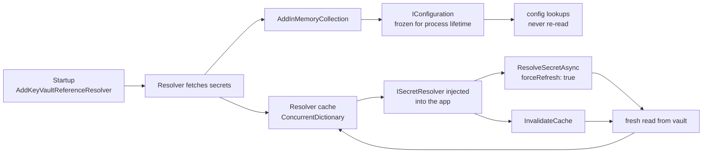

# Secret Caching and Rotation

## Overview and Purpose

There are two caches in this library and they behave very differently, which is the single most common source of confusion about it.

The first is the **resolver cache**: an in-memory dictionary inside `KeyVaultSecretResolver` or `HashiCorpVaultSecretResolver`, holding secret values keyed by reference. It is invalidatable, refreshable, and under the application's control.

The second is not really a cache at all. It is the set of values that reference resolution wrote into `IConfiguration` during startup. Those are ordinary strings in an in-memory configuration provider, and nothing in this library can change them afterwards. Clearing the resolver cache does not touch them.

That distinction determines the rotation story. An application that reads secrets through `IConfiguration` — the common case — picks up a rotated secret only on restart. An application that holds an `ISecretResolver` and calls it directly can refresh on demand without restarting. Both are supported; only the second can rotate in place.

The design also takes a position on *when* to refresh. The default TTL is infinite, which looks wrong until you consider what a finite TTL actually buys. Secrets rotate rarely — quarterly, or on an incident — so polling a vault on a timer means thousands of reads whose only outcome is confirming nothing changed, plus throttling risk, plus a rotation still not being picked up until the TTL happens to elapse. Refreshing on evidence is both cheaper and faster.

## Architecture Diagram



Follow the two branches down from the resolver. The right-hand branch is live: an injected `ISecretResolver` reads through its cache, and `forceRefresh` or `InvalidateCache` pushes a fresh value into it. The left-hand branch is a dead end once startup completes — `IConfiguration` holds a copy, and no arrow leads back to it.

There is no `IChangeToken`, no `IOptionsMonitor` integration, and no background timer anywhere in the library. Everything is either pulled on demand or fixed at startup.

## How It Works

### The cache entry

Both resolvers use the same `readonly struct`:

```csharp
private readonly struct CacheEntry
{
    private readonly DateTimeOffset _expiresAt;

    public CacheEntry(string value, TimeSpan ttl)
    {
        Value = value;
        _expiresAt = ttl == System.Threading.Timeout.InfiniteTimeSpan
            ? DateTimeOffset.MaxValue
            : DateTimeOffset.UtcNow.Add(ttl);
    }

    public string Value { get; }

    public bool IsExpired => DateTimeOffset.UtcNow >= _expiresAt;
}
```

The TTL is converted to an absolute instant at insertion, so `IsExpired` is one comparison with no arithmetic. `Timeout.InfiniteTimeSpan` maps to `DateTimeOffset.MaxValue`, which means the infinite case costs exactly the same comparison rather than needing a special branch.

A struct rather than a class, so entries live inline in the `ConcurrentDictionary` buckets with no per-entry heap allocation.

### The lookup

```csharp
if (!forceRefresh &&
    _options.EnableCaching &&
    _secretCache.TryGetValue(secretUri, out var cached) &&
    !cached.IsExpired)
{
    if (_logger.IsEnabled(LogLevel.Debug))
    {
        var maskedUri = MaskUri(secretUri);
        Log.CacheHit(_logger, maskedUri);
    }

    return cached.Value;
}
```

Four conditions, short-circuiting in cost order: the caller's `forceRefresh`, the `EnableCaching` option, the dictionary lookup, then the expiry comparison. The `IsEnabled` guard around the log record matters because masking allocates and this path runs per secret on every resolution — including when Debug is switched off.

An expired entry is not evicted here. It stays in the dictionary until the next successful read overwrites it, so a vault outage after expiry leaves a stale entry behind that will not be served (`IsExpired` is `true`) but also will not be cleaned up. Harmless, and it avoids a write on the read path.

### Cache keys

The two resolvers key differently, and it matters.

The Azure resolver keys on the **canonical secret URI**, produced by `UriFromMatch`. Both Azure reference formats converge to the same string, so `@Microsoft.KeyVault(SecretUri=https://v.vault.azure.net/secrets/pw)` and `@Microsoft.KeyVault(VaultName=v;SecretName=pw)` share one cache entry.

The HashiCorp resolver keys on the **raw reference string**. `@HashiCorp.Vault(VaultAddress=https://vault.example.com;SecretPath=secret/data/app;SecretKey=pw)` and `hashicorp://vault.example.com/secret/data/app#pw` denote the same secret but occupy two cache entries, and `InvalidateCache` must be called with whichever form the application uses.

Both use ordinal comparison, correctly: Key Vault secret names and Vault paths are case-sensitive.

### Writing to the cache

```csharp
if (_options.EnableCaching)
{
    _secretCache[secretUri] = new CacheEntry(secretValue, _options.CacheTtl);
}
```

Indexer assignment, so a `forceRefresh` read replaces the entry rather than needing an explicit eviction. On the Azure side this happens *after* `CheckValidityPeriod`, so a secret rejected for being outside its validity period never lands in the cache.

Writes are last-write-wins under concurrency. Two threads resolving the same URI simultaneously both read from the vault and one overwrites the other — a duplicated fetch, not a correctness problem. There is no per-key lock, which keeps the read path free of contention at the cost of an occasional redundant read during a startup burst.

### Invalidation

```csharp
public void InvalidateCache(string? secretUri = null)
{
    if (secretUri == null)
    {
        _secretCache.Clear();
        return;
    }

    _secretCache.TryRemove(secretUri, out _);
}
```

Null clears everything; a reference removes one entry. `TryRemove` on a key that is not present is a no-op.

The XML docs state the boundary explicitly:

> This affects secrets resolved through this instance. Values already written into `IConfiguration` during startup are not re-read and keep their original values until the application restarts.

Note "through this instance". The extension methods construct a resolver internally when the consumer does not supply one, and that instance is not exposed anywhere — so an application that only calls `AddKeyVaultReferenceResolver()` has no handle to invalidate. Registering a resolver in DI is a prerequisite for on-demand refresh.

### Force refresh

```csharp
public async Task<string> ResolveSecretAsync(string secretUri, bool forceRefresh, CancellationToken cancellationToken = default)
```

Beyond the `ISecretResolver` interface, so reachable only through the concrete type. Bypasses the lookup, reads from the vault, and replaces the entry. There is also a synchronous `ResolveSecret(string, bool)`.

`forceRefresh: true` is preferable to `InvalidateCache` followed by a resolve, because it is one call and cannot race with another thread repopulating the entry in between.

### The recommended rotation pattern

Refresh on evidence, not on a timer. The evidence is usually a downstream authentication failure:

```csharp
public class DownstreamClient
{
    private readonly ISecretResolver _resolver;
    private const string ApiKeyRef = "@Microsoft.KeyVault(SecretUri=https://v.vault.azure.net/secrets/api-key)";

    public async Task<Response> CallAsync(CancellationToken ct)
    {
        var key = await _resolver.ResolveSecretAsync(ApiKeyRef, ct);
        var response = await SendAsync(key, ct);

        if (response.StatusCode == HttpStatusCode.Unauthorized)
        {
            // The cached key may have been rotated. Re-read once and retry.
            var fresh = await ((KeyVaultSecretResolver)_resolver)
                .ResolveSecretAsync(ApiKeyRef, forceRefresh: true, ct);
            response = await SendAsync(fresh, ct);
        }

        return response;
    }
}
```

The cast to the concrete type is needed because `forceRefresh` is not on the interface. If that is awkward, inject `KeyVaultSecretResolver` directly, or expose a small application-level interface that includes the refresh capability.

The important structural point is that this pattern only works for secrets read through the resolver. A secret that the application reads as `config["ExternalServices:ApiKey"]` cannot be refreshed this way, because `IConfiguration` holds a copy taken at startup. Choose deliberately: configuration references for things that are stable for a deployment's lifetime, direct resolver calls for things that may need to change under a running process.

### Registering a resolver for runtime use

```csharp
var builder = WebApplication.CreateBuilder(args);

// Startup references — frozen into IConfiguration.
builder.Configuration.AddKeyVaultReferenceResolver(options =>
{
    options.ExcludeEnvironmentCredential = true;
});

// Runtime refreshable access — a separate, DI-managed instance.
builder.Services.AddSingleton<KeyVaultSecretResolver>(sp =>
    new KeyVaultSecretResolver(
        new KeyVaultReferenceResolverOptions { ExcludeEnvironmentCredential = true },
        sp.GetRequiredService<ILogger<KeyVaultSecretResolver>>()));

builder.Services.AddSingleton<ISecretResolver>(sp => sp.GetRequiredService<KeyVaultSecretResolver>());
```

Register as a singleton: the resolver's whole value is the client and secret caches it holds, and a scoped or transient registration would rebuild them per request and re-acquire credentials. The resolver is `IDisposable`, and a singleton registered this way is disposed by the container at shutdown.

Registering the concrete type and mapping the interface to it means both `ISecretResolver` and the `forceRefresh` overloads are injectable without two instances.

### Disabling caching

`EnableCaching = false` means every resolution hits the vault. Reasonable when the resolver is used exclusively during startup — the cache buys nothing if each URI is read once — and reasonable in tests. Not reasonable for a resolver injected into request handling, where it turns every call into a vault round trip and invites HTTP 429.

Note that the Azure pipeline deduplicates URIs before fetching, so even with caching off, a configuration with ten keys pointing at one secret produces one read during startup.

## Key Components

### CacheEntry

Described above. Duplicated verbatim in both resolvers rather than shared, since it is a private implementation detail of each and the HashiCorp package would otherwise need to expose it from the core package.

### InvalidateCache

The eviction entry point. Documented as affecting only the instance it is called on.

### ResolveSecretAsync(uri, forceRefresh, ct)

The refresh entry point. Off-interface, so it needs the concrete type or an application-level abstraction.

### CacheTtl

Default `Timeout.InfiniteTimeSpan`. `Validate()` rejects zero or negative values:

```csharp
if (CacheTtl <= TimeSpan.Zero && CacheTtl != System.Threading.Timeout.InfiniteTimeSpan)
    throw new ArgumentOutOfRangeException(nameof(CacheTtl), CacheTtl, "CacheTtl must be positive or Timeout.InfiniteTimeSpan.");
```

So "cache nothing" must be expressed as `EnableCaching = false`, not as a zero TTL.

### Dispose

Clears the secret and client caches:

> Resolved secrets are plain managed strings and cannot be zeroed, but dropping the references lets the garbage collector reclaim them rather than keeping them reachable (and therefore present in any crash dump) for the lifetime of the process.

A mitigation, not a guarantee — `string` is immutable in .NET and cannot be overwritten. Secrets already in `IConfiguration` stay reachable regardless.

## The two caches compared

| | Resolver cache | `IConfiguration` values |
| --- | --- | --- |
| Lives in | `ConcurrentDictionary` on the resolver | in-memory configuration provider |
| Populated | on each resolve | once, during `Build()` |
| Keyed by | reference string | configuration key |
| TTL | `CacheTtl`, default infinite | none — permanent |
| Invalidatable | `InvalidateCache()` | no |
| Refreshable | `forceRefresh: true` | no |
| Cleared by `Dispose()` | yes | no |
| Picks up rotation | yes, on demand | only on restart |

## Design Decisions and Trade-offs

**Infinite TTL by default.** The rationale, from the options XML docs:

> Secrets rotate rarely, so polling Key Vault on a timer mostly buys traffic and throttling risk. Instead of a TTL, refresh on demand when the application observes that a secret has gone stale.

A finite TTL is worse on three axes: it generates reads that almost always confirm no change, it invites 429s from a fleet of instances expiring in lockstep, and it still does not detect a rotation promptly — the application keeps using the old value until the TTL happens to elapse. Refreshing on a failed downstream login detects it immediately. The trade-off is that the application must notice and act; nothing happens automatically.

**No reload support for `IConfiguration`.** The consequence of resolving at build time rather than implementing an `IConfigurationProvider`, and the reason a provider was not chosen is that references legitimately appear in any source while a provider only sees its own. Documented rather than worked around, including in [SECURITY.md](../../SECURITY.md) so it is not reported as a defect.

**No per-key locking.** Concurrent resolution of one URI can fetch twice. A `Lazy<Task<string>>` per key would eliminate that, at the cost of holding a task per entry and complicating invalidation. Given the dominant pattern — a startup burst over distinct URIs, already deduplicated on the Azure side — the redundant fetch is rare and cheap.

**Do not evict expired entries on read.** Keeps the read path allocation-free and write-free. Leaves stale entries in memory that will never be served; bounded by the number of distinct references, which is small.

**`forceRefresh` off the interface.** Keeps `ISecretResolver` to two members so a test double is trivial to write. Costs consumers a cast or a concrete-type injection when they want refresh.

**Two different cache key schemes.** Canonical URI on the Azure side because canonicalisation is unambiguous there; raw reference on the Vault side because canonicalising two dissimilar formats risks merging distinct secrets. The visible consequence is that Vault callers must invalidate with the exact reference string they resolve with.

## Integration Points

- **`IConfiguration`** — the destination for startup resolution and the boundary beyond which this library has no further influence.
- **Dependency injection** — a singleton `KeyVaultSecretResolver` or `HashiCorpVaultSecretResolver` is the supported way to get refreshable access. The container disposes it at shutdown.
- **`ISecretResolver`** — the injectable abstraction. Extend it with an application-level interface if you need `forceRefresh` without a cast.
- **Azure Key Vault / HashiCorp Vault** — the source of truth. Event Grid can notify on Key Vault `SecretNewVersionCreated`, which is a valid trigger for calling `InvalidateCache` — though it requires the application to be reachable by the notification.
- **`IOptionsMonitor<T>`** — *not* integrated. Options bound from configuration containing references are bound once from the resolved values and will not change.

## Important Considerations

### Performance

- A cache hit is a dictionary lookup plus a `DateTimeOffset` comparison, and allocates nothing unless Debug logging is enabled.
- `CacheEntry` is a struct, so entries add no per-key heap allocation.
- Clients are cached separately from secrets, so a cache miss does not mean re-authenticating.
- With caching off and a resolver used at runtime, every call is a vault round trip. Do not do this.
- `InvalidateCache()` with no argument clears everything, so the next resolution of *every* reference goes back to the vault. Prefer the single-key form.

### Security

- Cached secrets are plain `string` values on the managed heap and appear in a full process dump for as long as they are reachable.
- `Dispose()` drops the references so the GC can reclaim them. Dispose resolvers you create manually; the DI container handles singletons.
- Caching does not weaken the vault's access controls — the identity is still required for every miss.
- A rotated-because-compromised secret stays in the resolver cache until invalidated and in `IConfiguration` until restart. Incident response for a leaked secret must include a restart, not just a rotation.

### Operational

- **Rotating a secret in the vault does not affect a running application** unless it reads through a resolver and refreshes. Plan a restart.
- `CacheHit` (1201 / 2201) is `Debug` and guarded by an `IsEnabled` check; enable Debug briefly if you need to confirm the cache is working.
- Startup secret reads are visible as `SecretRead` (1002 / 2002) at `Information` — one per distinct secret, naming only the vault.
- If a rotation is urgent and the application reads from `IConfiguration`, a rolling restart is the only mechanism this library offers.
- A secret rejected for expiry never enters the cache, so fixing the expiry date in the vault and restarting is sufficient — no cache clearing needed.
