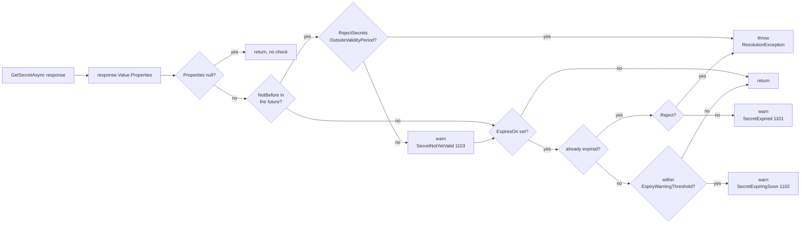

# Secret Validity Enforcement

## Overview and Purpose

Azure Key Vault lets you set `NotBefore` and `ExpiresOn` on a secret, and then does nothing with them. A `GET` on a secret whose expiry passed last year succeeds and returns the value. For secrets — unlike certificates — the validity period is advisory metadata.

That has a consequence worth stating plainly: the CIS Microsoft Azure Foundations Benchmark control *"Ensure that the expiration date is set on all secrets"* has no enforcement effect on its own. You can satisfy the control, pass the audit, and still have every application in the estate happily using expired credentials. The metadata is only useful if something reads it.

`CheckValidityPeriod` in [KeyVaultSecretResolver.cs](../../src/KeyVaultReferenceResolver/KeyVaultSecretResolver.cs) is that something. It reads the properties Key Vault returns alongside the secret value, warns when a secret is outside or approaching the end of its validity period, and — when configured to — refuses the secret outright. That turns an advisory field into an enforceable control at the consumer.

The secondary value is diagnostic. Without this check, an expired secret produces a failure at the *downstream* service: a database rejecting a password, an API returning 401. The application's own logs show a working configuration and a failing dependency, and nobody thinks to check a vault expiry date. With the check, the application logs *"Secret from https://myvault.vault.azure.net expired at 2026-03-01 00:00:00Z and is being used anyway"* at startup, which is the whole investigation.

This feature is Azure-only. HashiCorp Vault KV secrets carry no comparable expiry metadata, so the HashiCorp resolver has no equivalent.

## Architecture Diagram



Three outcomes, three event IDs. Note that `NotBefore` and `ExpiresOn` are checked independently — a secret can be both not-yet-valid and have an expiry, and in warn mode both records are emitted. And note where the check sits: it runs on the response, before the value is cached, so a rejected secret never lands in the resolver cache.

The `Properties == null` guard is defensive. A real Key Vault response always populates it; a hand-built `KeyVaultSecret` in a test might not.

## How It Works

### The check

```csharp
private void CheckValidityPeriod(KeyVaultSecret secret, string secretUri)
{
    var properties = secret.Properties;
    if (properties == null)
        return;

    var now = DateTimeOffset.UtcNow;
    var masked = MaskUri(secretUri);
```

One `DateTimeOffset.UtcNow` reading for the whole method, so the three comparisons are consistent with each other. The URI is masked once, up front, because it may appear in an exception message.

### NotBefore

```csharp
if (properties.NotBefore.HasValue && now < properties.NotBefore.Value)
{
    if (_options.RejectSecretsOutsideValidityPeriod)
    {
        throw new KeyVaultReferenceResolutionException(
            $"Secret {masked} is not valid until {properties.NotBefore.Value:u}.");
    }

    Log.SecretNotYetValid(_logger, properties.VaultUri, Format(properties.NotBefore.Value));
}
```

A `NotBefore` in the future usually means a scheduled rotation: the new version was created ahead of a cutover date. Reading it early means using a credential the downstream system has not started accepting yet, which produces exactly the same confusing authentication failure as an expired one.

`Format` renders the timestamp with the `"u"` round-trip pattern under `CultureInfo.InvariantCulture`, so records are comparable across hosts with different locales.

Note the record carries `properties.VaultUri` — the vault, not the secret name. That is the log-level discipline described in [Security-Model.md](../Architecture/Security-Model.md): a `Warning` record goes to an aggregated store, and naming the secret there would contribute to an inventory of the vault's contents.

Execution continues after the warning, so an `ExpiresOn` on the same secret is also evaluated.

### Already expired

```csharp
if (!properties.ExpiresOn.HasValue)
    return;

var expiresOn = properties.ExpiresOn.Value;

if (now >= expiresOn)
{
    if (_options.RejectSecretsOutsideValidityPeriod)
    {
        throw new KeyVaultReferenceResolutionException(
            $"Secret {masked} expired at {expiresOn:u}.");
    }

    Log.SecretExpired(_logger, properties.VaultUri, Format(expiresOn));
}
```

`SecretExpired` (1101) is the most actionable record the library emits. In warn mode the message ends *"and is being used anyway"*, which is deliberately blunt — the wording is meant to be uncomfortable enough to prompt a ticket.

A secret with no `ExpiresOn` at all returns early. That is the common case in estates that never adopted the CIS control, and it is not warned about: the library reports what the metadata says, it does not insist the metadata exist.

### Expiring soon

```csharp
else if (_options.ExpiryWarningThreshold > TimeSpan.Zero &&
         expiresOn - now <= _options.ExpiryWarningThreshold)
{
    Log.SecretExpiringSoon(_logger, properties.VaultUri, Format(expiresOn), _options.ExpiryWarningThreshold);
}
```

Reached only when the secret has *not* expired — it is the `else` of the expiry branch. `ExpiryWarningThreshold` defaults to 7 days; `TimeSpan.Zero` disables the warning entirely.

Seven days is chosen to be a useful lead time for a rotation that needs a change request, while not being so long that the warning becomes background noise. The record includes the threshold, so an operator reading it knows why it fired.

This is the record to route to a ticketing system rather than an alert channel. On an application that restarts daily it fires once per start for seven days before an expiry, which is a reasonable escalating signal.

### The reject switch

```csharp
public bool RejectSecretsOutsideValidityPeriod { get; set; }
```

Defaults to `false`. From the XML docs:

> Key Vault does not block reads of a secret whose `ExpiresOn` has passed — for secrets, expiry is advisory metadata, which is why the CIS "set an expiration date on all secrets" control has no effect on its own. Enabling this makes the control enforceable at the consumer. It defaults to off because turning it on can stop an application that is currently working with a secret whose expiry date was never maintained.

That last sentence is the whole reason for the default. Turning it on in an estate where expiry dates were set once at creation and never maintained will fail the startup of every application whose secrets have drifted past their dates — including applications whose secrets are perfectly valid and simply mislabelled. The switch is safe only once expiry metadata is actually curated.

When it does fire, the exception is a `KeyVaultReferenceResolutionException` raised from inside `ResolveSecretAsync`. The pipeline catches it, nulls the configuration value, logs `ResolutionFailed` (1003), and — if `ThrowOnResolveFailure` is on — rethrows it out of `IConfigurationBuilder.Build()`. So the two options compose: reject decides whether an expired secret is a failure, throw-on-failure decides whether that failure stops startup.

The message from the reject path is the *more* useful of the two. `"Secret https://myvault.vault.azure.net/secrets/*** expired at 2026-03-01 00:00:00Z."` names the cause directly, where the warn path leaves the reader to connect a warning at startup with a failure minutes later.

### A staged adoption path

The options are designed to be turned on in sequence:

```csharp
// Stage 1 — observe. Default settings. Collect 1101 and 1102 records
// across the estate to find out how bad the drift is.

// Stage 2 — widen the lead time while remediating.
options.ExpiryWarningThreshold = TimeSpan.FromDays(30);

// Stage 3 — enforce, once no 1101 records have appeared for a full
// rotation cycle and expiry dates are maintained as part of rotation.
options.RejectSecretsOutsideValidityPeriod = true;
```

Going straight to stage 3 in an estate that has not curated its expiry metadata will cause a startup outage. The audit evidence that stage 3 produces is only meaningful once stage 1 has been quiet for a while.

## Key Components

### CheckValidityPeriod

The whole feature. Private, called from `ResolveSecretAsync` immediately after the vault read and before caching. Takes the `KeyVaultSecret` rather than just the properties, so it has the full response available if the check ever needs more.

### Format

```csharp
private static string Format(DateTimeOffset value)
{
    return value.ToString("u", CultureInfo.InvariantCulture);
}
```

Timestamps are pre-formatted to strings before being passed to the source-generated log methods, invariant so records are comparable across hosts. Formatting at the call site rather than relying on a `{ExpiresOn:u}` format specifier in the template is what lets `LoggerMessage` generation avoid boxing.

### SecretProperties

The Azure SDK type carrying `NotBefore`, `ExpiresOn`, `VaultUri`, `Version`, `CreatedOn`, `UpdatedOn` and `Enabled`. Only the first three are used. `Enabled` is not checked, because a disabled secret cannot be read at all — Key Vault returns 403, which the resolver's status mapping already handles.

### ExpiryWarningThreshold

`TimeSpan`, default 7 days, `TimeSpan.Zero` to disable. Not subject to `Validate()`, since zero is a legitimate value and a negative value simply never matches the comparison.

### The three event IDs

| ID | Name | Level | Fires when |
| --- | --- | --- | --- |
| 1101 | `SecretExpired` | Warning | `ExpiresOn` has passed, reject off |
| 1102 | `SecretExpiringSoon` | Warning | expiry within the threshold |
| 1103 | `SecretNotYetValid` | Warning | `NotBefore` in the future, reject off |

Grouped in the 1100 range — validity — to separate them from resolution (1000s) and caching (1200s). Public and stable, because a log-based control is only testable against a stable identifier. See [Logging-And-Monitoring.md](../Operations/Logging-And-Monitoring.md).

## Design Decisions and Trade-offs

**Warn by default, reject on request.** The safe default for a library that can stop an application from starting. An estate where expiry dates were set at creation and never maintained would experience an outage on upgrade if rejection were the default — and the secrets involved would mostly be valid ones with stale labels. The cost is that the control is off until someone turns it on, so the compliance benefit requires a deliberate act.

**Check `NotBefore` as well as `ExpiresOn`.** Cheap, and catches a real scenario: a scheduled rotation where the new version is created ahead of its cutover. The failure it prevents looks identical to the expired case from the downstream service's perspective.

**Log the vault, not the secret name, in the warnings.** A `Warning` record reaches aggregated log stores where an accumulation of secret names would amount to a vault inventory. The name is available at `Debug` on the `ResolvingSecret` record from the same resolution. The cost is an extra step for an operator: correlate the warning with the Debug record, or look at which secrets in that vault have expiry dates.

**A single warning threshold, not a schedule.** No escalating severity, no distinct 30/7/1-day records. One threshold and one record keeps the configuration surface small; an application that restarts regularly turns it into a repeated signal anyway, and a monitoring system can escalate on frequency.

**Do not warn about missing expiry metadata.** Arguably a miss — "this secret has no expiry date" is itself a CIS finding. Left out because the library reports what the metadata says rather than auditing the vault's configuration, and because in most estates it would fire on nearly every secret and be muted immediately. Vault-configuration auditing belongs in Azure Policy or Defender for Cloud.

**Check before caching.** A rejected secret does not enter the cache, so fixing the expiry date in the vault and restarting is sufficient — no cache clearing needed. Costs nothing.

**No HashiCorp equivalent.** Vault KV secrets have no expiry metadata to read. Vault's answer to the same problem is dynamic secrets with leases, which is a different model the library does not attempt to wrap.

## Integration Points

- **`Azure.Security.KeyVault.Secrets`** — `KeyVaultSecret.Properties` supplies `NotBefore`, `ExpiresOn` and `VaultUri`. No extra call is made; the metadata arrives with the value.
- **`KeyVaultReferenceResolutionException`** — the rejection exception type, masking the URI in its `SecretUri` property.
- **`ThrowOnResolveFailure`** — composes with rejection to decide whether the resulting failure stops startup.
- **Resolver cache** — the check gates cache insertion, so rejected secrets are never cached.
- **`LogEvents`** — the three stable warning IDs.
- **Azure Policy / Defender for Cloud** — the right place to enforce that expiry dates *exist*. This feature enforces that they are *honoured*. The two are complementary.
- **Key Vault Event Grid** — `SecretNearExpiry` and `SecretExpired` events are the platform-side equivalent, fired per secret regardless of whether anything reads it. Useful alongside this, since the library only sees secrets it actually resolves.

## Important Considerations

### Performance

- No additional network call. The metadata comes back with the secret value.
- Three `DateTimeOffset` comparisons and, in the warning cases, one string format. Runs once per vault read, never on a cache hit.
- Pre-formatting timestamps to strings keeps the source-generated log path allocation-light on the non-warning path.

### Security

- The reject switch is what makes the CIS expiration control enforceable rather than decorative. Turn it on once expiry metadata is curated.
- An expired credential is a live credential until rotated. This feature makes its use visible; it does not make it safe.
- Warnings name only the vault. Do not "improve" them by adding the secret name — that would put a vault inventory into aggregated logs.
- A rejected secret never enters the cache and never reaches `IConfiguration`, so enforcement is genuinely fail-closed.

### Operational

- **Alert on `SecretExpired` (1101).** An expired credential is in active use.
- **Ticket on `SecretExpiringSoon` (1102).** Rotate within the window. Route to a queue, not a pager.
- **Investigate `SecretNotYetValid` (1103).** Usually a scheduled rotation whose cutover has not arrived; occasionally a clock problem on the host.
- Warnings appear during application startup, so they are in the first seconds of a container's log — easily missed if log shipping starts late.
- Before enabling rejection, confirm no 1101 records have appeared across a full rotation cycle. Enabling it blind is a startup outage.
- After rotating to fix an expiry, restart the application: values already in `IConfiguration` do not change. See [Secret-Caching-And-Rotation.md](../Features/Secret-Caching-And-Rotation.md).
