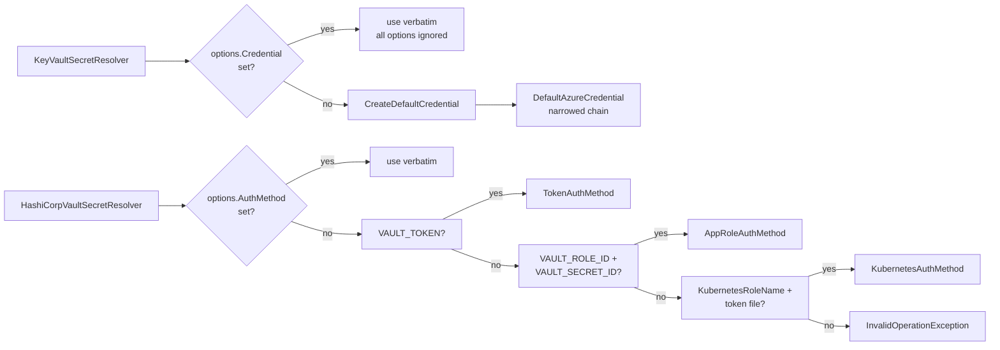

# Vault Authentication Methods

## Overview and Purpose

Both packages need an identity before they can read a secret, and both take the position that the identity should be ambient — supplied by the platform, not by the application. Azure managed identity and Kubernetes service accounts are the two cases that matter, and neither requires the application to hold a credential.

The two packages get there differently. The Azure side delegates to `Azure.Identity`'s `DefaultAzureCredential`, a chain that tries several credential sources in order, and the library's contribution is to *narrow* that chain — turning off sources whose presence would be a liability in a production process. The HashiCorp side has no equivalent SDK-level chain, so the library implements one: an `IVaultAuthMethod` abstraction with three implementations and an explicit auto-detection order.

Both chains share a hazard worth stating up front. A chain that falls back to an environment variable will silently use that environment variable, and the environment of a running process is not always as controlled as the deployment manifest suggests. On the Azure side that is `AZURE_CLIENT_SECRET`; on the Vault side it is `VAULT_TOKEN`. In both cases the fallback sits *ahead* of the platform identity in priority order. The library's response is an option on one side and a log record on the other.

## Architecture Diagram



The symmetry is deliberate: on both sides, supplying the credential explicitly bypasses all detection. That is the recommended configuration for any deployment where you know what the identity should be, and it removes the entire ambient-environment question.

The asymmetry is where the two sides differ in when they resolve. The Azure credential is built in the resolver's constructor; the Vault auth method is resolved lazily, inside `GetOrCreateClient`. That means a `HashiCorpVaultSecretResolver` can be constructed in an environment with no Vault credentials at all and only fails if a reference actually needs resolving — which matches the pipeline's short-circuit when a configuration contains no references.

## How It Works

### Azure: the narrowed credential chain

`CreateDefaultCredential` in [KeyVaultSecretResolver.cs](../../src/KeyVaultReferenceResolver/KeyVaultSecretResolver.cs):

```csharp
var credentialOptions = new DefaultAzureCredentialOptions
{
    ExcludeAzureCliCredential = !options.AllowDeveloperCredentials,
    ExcludeAzureDeveloperCliCredential = !options.AllowDeveloperCredentials,
    ExcludeVisualStudioCredential = !options.AllowDeveloperCredentials,
    ExcludeAzurePowerShellCredential = !options.AllowDeveloperCredentials,
    ExcludeInteractiveBrowserCredential = true,
    ExcludeEnvironmentCredential = options.ExcludeEnvironmentCredential
};

if (!string.IsNullOrWhiteSpace(options.ManagedIdentityClientId))
    credentialOptions.ManagedIdentityClientId = options.ManagedIdentityClientId;

if (!string.IsNullOrWhiteSpace(options.TenantId))
    credentialOptions.TenantId = options.TenantId;

if (options.AuthorityHost != null)
    credentialOptions.AuthorityHost = options.AuthorityHost;

return new DefaultAzureCredential(credentialOptions);
```

**Developer credentials are off by default.** `AllowDeveloperCredentials` defaults to `false`, which inverts `DefaultAzureCredential`'s own behaviour. The four excluded sources — Azure CLI, Azure Developer CLI, Visual Studio, Azure PowerShell — all read a locally cached token belonging to a human. A process running in Azure that falls back to one of them is using an identity that is typically far more privileged than the workload's and much harder to attribute in an audit. Turn it on for local development only:

```csharp
builder.Configuration.AddKeyVaultReferenceResolver(options =>
{
    options.AllowDeveloperCredentials = builder.Environment.IsDevelopment();
});
```

**Interactive browser is off unconditionally.** A non-interactive startup path should never open a browser, and if it somehow can, that is a prompt an operator can be socially engineered through.

**The environment credential is on by default, and should not be.** This is the weakest default in the library, kept for 1.x compatibility. `EnvironmentCredential` reads `AZURE_CLIENT_ID` / `AZURE_TENANT_ID` / `AZURE_CLIENT_SECRET` and sits *ahead of* managed identity in the chain, so anything able to set those variables in the process environment redirects all vault access to an identity of its choosing. Set it to `true` in any deployment using managed or workload identity:

```csharp
options.ExcludeEnvironmentCredential = true;
```

**`ManagedIdentityClientId` is required with multiple identities.** A host with more than one user-assigned managed identity gives the credential no way to choose, and the failure is an unhelpful authentication error rather than a clear message. Set it whenever more than one identity is assigned.

**`TenantId` and `AuthorityHost` are for sovereign clouds and cross-tenant cases.** `AuthorityHost` takes an Entra ID endpoint — `https://login.microsoftonline.us/` for Azure Government — and should be set alongside `VaultDnsSuffix`. See [Environment-Deployment-Guide.md](../Deployment/Environment-Deployment-Guide.md).

The effective chain, with defaults, is: environment credential → workload identity → managed identity. With `ExcludeEnvironmentCredential = true` it is workload identity → managed identity, which is what a production Azure workload should be using.

### Azure: bypassing the chain entirely

```csharp
_credential = _options.Credential ?? CreateDefaultCredential(_options);
```

If `options.Credential` is set, every credential-shaping option above is ignored — silently. That is the documented behaviour and the escape hatch for anything `DefaultAzureCredential` cannot express:

```csharp
// Workload identity in AKS, explicit
options.Credential = new WorkloadIdentityCredential();

// A specific user-assigned managed identity
options.Credential = new ManagedIdentityCredential(clientId: "...");

// Federated credential from a CI pipeline
options.Credential = new ClientAssertionCredential(tenantId, clientId, () => GetAssertionAsync());
```

The silent-ignore behaviour is worth remembering when debugging: if an identity looks wrong and the exclusion options appear correct, check whether a credential was passed explicitly somewhere.

### HashiCorp: the IVaultAuthMethod abstraction

```csharp
public interface IVaultAuthMethod
{
    IAuthMethodInfo GetAuthMethodInfo();
}
```

One member, returning VaultSharp's `IAuthMethodInfo`. Thin by design: the library's contribution is the acquisition logic (read this environment variable, re-read this token file), not the protocol, which VaultSharp owns.

`GetAuthMethodInfo()` is called each time a client is created, not once per instance. That is what makes the Kubernetes implementation's token re-reading possible.

### HashiCorp: TokenAuthMethod

```csharp
public static bool TryFromEnvironment([NotNullWhen(true)] out TokenAuthMethod? authMethod)
{
    var token = Environment.GetEnvironmentVariable("VAULT_TOKEN");
    if (string.IsNullOrWhiteSpace(token))
    {
        authMethod = null;
        return false;
    }

    authMethod = new TokenAuthMethod(token);
    return true;
}
```

A Vault token used directly. Simplest and least suitable for production: the token is a long-lived bearer credential sitting in an environment variable, visible to anything that can read the process environment, and it has to be provisioned and rotated by something outside the application.

Its real use is local development, where `vault server -dev` prints a root token, and CI where a short-lived token is minted per job. Each auth method exposes both a `FromEnvironment` that throws and a `TryFromEnvironment` that returns `false`; the `Try` variants are what auto-detection uses, and `[NotNullWhen(true)]` comes from the `Nullable` shim package since this targets netstandard2.0.

### HashiCorp: AppRoleAuthMethod

```csharp
public AppRoleAuthMethod(string roleId, string secretId, string mountPoint = "approle")
```

Reads `VAULT_ROLE_ID` and `VAULT_SECRET_ID`, with a configurable mount point defaulting to `approle`. The AppRole model separates a stable, non-secret role ID from a secret ID that can be short-lived, single-use, or delivered by a trusted orchestrator — which is a meaningful improvement over a raw token even though both live in environment variables.

`GetAuthMethodInfo()` returns a fresh `AppRoleAuthMethodInfo` each call, so the values captured at construction are re-presented. A rotated secret ID therefore requires a new instance; the auth method does not re-read the environment.

Suitable for VMs and containers outside Kubernetes. In Kubernetes, use Kubernetes auth instead — it removes the provisioning problem entirely.

### HashiCorp: KubernetesAuthMethod

The most production-appropriate of the three, and the one with real logic behind it.

```csharp
public const string DefaultTokenPath = "/var/run/secrets/kubernetes.io/serviceaccount/token";
```

Kubernetes projects a service account JWT into every pod at that path. Vault's Kubernetes auth method validates that JWT against the cluster's API and issues a Vault token bound to a role. Nothing needs provisioning into the pod.

The critical detail is that the JWT is **re-read on every login**:

```csharp
public IAuthMethodInfo GetAuthMethodInfo()
{
    return new KubernetesAuthMethodInfo(_mountPoint, _roleName, ReadCurrentJwt());
}

private string ReadCurrentJwt()
{
    if (_tokenPath == null)
        return _jwt;

    try
    {
        var jwt = File.ReadAllText(_tokenPath).Trim();
        if (!string.IsNullOrWhiteSpace(jwt))
            return jwt;
    }
    catch (IOException) { /* fall through to last known good */ }
    catch (UnauthorizedAccessException) { /* fall through */ }

    return _jwt;
}
```

> Kubernetes rotates projected service account tokens at roughly 80% of their lifetime, so a JWT captured once would become a stale credential and later logins would fail.

Bound service account tokens have a finite lifetime — an hour by default — and the kubelet rewrites the file in place before expiry. A JWT read once at construction is therefore a *time bomb*: it works at startup and fails on the next login, which in combination with VaultSharp's cached login means the failure appears an hour into the process's life. Re-reading the file closes that.

The two catch blocks fall back to the last known good token rather than failing. A transient read error during the kubelet's atomic rewrite should not break a login when a probably-still-valid token is in hand.

Note the split constructors. The public `KubernetesAuthMethod(roleName, jwt, mountPoint)` sets `_tokenPath = null`, so a caller-supplied JWT is used as-is forever; the private constructor used by `FromFile`/`TryFromFile` records the path and enables re-reading. The XML docs on the public constructor say to prefer `FromFile` in Kubernetes for exactly this reason.

`IsRunningInKubernetes()` is a static convenience that checks for the token file's existence.

### HashiCorp: auto-detection order

```csharp
public IVaultAuthMethod GetEffectiveAuthMethod()
{
    if (AuthMethod != null)
        return AuthMethod;

    if (TokenAuthMethod.TryFromEnvironment(out var tokenAuth))
        return tokenAuth;

    if (AppRoleAuthMethod.TryFromEnvironment(out var appRoleAuth))
        return appRoleAuth;

    if (!string.IsNullOrWhiteSpace(KubernetesRoleName) &&
        KubernetesAuthMethod.TryFromFile(KubernetesRoleName!, out var k8sAuth))
        return k8sAuth;

    throw new InvalidOperationException(
        "No authentication method configured. Set AuthMethod option, VAULT_TOKEN, " +
        "VAULT_ROLE_ID + VAULT_SECRET_ID, or configure KubernetesRoleName when running in Kubernetes.");
}
```

Order: explicit → `VAULT_TOKEN` → AppRole → Kubernetes. The final exception enumerates every way to satisfy it.

The ordering is the hazard. `VAULT_TOKEN` wins over both AppRole and the Kubernetes service account, so a leftover `VAULT_TOKEN` in a production container overrides the intended workload identity. That token might be a stale dev token, a token with the wrong policy, or one that has been revoked — and the symptom is a 403 that looks like a policy problem.

Kubernetes auth also requires `KubernetesRoleName` to be set, so it can never be reached by environment alone. That is intentional — there is no way to guess the Vault role name — but it means "running in Kubernetes" is not sufficient for auto-detection to find it.

The mitigation is a log record, from `GetOrCreateClient`:

```csharp
// Record which method won the auto-detection race. Without this, a leftover
// VAULT_TOKEN in a production container silently overrides the intended
// workload identity - VAULT_TOKEN is tried before AppRole, which is tried
// before the Kubernetes service account - and nothing says so.
_logger.LogInformation(
    HashiCorpLogEvents.AuthMethodSelected,
    "Authenticating to Vault at {VaultAddress} using {AuthMethod}",
    address, authMethod.GetType().Name);
```

`AuthMethodSelected` (2101) at `Information` is an audit control, not diagnostics. Only the method's type name is logged, never a credential. Alert on it reporting `TokenAuthMethod` in an environment expected to use Kubernetes auth.

The cleaner answer is to set `AuthMethod` explicitly and skip detection:

```csharp
builder.Configuration.AddHashiCorpVaultResolver(options =>
{
    options.VaultAddress = "https://vault.example.com";
    options.AuthMethod = KubernetesAuthMethod.FromFile("my-app-role");
});
```

### HashiCorp: login lifetime and re-authentication

VaultSharp performs its login once and caches the resulting Vault token on the auth method info. Vault login tokens have a TTL — commonly an hour — after which every read through that client returns 403 for the life of the process. `HashiCorpVaultSecretResolver` handles this by evicting the cached client and logging in again, once, logging `Reauthenticated` (2102). Detail in [HashiCorp-Vault-Provider.md](../Features/HashiCorp-Vault-Provider.md).

This is where the Kubernetes token re-reading earns its keep: the re-login needs a *current* JWT, and by then the original one has been rotated away.

## Environment variables

| Variable | Read by | Purpose |
| --- | --- | --- |
| `VAULT_ADDR` | `GetEffectiveVaultAddress()` | Vault server address when `options.VaultAddress` is unset |
| `VAULT_TOKEN` | `TokenAuthMethod` | Vault token; first in auto-detection |
| `VAULT_ROLE_ID` | `AppRoleAuthMethod` | AppRole role ID; needs `VAULT_SECRET_ID` too |
| `VAULT_SECRET_ID` | `AppRoleAuthMethod` | AppRole secret ID |
| `AZURE_CLIENT_ID` | `EnvironmentCredential` | Service principal client ID |
| `AZURE_TENANT_ID` | `EnvironmentCredential` | Tenant |
| `AZURE_CLIENT_SECRET` | `EnvironmentCredential` | Service principal secret |
| `AZURE_LOG_LEVEL` | Azure SDK | Enables SDK logging; content logging is forced off regardless |

The Kubernetes service account token path is not an environment variable — it is the fixed `KubernetesAuthMethod.DefaultTokenPath`, overridable per call.

Tests that mutate the `VAULT_*` variables must join the `"VaultEnvironment"` xUnit collection, which disables parallelisation. See [Local-Setup-And-Testing.md](../Development/Local-Setup-And-Testing.md).

## Method comparison

| | Token | AppRole | Kubernetes | Azure managed identity |
| --- | --- | --- | --- | --- |
| Credential location | env var | two env vars | projected file | platform |
| Provisioning needed | yes | yes | no | no |
| Rotates automatically | no | secret ID can | yes, by kubelet | yes, by platform |
| Re-read on login | no | no | **yes** | n/a |
| Auto-detected | 1st | 2nd | 3rd, needs role name | via chain |
| Recommended for | local dev, CI | VMs, non-K8s containers | Kubernetes | Azure |

## Design Decisions and Trade-offs

**Narrow `DefaultAzureCredential` rather than replace it.** Consumers keep a credential chain they already understand and can still pass their own `TokenCredential`. The cost is inheriting the chain's ordering, including the environment credential sitting ahead of managed identity — which the library can only mitigate with an option.

**Developer credentials off by default, environment credential on by default.** Inconsistent, and deliberate. Excluding developer credentials breaks nobody who was relying on documented behaviour; excluding the environment credential would break every 1.x consumer using a service principal in environment variables. A future major version should flip it.

**Silently ignore credential-shaping options when `Credential` is set.** Simple and predictable once known, and a source of confusion when not. Throwing on the conflicting combination would be more defensive; documenting it was the choice made.

**Mirror the chain concept on the Vault side.** Familiar to anyone who has used `DefaultAzureCredential`, and it makes `VAULT_ADDR` + `VAULT_TOKEN` work with zero configuration for local development. It also imports the same hazard, which is why the selected method is logged.

**Put `VAULT_TOKEN` first.** Matches the Vault CLI's own precedence, so a developer's expectations carry over. The production hazard is real and is addressed with a log record rather than a reordering, because reordering would surprise anyone whose mental model comes from the CLI.

**Require `KubernetesRoleName` for Kubernetes auto-detection.** The Vault role name cannot be inferred, so there is no alternative. It does mean Kubernetes auth is never fully automatic.

**Re-read the projected token on every login.** One file read per login, versus a credential that expires an hour into the process's life. Not a close call. The last-known-good fallback on `IOException` handles the kubelet's atomic rewrite window.

**Two constructors with different re-read behaviour.** The explicit-JWT constructor cannot re-read because there is no path to read from. Marking it clearly in the XML docs was preferred over removing it, since a caller obtaining a JWT from elsewhere is a legitimate case.

## Integration Points

- **`Azure.Identity`** — `DefaultAzureCredential`, `DefaultAzureCredentialOptions`, and every `TokenCredential` a consumer might substitute, including `WorkloadIdentityCredential` and `ClientAssertionCredential`.
- **VaultSharp auth namespaces** — `VaultSharp.V1.AuthMethods.Token`, `.AppRole`, `.Kubernetes` supply the `IAuthMethodInfo` implementations this library wraps.
- **Kubernetes projected service account tokens** — the file at `DefaultTokenPath`, rotated by the kubelet. Requires the Vault Kubernetes auth method to be enabled and a role bound to the pod's service account.
- **Azure workload identity** — handled by `DefaultAzureCredential`'s workload identity step, or explicitly via `options.Credential = new WorkloadIdentityCredential()`.
- **`Nullable` shim package** — provides `[NotNullWhen]` on netstandard2.0 for the `Try*` patterns. `PrivateAssets="all"`, so it does not flow to consumers.

## Important Considerations

### Performance

- The Azure credential is constructed once per resolver and caches tokens internally.
- The Vault auth method is resolved once per distinct Vault address, at first client creation.
- `GetAuthMethodInfo()` is called per client creation, so the Kubernetes file read happens per login, not per secret.
- Re-authentication costs one login plus one re-read, once per token TTL.

### Security

- Set `ExcludeEnvironmentCredential = true` on Azure whenever the workload has a managed or workload identity.
- Set `ManagedIdentityClientId` when more than one identity is assigned to the host.
- Set `options.AuthMethod` explicitly on the Vault side to eliminate auto-detection entirely.
- Prefer Kubernetes auth over AppRole over Token. Prefer `FromFile` over the explicit-JWT constructor.
- Never log a credential. The library logs only the auth method's *type name*.
- Scope both identities minimally: `Key Vault Secrets User` on specific secrets where possible; a Vault policy granting `read` on one path prefix.

### Operational

- `AuthMethodSelected` (2101) is the record to watch. `TokenAuthMethod` where you expect `KubernetesAuthMethod` means a stray `VAULT_TOKEN`.
- *"No authentication method configured"* lists all four remedies in the message.
- *"VAULT_ROLE_ID environment variable is not set"* from `FromEnvironment` means the eager variant was called; auto-detection uses `TryFromEnvironment` and would have moved on.
- A `FileNotFoundException` for the service account token means the pod has `automountServiceAccountToken: false`.
- Azure 403 at startup: check the role assignment *and* the vault firewall — and check whether a stray `AZURE_CLIENT_SECRET` redirected the identity.
- Vault 403 repeated with no `Reauthenticated` in between is a policy problem, not a TTL problem.
