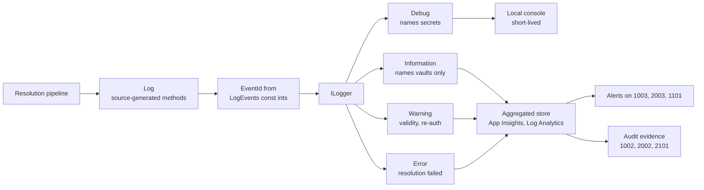

# Logging and Monitoring

## Overview and Purpose

This library emits sixteen distinct log records across two packages, every one of them carrying a stable numeric `EventId`. That is unusual for a library this small, and it is deliberate.

Secret access is the kind of activity an ISO 27001 or SOC 2 audit asks for evidence of. "We log every secret read" is an assertion; a stable event ID that a monitoring query can filter on is a *testable control*. The `LogEvents` and `HashiCorpLogEvents` classes are public for that reason — an alert rule or a compliance query should bind to `EventId == 1003`, not to a `grep` for message text that a future refactor can silently break.

The second design concern is what the records *contain*. Aggregated log stores are a much softer target than a vault: more people have read access, retention is longer, and the data is replicated into analytics systems. So the level assignment is not about verbosity, it is about exposure. Records that name a secret are `Debug`. Records that reach an aggregated store are `Information` and name only the vault. That split is enforced consistently and is the thing most likely to be broken by a well-meaning change.

## Architecture Diagram



Read the split down the middle. The `Debug` branch is for a developer with a console attached, where naming a secret is fine because the log does not leave the machine. The `Information` and above branch is for everything that ships somewhere, and those records are written on the assumption that the destination is semi-public.

The `Log` class in the middle is a source-generation layer, not a policy layer: it compiles the message templates once and avoids boxing arguments. Event IDs still come from the `const int` fields on `LogEvents`, which remains the public reference.

## How It Works

### Event ID allocation

Numbers are grouped by concern and separated by package so a consumer using both sees no collisions.

| Range | Package | Concern |
| --- | --- | --- |
| 1000–1099 | Core (Azure) | Resolution |
| 1100–1199 | Core (Azure) | Secret validity |
| 1200–1299 | Core (Azure) | Caching |
| 2000–2099 | HashiCorp | Resolution |
| 2100–2199 | HashiCorp | Authentication |
| 2200–2299 | HashiCorp | Caching |

Both classes expose each ID twice — as a `const int` and as an `EventId` — declared adjacently so the two forms cannot drift:

```csharp
/// <summary>Numeric ID of <see cref="ResolutionFailed"/>.</summary>
public const int ResolutionFailedId = 1003;

/// <summary>A reference could not be resolved and its value was set to null. Error.</summary>
public static readonly EventId ResolutionFailed = new EventId(ResolutionFailedId, nameof(ResolutionFailed));
```

The `const int` is what the `[LoggerMessage]` attributes bind to, since an attribute argument must be a compile-time constant. The `EventId` is the consumer-facing form, carrying a name as well as a number so a structured sink can render `ResolutionFailed` rather than `1003`.

### Source-generated log methods

The core package routes its records through [Log.cs](../../src/KeyVaultReferenceResolver/Log.cs), an `internal static partial class` using `[LoggerMessage]`:

```csharp
[LoggerMessage(
    EventId = LogEvents.ResolutionFailedId,
    Level = LogLevel.Error,
    Message = "Failed to resolve Key Vault reference for '{ConfigKey}'; the value has been set to null")]
public static partial void ResolutionFailed(ILogger logger, Exception exception, string configKey);
```

> Generated rather than hand-written `LoggerExtensions` calls so that the message template is compiled once, the arguments are not boxed into a `params` array, and nothing is evaluated when the level is disabled.

The generator emits a method that checks `IsEnabled` first and passes arguments through a strongly-typed state object. For a library whose logging runs in a startup loop over every configuration value, that removes a measurable amount of allocation.

Two call sites add an explicit `IsEnabled` guard on top, because their *arguments* are expensive to compute:

```csharp
if (_logger.IsEnabled(LogLevel.Debug))
{
    var maskedUri = MaskUri(secretUri);
    Log.CacheHit(_logger, maskedUri);
}
```

Masking allocates a new string, and the generated method's own `IsEnabled` check happens too late to avoid that. The guard is needed on the cache-hit and reference-resolved paths specifically because both run per secret on every resolution.

Timestamps are pre-formatted to invariant strings before being passed in:

```csharp
private static string Format(DateTimeOffset value)
    => value.ToString("u", CultureInfo.InvariantCulture);
```

This keeps the generated path free of boxing and makes records comparable across hosts with different locales, at the cost of the sink receiving a string rather than a structured timestamp.

The HashiCorp package currently calls `ILogger` extension methods directly with the `HashiCorpLogEvents` `EventId` fields. Its numeric `const int` fields are already in place, so the same treatment can be applied there; the records, IDs, levels and messages are identical either way.

### Core package records

| ID | Name | Level | Message | Fields |
| --- | --- | --- | --- | --- |
| 1001 | `SecretResolved` | Debug | `Resolving secret {SecretName} from vault {VaultUri}` | `SecretName`, `VaultUri` |
| 1001 | `SecretResolved` | Debug | `Resolved Key Vault reference: {SecretUri}` | masked `SecretUri` |
| 1002 | `SecretRead` | Information | `Successfully resolved secret from {VaultUri}` | `VaultUri` |
| 1003 | `ResolutionFailed` | Error | `Failed to resolve Key Vault reference for '{ConfigKey}'; the value has been set to null` | `ConfigKey`, exception |
| 1004 | `ResolutionSummary` | Information | `Resolved {Count} of {Total} configuration value(s) containing Key Vault reference(s)` | `Count`, `Total` |
| 1101 | `SecretExpired` | Warning | `Secret from {VaultUri} expired at {ExpiresOn} and is being used anyway` | `VaultUri`, `ExpiresOn` |
| 1102 | `SecretExpiringSoon` | Warning | `Secret from {VaultUri} expires at {ExpiresOn}, within the {Threshold} warning threshold` | `VaultUri`, `ExpiresOn`, `Threshold` |
| 1103 | `SecretNotYetValid` | Warning | `Secret from {VaultUri} is not valid until {NotBefore} but is being used now` | `VaultUri`, `NotBefore` |
| 1201 | `CacheHit` | Debug | `Returning cached secret for URI: {SecretUri}` | masked `SecretUri` |

Note that 1001 covers two distinct records — the resolver's pre-read statement, which names the secret, and the pipeline's post-read confirmation, which carries a masked URI. Both are `Debug` and both concern a single secret read, so they share an ID. Filter on the message template if you need to distinguish them.

### HashiCorp package records

| ID | Name | Level | Message | Fields |
| --- | --- | --- | --- | --- |
| 2001 | `SecretResolved` | Debug | `Resolving secret {SecretKey} from path {SecretPath} at {VaultAddress}` | `SecretKey`, masked `SecretPath`, `VaultAddress` |
| 2001 | `SecretResolved` | Debug | `Resolved HashiCorp Vault reference: {ConfigKey}` | `ConfigKey` |
| 2002 | `SecretRead` | Information | `Successfully resolved secret from {SecretPath}` | masked `SecretPath` |
| 2003 | `ResolutionFailed` | Error | `Failed to resolve HashiCorp Vault reference for '{ConfigKey}'; the value has been set to null` | `ConfigKey`, exception |
| 2004 | `ResolutionSummary` | Information | `Resolved {Count} of {Total} HashiCorp Vault reference(s)` | `Count`, `Total` |
| 2005 | `KvVersionProbe` | Debug | `Mount {MountPath} did not answer as KV v2 (HTTP {Status}); retrying as KV v1. Set KvVersion to skip this probe.` | `MountPath`, `Status` |
| 2101 | `AuthMethodSelected` | Information | `Authenticating to Vault at {VaultAddress} using {AuthMethod}` | `VaultAddress`, `AuthMethod` type name |
| 2102 | `Reauthenticated` | Information | `Vault returned {Status} for {SecretPath}; re-authenticating and retrying once.` | `Status`, masked `SecretPath` |
| 2201 | `CacheHit` | Debug | `Returning cached secret for: {SecretUri}` | masked reference |

### What each level emits

**Debug** names secrets. `SecretResolved` carries the secret name (Azure) or the key name and masked path (Vault); `CacheHit` carries a masked reference; `KvVersionProbe` carries a mount path. Safe on a developer console, not safe to ship.

**Information** names vaults and counts. `SecretRead` says a secret was read from a named vault without saying which secret. `ResolutionSummary` gives an aggregate. `AuthMethodSelected` gives an auth method type name. This is the level to ship and retain.

**Warning** is the validity family plus `Reauthenticated`. All are actionable but none are failures.

**Error** is `ResolutionFailed` only, and it is unambiguous: a reference could not be resolved and the configuration value has been set to `null`. If `ThrowOnResolveFailure` is on, an exception follows out of `Build()`.

There is no `Critical` and no `Trace`.

### The level discipline, and why it looks over-cautious

From the pipeline source:

```csharp
// Debug rather than Information: one record per key produces a map of exactly
// which configuration keys hold credentials, and key names routinely embed
// tenant or customer identifiers (Clients:AcmeCorp:ApiKey). The aggregate count
// is logged at Information instead.
```

And from the resolver:

```csharp
// Information level carries no secret name: these records are shipped to
// aggregated log stores, where the set of names would amount to an inventory
// of the vault's contents. The name is available at Debug.
```

The reasoning is cumulative rather than per-record. One `Information` record naming a secret is harmless. Every application in an estate emitting one per secret per restart, retained for ninety days in a store that a dozen teams can query, produces a searchable index of which credentials exist, where they live, and which applications hold them. That is a genuinely useful artifact for an attacker who has already got as far as log access.

The HashiCorp side applies the same rule to paths. `MaskPath` reduces `secret/data/prod/db-credentials` to `secret/***`, because Vault key names are self-describing.

**Do not "improve" these records by adding the secret name at `Information`.** It is the most tempting change in the codebase and the one that undoes the most.

### Wiring up a logger

Startup logging is opt-in. Without an `ILogger`, the library uses `NullLogger.Instance` and resolution — including its failures — is completely silent.

In ASP.NET Core the host's logger does not exist yet while `builder.Configuration` is being assembled, so a bootstrap logger is needed:

```csharp
var builder = WebApplication.CreateBuilder(args);

using var loggerFactory = LoggerFactory.Create(b =>
{
    b.AddConsole();
    b.SetMinimumLevel(LogLevel.Information);
});
var logger = loggerFactory.CreateLogger("KeyVaultReferenceResolver");

builder.Configuration.AddKeyVaultReferenceResolver(
    new KeyVaultReferenceResolverOptions { ExcludeEnvironmentCredential = true },
    logger);
```

The `using` matters: dispose the bootstrap factory once configuration is built, so its console provider does not linger alongside the host's.

A resolver registered in DI for runtime use takes the host's logger normally, since the parameter is `ILogger` and `ILogger<T>` derives from it:

```csharp
builder.Services.AddSingleton(sp => new KeyVaultSecretResolver(
    options, sp.GetRequiredService<ILogger<KeyVaultSecretResolver>>()));
```

### Filtering by category

Records are emitted under whatever category the supplied logger has — `"KeyVaultReferenceResolver"` for the bootstrap example above, `KeyVaultReferenceResolver.KeyVaultSecretResolver` for an `ILogger<T>`. To see `Debug` from the library only:

```json
{
  "Logging": {
    "LogLevel": {
      "Default": "Information",
      "KeyVaultReferenceResolver": "Debug"
    }
  }
}
```

That applies to the DI-registered resolver. The startup pass uses the bootstrap logger's own configuration, which is separate.

### Querying event IDs

Structured sinks surface the ID as a scalar. Application Insights:

```kusto
traces
| where customDimensions.EventId in ("1003", "2003")
| project timestamp, message, cloud_RoleInstance, customDimensions.ConfigKey
| order by timestamp desc
```

```kusto
// Expired secrets in active use
traces
| where customDimensions.EventId == "1101"
| summarize count() by tostring(customDimensions.VaultUri), bin(timestamp, 1d)
```

```kusto
// Partial resolution — Count < Total
traces
| where customDimensions.EventId in ("1004", "2004")
| extend Count = toint(customDimensions.Count), Total = toint(customDimensions.Total)
| where Count < Total
| project timestamp, cloud_RoleInstance, Count, Total
```

The exact dimension names depend on the sink. Serilog with a structured sink exposes `EventId.Id`; the OpenTelemetry logging exporter maps it to the `logrecord.event.id` attribute.

## Suggested alerts

| Alert | Condition | Severity | Meaning |
| --- | --- | --- | --- |
| Resolution failed | any 1003 or 2003 | **High** | A configuration value is `null`. The application is degraded or did not start. |
| Partial resolution | 1004/2004 with `Count < Total` | **High** | Same, seen in aggregate. Catches the `ThrowOnResolveFailure = false` case. |
| Expired secret in use | any 1101 | **High** | An expired credential is being used. Rotate. |
| Unexpected auth method | 2101 where `AuthMethod != expected` | **High** | A stray `VAULT_TOKEN` beat the intended workload identity. |
| Secret not yet valid | any 1103 | Medium | A scheduled rotation whose cutover has not arrived, or host clock skew. |
| Re-auth spike | 2102 rate above baseline | Medium | Vault login TTL shorter than the workload's read interval. |
| Secret expiring | any 1102 | Low / ticket | Rotate within the window. Route to a queue, not a pager. |
| KV probe on every start | any 2005 | Low | Set `KvVersion` to remove a round trip. |

Two notes on tuning. **`ResolutionSummary` with `Count < Total` is the most valuable single signal** in the set, because it catches failures that `ThrowOnResolveFailure = false` would otherwise hide — the application starts, nothing throws, and only the count mismatch says something is wrong. And **`Reauthenticated` is normal at a low rate**; alert on the derivative, not on occurrence.

## Audit evidence

For an ISO 27001 or SOC 2 control around secret access, the records that matter are:

- **1002 / 2002 (`SecretRead`)** — every successful secret read, with a timestamp and the vault. One per distinct secret per process start.
- **2101 (`AuthMethodSelected`)** — which identity was used, per vault.
- **1003 / 2003 (`ResolutionFailed`)** — every failure, with the configuration key.
- **1101–1103** — every use of a secret outside its stated validity period.

These are deliberately vault-side-agnostic: they are the *application's* record of what it read. Pair them with the vault's own audit log — Key Vault diagnostic settings shipping `AuditEvent` to Log Analytics, or Vault's audit device — so a read appears on both sides and a gap between them is detectable.

Retain at `Information`. Do not retain `Debug`, which contains secret names.

## Design Decisions and Trade-offs

**Public, stable event IDs.** They become public API: renumbering is a breaking change. Accepted, because the alternative — matching message text — produces alert rules that break silently on a wording change.

**Two forms of each ID.** The `const int` is required by `[LoggerMessage]`; the `EventId` is nicer for consumers. Declaring both doubles the boilerplate in the `LogEvents` classes, and declaring them adjacently is what stops them drifting.

**Source-generated logging.** Removes template parsing and argument boxing from a startup loop. Costs a generated file and a slightly indirect call path — a reader tracing a message now has to look in `Log.cs` rather than at the call site.

**Explicit `IsEnabled` guards on two paths.** Redundant with the generator's own check, except that the *argument* computation happens first. Only applied where masking would otherwise allocate on every resolution.

**Pre-formatted timestamps.** Keeps the generated path allocation-light and makes records locale-independent. The sink loses a structured timestamp field, which is a real loss for anyone wanting to compute against `ExpiresOn` in a query.

**Secret names at `Debug` only.** The most consequential decision here. It costs operators a step — correlating an `Information` warning with a `Debug` record, or checking the vault — and prevents an aggregated log store from becoming a vault inventory.

**Sharing an ID between two records (1001, 2001).** Both concern one secret read, so a filter on 1001 gets "everything about resolving individual secrets". It does mean two different message templates share an ID, which a strict reading of event-ID conventions would disallow.

**`NullLogger.Instance` as the default.** A library should not log where it was not asked to. The consequence is that a consumer who never passes a logger gets silent failures at startup, which is why every deployment recipe in [Environment-Deployment-Guide.md](../Deployment/Environment-Deployment-Guide.md) passes one.

**No `Critical`.** A resolution failure that stops startup is already visible as an unhandled exception. Reserving `Critical` for nothing avoids competing with the host's own reporting.

## Integration Points

- **`Microsoft.Extensions.Logging.Abstractions`** — the only logging dependency. No sink is imposed, so the consumer owns retention and access control for records that name vaults.
- **`ILogger<T>`** — accepted anywhere `ILogger` is, since it derives from it.
- **Application Insights / Log Analytics** — event IDs arrive as custom dimensions; see the KQL above.
- **Serilog / NLog** — both surface `EventId` through the `Microsoft.Extensions.Logging` bridge. Serilog exposes `EventId.Id` as a structured property.
- **OpenTelemetry** — the logging exporter maps `EventId` onto `logrecord.event.id`.
- **Azure SDK diagnostics** — separate from this library's logging and controlled by `AZURE_LOG_LEVEL` or an `AzureEventSourceListener`. Content logging is forced off, but request URLs still contain secret names, so SDK verbose logging is not something to leave on.
- **Key Vault diagnostic settings / Vault audit devices** — the vault-side counterpart. Correlate against 1002 / 2002.

## Important Considerations

### Performance

- Source-generated methods compile the template once and avoid boxing.
- The two hot paths are guarded with `IsEnabled` so masking does not allocate when Debug is off.
- `Debug` off in production means near-zero logging cost from this library.
- All logging happens at startup, except on a resolver injected for runtime use.

### Security

- **Never promote a secret-naming record above `Debug`.**
- Do not ship `Debug` to a retained aggregated store.
- `Information` records name vaults and counts. Treat the store as semi-public and size the exposure accordingly.
- `ResolutionFailed` includes the *configuration key*, which is not a secret but does reveal structure. Acceptable at `Error`, where volume is low and diagnostic value is high.
- The exception attached to 1003 / 2003 may carry an unmasked URI in a third-party `InnerException`. Do not serialise inner exceptions into a user-facing error page.
- `AuthMethodSelected` logs a type name, never a credential.

### Operational

- **Pass an `ILogger`.** Without one, startup resolution is silent including its failures.
- Startup records land in the first seconds of a container's log — easily missed if log shipping starts late.
- Build the `Count < Total` alert on 1004 / 2004. It is the signal that catches quiet degradation.
- Enable `Debug` briefly and locally to identify which secret is failing, then turn it off.
- `Reauthenticated` (2102) at a low rate is normal token-TTL churn.
- `KvVersionProbe` (2005) on every start means `KvVersion` is unset.
- Event IDs are stable across versions; alert rules bound to them will not break on a message reword.
