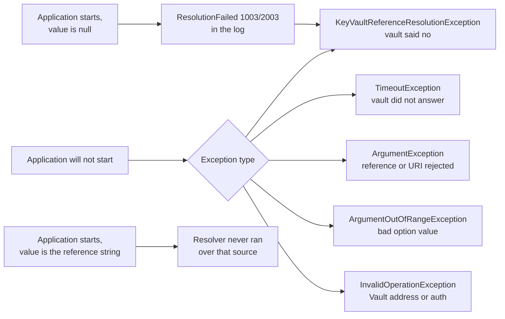

# Troubleshooting Guide

## Overview and Purpose

Almost every failure in this library surfaces in the same place — out of `IConfigurationBuilder.Build()`, during application startup — which means the symptom an operator sees is usually "the application will not start" plus one exception. This guide works backwards from that: each exception message and each observable symptom, mapped to what actually caused it and what to do.

Two behaviours explain most of the confusing cases, so they are worth knowing before reading further.

**A `null` configuration value is not a bug, it is the fail-closed path.** When a reference cannot be resolved, the key is set to `null` — never left holding the literal reference string. If `ThrowOnResolveFailure` is `false`, the application starts with `null` and fails later, somewhere else. The `ResolutionFailed` (1003 / 2003) record in the log is the real diagnosis.

**Startup resolution is silent unless you passed an `ILogger`.** The default is `NullLogger.Instance`. An application that fails to start with a bare exception and no surrounding context almost certainly did not pass one. Fixing that first will usually make the rest of this document unnecessary.

## Architecture Diagram



The right-hand branches are the two silent cases, and they are distinct. A `null` value means resolution ran and failed. A value that still contains `@Microsoft.KeyVault(...)` means resolution never saw it — a registration-order problem, not a vault problem.

## Azure Key Vault failures

### "Access denied reading ... (HTTP 403)"

```text
Access denied reading https://myvault.vault.azure.net/secrets/*** (HTTP 403).
Check that the application identity holds the 'Key Vault Secrets User' role on
https://myvault.vault.azure.net (or 'Get' in a legacy access policy), and that
the vault firewall allows this caller.
```

The message names both causes because HTTP 403 cannot distinguish them. Work through:

1. **Which identity is actually being used?** This is the most common answer and the least obvious. Check for a stray `AZURE_CLIENT_ID` / `AZURE_CLIENT_SECRET` in the process environment — the environment credential sits *ahead of* managed identity in the chain, and `ExcludeEnvironmentCredential` defaults to `false`. On App Service, every application setting becomes an environment variable, so a leftover setting from an earlier deployment model is a live hazard. Set `ExcludeEnvironmentCredential = true`.
2. **Multiple managed identities assigned?** The credential cannot choose. Set `ManagedIdentityClientId`.
3. **Role assignment.** `Key Vault Secrets User` on the vault or the specific secret. Propagation can take a few minutes after creation.
4. **Legacy access policies.** If the vault has not migrated to RBAC, the identity needs the `Get` secret permission in an access policy — a role assignment does nothing.
5. **Vault firewall.** With `publicNetworkAccess: Disabled`, a caller outside the private endpoint gets 403. Check the vault's network configuration and whether DNS resolves the vault host to the private endpoint.
6. **`options.Credential` set somewhere?** It silently overrides every credential-shaping option.

A 401 produces the same message and is usually a token acquisition failure rather than an authorisation one — check the authority host if you are in a sovereign cloud.

### "Secret not found at ... (HTTP 404)"

```text
Secret not found at https://myvault.vault.azure.net/secrets/*** (HTTP 404).
Check the secret name, and whether the secret has been deleted - a soft-deleted
secret must be recovered before it can be read.
```

1. **Spelling and case.** Key Vault secret names are case-sensitive.
2. **Soft delete.** This is the non-obvious cause the message exists for: a deleted secret is invisible to a read and still occupies its name. `az keyvault secret list-deleted --vault-name $VAULT` shows it; `az keyvault secret recover` brings it back.
3. **Wrong vault.** A `VaultName=` reference in a sovereign cloud composes against `VaultDnsSuffix`; if that is unset, the URI names a `vault.azure.net` host that does not exist in your cloud.
4. **A pinned version that no longer exists.** A `SecretUri` ending in `/{version}` fails if that version was purged.

### "Key Vault throttled the request for ... (HTTP 429)"

```text
Key Vault throttled the request for https://myvault.vault.azure.net/secrets/*** (HTTP 429).
Reduce MaxConcurrency, raise Timeout so the SDK's backoff can complete, or stagger
application startup.
```

Almost always a fleet problem rather than a single-instance one: N instances all starting at once, each fetching M secrets at concurrency 8. Remedies in order of effectiveness:

- **Raise `Timeout`** (default 30 s). The Azure SDK already retries with backoff; a short timeout cuts the retry off before it can succeed. This is the fix most often missed.
- **Reduce `MaxConcurrency`** from 8.
- **Stagger startup** across the fleet.
- **Reduce distinct secrets.** Consolidating several values into one JSON secret trades granularity for round trips.

Key Vault's limits are per-vault, so splitting secrets across vaults also works.

### TimeoutException

```text
Timeout resolving secret from https://myvault.vault.azure.net/secrets/***
```

The per-secret `Timeout` elapsed. Distinct from a 403 or 404: the vault did not answer at all.

- **A firewall dropping rather than rejecting.** The classic signature — no response, not a refusal.
- **Private endpoint without DNS.** The name resolves to a public IP that the firewall blocks.
- **A proxy that needs configuring.** Set `ClientOptions.Transport`.
- **Genuinely slow vault** under heavy load; raise `Timeout`.

If `OverallTimeout` elapses instead, the in-flight reads are cancelled and surface as `OperationCanceledException` rather than `TimeoutException` — a sign that the *total* budget ran out, usually because many references are unreachable.

### "Vault host '...' is not an allowed Key Vault host"

```text
Vault host 'evil.example.com' is not an allowed Key Vault host. Add its suffix to
KeyVaultReferenceResolverOptions.AllowedVaultHostSuffixes if this is intentional.
```

The allowlist rejected the host. Either the control is working — a reference names a host it should not — or the deployment has a legitimately unusual vault host.

Legitimate cases: a custom DNS name in front of a private endpoint, or a Managed HSM in a cloud not among the eight defaults. **Add to the list, do not clear it:**

```csharp
options.AllowedVaultHostSuffixes.Add(".vault.contoso-private.net");
```

If the host is genuinely unexpected, treat it as a tampered configuration source and investigate where the value came from.

### "Key Vault secret URIs must use https"

A reference with an `http://` URI. The `SecretUri` pattern requires `https://`, so this generally means the URI reached `ParseSecretUri` some other way — a direct `ISecretResolver` call, for instance. There is no opt-out on the Azure side.

### "Invalid Key Vault secret URI format"

```text
Invalid Key Vault secret URI format: https://myvault.vault.azure.net/secrets/***.
Expected format: https://{vault}.vault.azure.net/secrets/{secret-name}[/{version}]
```

The path's first segment is not `secrets`, or there is no second segment. Usually a hand-built URI pointing at `/keys/` or `/certificates/`, which this library does not resolve.

### "Secret ... expired at ..." / "is not valid until ..."

`RejectSecretsOutsideValidityPeriod` is on and the secret is outside its validity period. Either rotate the secret, or correct the `ExpiresOn` metadata if the secret is actually fine and only the label is stale.

If you see the *warning* forms (1101 / 1103) instead, the secret is being used anyway. See [Secret-Validity-Enforcement.md](../Features/Secret-Validity-Enforcement.md).

## HashiCorp Vault failures

### "Refusing to authenticate against an unexpected vault"

```text
Vault address 'https://other-vault.example.com' in a configuration reference does not
match the configured VaultAddress. Refusing to authenticate against an unexpected vault.
```

`options.VaultAddress` is set and a reference names a different address. This is the pinning control working.

- If the reference is wrong, fix the configuration value.
- If the application legitimately reads from several vaults, clear `VaultAddress` and populate `AllowedVaultAddresses` instead.
- If neither, investigate how a configuration value came to name an unexpected host.

Comparison is on the normalised address — scheme and host lowercased, trailing slash trimmed, **path case preserved**. `https://gw.example.com/Vault` and `https://gw.example.com/vault` do not match, deliberately.

### "Vault address '...' is not listed in AllowedVaultAddresses"

Same control, allowlist variant. Add the address, or fix the reference.

### "Vault address '...' must use https"

```text
Vault address 'http://127.0.0.1:8200' must use https. Plaintext HTTP sends the Vault
token and the secret in the clear; set AllowInsecureTransport to true only for a local
development Vault.
```

Set `AllowInsecureTransport = true` **only** for `vault server -dev` on a laptop, gated on an environment check. Note the `hashicorp://` reference format always reconstructs `https://`, so a plaintext dev Vault needs the `@HashiCorp.Vault(VaultAddress=http://...)` attribute form.

### "Vault address not configured"

```text
Vault address not configured. Set VaultAddress option or VAULT_ADDR environment variable.
```

Neither `options.VaultAddress` nor `VAULT_ADDR` is set, and no reference carried an address.

### "No authentication method configured"

```text
No authentication method configured. Set AuthMethod option, VAULT_TOKEN,
VAULT_ROLE_ID + VAULT_SECRET_ID, or configure KubernetesRoleName when running in Kubernetes.
```

Auto-detection found nothing. The message lists all four remedies. In Kubernetes, note that **`KubernetesRoleName` must be set** — Kubernetes auth can never be reached by environment alone, because the Vault role name cannot be inferred.

### Repeated 403 from Vault

Check the log for `Reauthenticated` (2102) records:

- **403, then a 2102 record, then success** — normal. The login token's TTL expired and the resolver re-authenticated. A steady low rate is expected; a burst means the auth role's `token_ttl` is shorter than the workload's read interval.
- **403 twice with a 2102 between them** — the re-authentication succeeded but the read still failed. This is a policy problem: the token is valid and the path is not granted. Check the Vault policy covers the exact path, including the `data/` segment for KV v2.
- **403 with no 2102 at all** — the failure came from somewhere other than the read, such as the login itself.

### "Secret key not found at path 'mount/***'"

A `KeyNotFoundException`. The path resolved and the read succeeded, but the field named by `SecretKey` (or the `#key` fragment) does not exist in that KV secret. A Vault KV secret is a dictionary; the reference names both a path and a field within it.

`vault kv get secret/myapp` lists the available fields. Watch for a field named `password` where the reference says `db-password`.

### "Vault secret path must not contain '.' or '..' segments" / "contains an illegal character"

Path validation rejected the reference. The characters blocked are `?`, `#`, `\` and control characters; `.` and `..` segments are blocked as whole segments.

This is a security control: `Uri` normalises dot segments away, so `secret/data/../../sys/mounts` would reach a different Vault API endpoint. A control character is reported as `\uXXXX` rather than emitted into the message. If a legitimate path is being rejected, rename the path in Vault.

### Wrong secret read, or a KV v1 path behaving oddly

`SplitPath` uses a heuristic: a `data` segment in position 1 means KV v2, and the mount is everything before it.

| Reference path | Mount | Path |
| --- | --- | --- |
| `secret/data/myapp` | `secret` | `myapp` |
| `kv/data/myapp/config` | `kv` | `myapp/config` |
| `secret/myapp` | `secret` | `myapp` |
| `myapp` | from `MountPath` | `myapp` |

The edge case: a KV **v1** mount with a folder genuinely named `data` at the second position. `secret/data/thing` is then split as v2 and reads the wrong path. Set `KvVersion = 1` and the v1 read path will use the split it produces.

### "Invalid HashiCorp Vault reference format"

The value matched neither pattern. The message shows both expected forms. Common mistakes: a missing `#key` fragment in the URI form, attributes in the wrong order in the attribute form (order is fixed), or a missing `SecretKey=`.

### Reads work, then stop after about an hour

The classic VaultSharp login-caching symptom, and it should no longer happen — the resolver evicts the client and re-authenticates once, logging 2102. If it *does* still happen:

- Confirm the auth method was created with `KubernetesAuthMethod.FromFile(...)` and not the explicit-JWT constructor. Only the `FromFile` variants re-read the rotated projected token; a JWT passed explicitly is used as-is forever.
- Confirm the pod's projected token is still being refreshed (`automountServiceAccountToken` not disabled).

## Silent failure modes

### A configuration value is null

Resolution ran and failed. Find `ResolutionFailed` (1003 / 2003) in the log — it names the configuration key and carries the original exception. Then work through the relevant section above.

If `ThrowOnResolveFailure` is `false`, this is the *only* signal, and the application will have started normally. Consider turning it back on; the option exists for compatibility, not as a recommendation.

`ResolutionSummary` (1004 / 2004) with `Count < Total` is the aggregate form of the same signal and the best thing to alert on.

### A configuration value still contains the reference string

Resolution never saw that value. This is **not** the fail-closed path — the library never leaves a reference in place after attempting it.

1. **Registration order.** The resolver only scans sources added *before* it. Move the call after every source that may contain references.
2. **A source added after the resolver** is shadowing the resolved value.
3. **App Service native references.** The platform resolves its own before the application starts; if it did not, the string remains and the library never ran. Pick one mechanism.
4. **A compound value on the HashiCorp side.** HashiCorp references must be the whole value — an embedded one is not recognised. Azure references can be embedded.

### An option appears to have no effect

- **`options.Credential` is set.** It silently makes `ManagedIdentityClientId`, `TenantId`, `AuthorityHost`, `AllowDeveloperCredentials` and `ExcludeEnvironmentCredential` inert.
- **`options.AuthMethod` is set.** Auto-detection and `KubernetesRoleName` are skipped.
- **`InvalidateCache` on the wrong instance.** The extension method builds its own resolver internally and does not expose it. Refresh only works on a resolver you registered in DI.
- **`CacheTtl` or `InvalidateCache` on `IConfiguration` values.** They cannot change values already materialised at startup. Only a restart does.
- **`ClientOptions.Diagnostics.IsLoggingContentEnabled = true`.** Forced to `false` unconditionally, by design.

### Startup is slow

- N unreachable references serialise into `ceil(N / MaxConcurrency)` waves of `Timeout` each, bounded by `OverallTimeout` (default 2 min).
- If the orchestrator kills the pod before `OverallTimeout` elapses, you get a crash loop with no diagnosis. Set `OverallTimeout` below the startup probe threshold so the library reports the failure.
- A `KvVersionProbe` (2005) on every read means `KvVersion` is unset and each read spends an extra round trip on a v1 mount.

### ArgumentOutOfRangeException at startup

From `Validate()`, naming the offending property:

| Property | Rule |
| --- | --- |
| `Timeout` | positive, or `Timeout.InfiniteTimeSpan` |
| `OverallTimeout` | positive, or `Timeout.InfiniteTimeSpan` |
| `CacheTtl` | positive, or `Timeout.InfiniteTimeSpan` |
| `MaxConcurrency` | at least 1 |

To disable caching entirely, use `EnableCaching = false` — a zero `CacheTtl` is rejected.

### Tests fail intermittently

Anything mutating the process-wide `VAULT_*` environment variables must join the `"VaultEnvironment"` xUnit collection, which disables parallelisation. Without it, tests race each other's environment. See [Local-Setup-And-Testing.md](../Development/Local-Setup-And-Testing.md).

Also: `Assert.Throws<T>` matches the exception type *exactly*. Use `Assert.ThrowsAny<T>` when a derived type is acceptable.

## Diagnostic checklist

In order, because each step makes the next easier:

1. **Pass an `ILogger`.** Nothing else in this list works without it.
2. **Read the `Information` records.** `ResolutionSummary` (1004 / 2004) tells you how many of how many resolved. `AuthMethodSelected` (2101) tells you which Vault identity was used.
3. **Read the `Error` records.** `ResolutionFailed` (1003 / 2003) names the configuration key and carries the cause.
4. **Enable `Debug` locally.** `SecretResolved` (1001 / 2001) names the specific secret. Turn it off afterwards — these records name secrets.
5. **Check the identity, not the permissions.** A stray `AZURE_CLIENT_SECRET` or `VAULT_TOKEN` is a more common cause of 403 than a missing role assignment.
6. **Check the vault's own audit log.** Key Vault diagnostic settings or a Vault audit device. A read that appears in neither never reached the vault — that is a network problem, not an authorisation one.
7. **Reproduce with a direct SDK call.** If `az keyvault secret show` works as the same identity and the library does not, the difference is in the identity resolution, not the vault.

## Design Decisions and Trade-offs

**Map HTTP statuses to prose.** `DescribeRequestFailure` names the specific thing to check for 401/403, 404 and 429. It costs some fidelity — the caller sees a `KeyVaultReferenceResolutionException` rather than the original `RequestFailedException` — but the original is preserved as `InnerException` with its Azure request ID. The four cases covered are the four that actually occur.

**Mask URIs in every message.** An operator cannot see which secret failed from the exception alone, and has to correlate with the `Debug` record or the configuration key. Accepted, because these messages reach crash dumps, developer error pages and APM sinks.

**Name the option to change in each rejection message.** Adds length. Removes a source-reading step for anyone hitting the host allowlist or the transport check legitimately.

**Fail closed even when not throwing.** `ThrowOnResolveFailure = false` still nulls the value, which produces a `NullReferenceException` somewhere downstream rather than a clear startup failure. The alternative — leaving the reference string — produces a credential-shaped value that reaches a downstream system's logs. The null is the lesser evil, and the `Error` record is the intended diagnosis path.

**One retry for Vault re-authentication.** A genuine policy problem produces 403 twice rather than looping. The cost is one wasted login on a real permission error.

## Integration Points

- **`ILogger`** — the primary diagnostic channel. Silent by default.
- **Key Vault diagnostic settings** — ship `AuditEvent` to Log Analytics for the vault-side view of every `SecretGet`.
- **Vault audit devices** — the same for HashiCorp Vault.
- **Azure SDK diagnostics** — `AZURE_LOG_LEVEL` or an `AzureEventSourceListener` for HTTP-level detail. Content logging stays off, but request URLs contain secret names.
- **`az keyvault secret show` / `vault kv get`** — the comparison baseline. If the CLI works as the same identity and the library does not, the identity resolution differs.
- **Application Insights / Log Analytics** — event-ID queries in [Logging-And-Monitoring.md](../Operations/Logging-And-Monitoring.md).

## Important Considerations

### Performance

- Failures are not fast. A misconfigured deployment pays `ceil(N / MaxConcurrency) × Timeout`, capped at `OverallTimeout`.
- Keep `OverallTimeout` under the orchestrator's probe threshold so failures are reported rather than killed.
- Raising `Timeout` is the correct response to intermittent 429s, because it lets the SDK's backoff complete.

### Security

- `Debug` records name secrets. Enable locally and briefly; do not ship to a retained store.
- Exception messages mask URIs, but the attached `InnerException` from a third-party SDK may not. Do not serialise inner exceptions into a user-facing error page.
- A 403 caused by a stray environment credential is a security finding, not just a configuration error — something set those variables.
- Host-allowlist and address-pinning rejections may be the control working. Check where the value came from before adding an exception.

### Operational

- **Pass an `ILogger`** — the single highest-value change for diagnosability.
- Alert on 1003 / 2003, and on 1004 / 2004 with `Count < Total`.
- A `null` value means resolution failed; a reference string means resolution never ran. Different causes, different fixes.
- Check the identity before the permissions.
- After rotating a secret, restart the application — `IConfiguration` values do not change in place.
